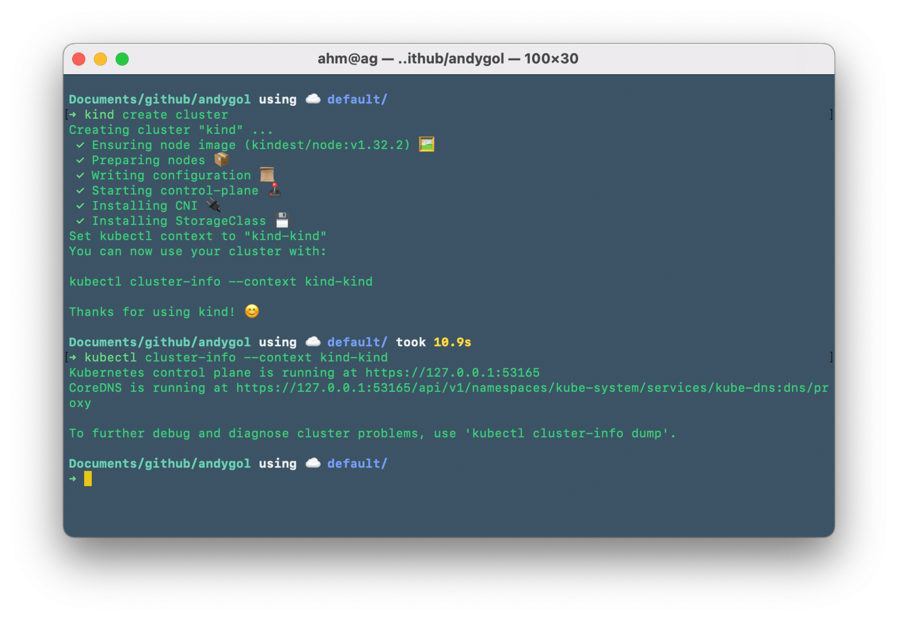
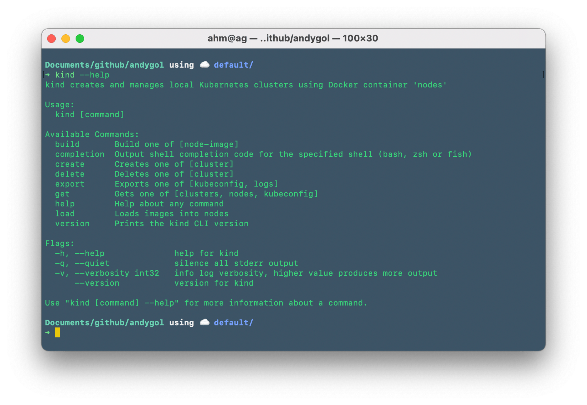

Kubernetes is no longer something that only platform engineers work with. More and more applications are wrapped in containers and run in container environments. What if, for some reason, you don't have access to a cloud platform but still need to develop an application that will run in the cloud? You can use [Kind](https://kind.sigs.k8s.io) to deploy [Kubernetes](https://andygol-k8s.netlify.app/en/docs/concepts/overview/) locally.

> [Kind](https://kind.sigs.k8s.io) is a tool for running local Kubernetes clusters using Docker container “nodes”. It was originally designed for testing Kubernetes itself, but it can also be used for local development or CI.

To run Kind, you’ll need [docker](https://www.docker.com/), [podman](https://podman.io/), or another container engine. Refer to the [Kind Quick Start Guide](https://kind.sigs.k8s.io/docs/user/quick-start/) on the official site.

## Creating a Cluster

So, we’ve installed Kind and a container runtime. We also have `kubectl` – the [command-line tool](https://andygol-k8s.netlify.app/en/docs/reference/kubectl/) for interacting with the cluster.

To create a local cluster, use the `kind create cluster` command.



You can always get the necessary help by using `kind [command] --help`.



We’ve created a local cluster named `kind-kind`. This is the default name Kind uses if the `-n cluster_name` or `--name cluster_name` parameter is not specified.

Instead of just passing CLI flags, you can also use a manifest to create a cluster with the desired parameters.

```sh
cat <<EOF > kind-config.yaml
kind: Cluster
apiVersion: kind.x-k8s.io/v1alpha4
name: my-super-cluster
nodes:
- role: control-plane
- role: worker
  extraMounts:
  - hostPath: /path/to/local/data
    containerPath: /data
# - role: worker
# - role: worker
#   extraMounts:
#   - hostPath: /path/to/local/data/dump
#     containerPath: /data/dump
#   - hostPath: /path/to/local/data/diff
#     containerPath: /data/diff
```

☝️ Here you can specify the number of desired nodes, their role, and—most importantly in our case—the local file system path on the host to be mounted into the cluster nodes and used as backing storage for our Persistent Volumes. See [Extra Mounts](https://kind.sigs.k8s.io/docs/user/configuration/#extra-mounts) in the Kind documentation.

Let’s apply our config to create the cluster
<a name="create-cluster"></a>

```sh
kind create cluster --config kind-config.yaml
```

```console
Creating cluster "kind" ...
 ✓ Ensuring node image (kindest/node:v1.32.2) 🖼
 ✓ Preparing nodes 📦
 ✓ Writing configuration 📜
 ✓ Starting control-plane 🕹️
 ✓ Installing CNI 🔌
 ✓ Installing StorageClass 💾
Set kubectl context to "kind-my-super-cluster"
You can now use your cluster with:

kubectl cluster-info --context kind-my-super-cluster

Have a question, bug, or feature request? Let us know! https://kind.sigs.k8s.io/#community 🙂
```

Let’s verify that the host file system is mounted in the worker node of our cluster.

```sh
docker container inspect osm-cluster-worker \
  | jq '[{"Name": .[0].Name,
          "BindMounts": (
            .[] |
            .Mounts[] |
            select(.Type == "bind")
        )}]'
```

And we see everything is OK—the file system is mounted.

```json
[
  {
    "Name": "/my-super-cluster-worker",
    "BindMounts": {
      "Type": "bind",
      "Source": "/host_mnt/path/to/local/data",
      "Destination": "/data",
      "Mode": "",
      "RW": true,
      "Propagation": "rprivate"
    }
  },
  {
    "Name": "/my-super-cluster-worker",
    "BindMounts": {
      "Type": "bind",
      "Source": "/lib/modules",
      "Destination": "/lib/modules",
      "Mode": "ro",
      "RW": false,
      "Propagation": "rprivate"
    }
  }
]
```

## Creating a PersistentVolume and PersistentVolumeClaim

Let’s define a manifest for our Persistent Volume:

```yaml
apiVersion: v1
kind: PersistentVolume
metadata:
  name: my-super-cluster-pv
spec:
  capacity:
    storage: 100Gi
  accessModes:
    - ReadWriteOnce
  volumeMode: Filesystem
  hostPath:
    path: "/data"
  storageClassName: my-storageclass
```

We’ll also create a PersistentVolumeClaim to mount the PV in workloads:

```yaml
apiVersion: v1
kind: PersistentVolumeClaim
metadata:
  name:  my-super-cluster-pvc
spec:
  accessModes:
    - ReadWriteOnce
  resources:
    requests:
      storage: 100Gi
  storageClassName: my-storageclass
```

Now the most important part 🥁—creating a StorageClass that explicitly links the PVC to the PV.

> **Note:** Kind [creates](#create-cluster) a default StorageClass when the cluster is created, but it has `reclaimPolicy: Delete`, which is not what we want.

```sh
kubectl get storageclass
```

```console
NAME                 PROVISIONER             RECLAIMPOLICY   VOLUMEBINDINGMODE      ALLOWVOLUMEEXPANSION   AGE
standard (default)   rancher.io/local-path   Delete          WaitForFirstConsumer   false                  80m
```

This means the contents of the volume will be deleted once it is unmounted—something we want to avoid.

Let’s define our own StorageClass:

```sh
kubectl apply -f -  <<EOF
apiVersion: storage.k8s.io/v1
kind: StorageClass
metadata:
  name: my-storageclass
provisioner: rancher.io/local-path
parameters:
  nodePath: /data
reclaimPolicy: Retain
volumeBindingMode: WaitForFirstConsumer
EOF
```

```console
storageclass.storage.k8s.io/my-storageclass created
```

and check it:

```sh
kubectl get storageclass
```

```console
NAME                 PROVISIONER             RECLAIMPOLICY   VOLUMEBINDINGMODE      ALLOWVOLUMEEXPANSION   AGE
my-storageclass      rancher.io/local-path   Retain          WaitForFirstConsumer   false                  5m27s
standard (default)   rancher.io/local-path   Delete          WaitForFirstConsumer   false                  91m
```

Make it the default, just in case:

```sh
kubectl patch storageclass my-storageclass -p '{"metadata": {"annotations":{"storageclass.kubernetes.io/is-default-class":"true"}}}'
```

And make `standard` non-default:

```sh
kubectl patch storageclass standard -p '{"metadata": {"annotations":{"storageclass.kubernetes.io/is-default-class":"false"}}}'
```

Check the result:

```sh
kubectl get storageclass
```

```console
NAME                        PROVISIONER             RECLAIMPOLICY   VOLUMEBINDINGMODE      ALLOWVOLUMEEXPANSION   AGE
my-storageclass (default)   rancher.io/local-path   Retain          WaitForFirstConsumer   false                  12m
standard                    rancher.io/local-path   Delete          WaitForFirstConsumer   false                  98m
```

## Using the PersistentVolumeClaim in a Pod

Apply the PV and PVC manifests to the cluster:

```sh
kubectl apply -f pv.yaml -f pvc.yaml
```

Now create a pod that uses the PVC:

```sh
kubectl apply -f - <<EOF
apiVersion: v1
kind: Pod
metadata:
  name: debug-pod
spec:
  containers:
  - name: debug-container
    image: busybox:latest
    command: ["sh", "-c", "sleep 3600"]
    volumeMounts:
    - mountPath: "/data"
      name: my-super-cluster
  volumes:
  - name: my-super-cluster
    persistentVolumeClaim:
      claimName: my-super-cluster-pvc
EOF
```

Check that the PVC is bound to the PV and used by our test pod:

```sh
kubectl get pv
```

```console
NAME                  CAPACITY   ACCESS MODES   RECLAIM POLICY   STATUS   CLAIM                          STORAGECLASS      VOLUMEATTRIBUTESCLASS   REASON   AGE
my-super-cluster-pv   100Gi      RWO            Retain           Bound    default/my-super-cluster-pvc   my-storageclass   <unset>                          9m20s
```

```sh
kubectl get pvc
```

```console
NAME                   STATUS   VOLUME                CAPACITY   ACCESS MODES   STORAGECLASS      VOLUMEATTRIBUTESCLASS   AGE
my-super-cluster-pvc   Bound    my-super-cluster-pv   100Gi      RWO            my-storageclass   <unset>                 8m48s
```

The `Bound` status confirms that the PVC has successfully bound to the PV.

```sh
kubectl describe pod
```

```console
Name:             debug-pod
Namespace:        default
Priority:         0
Service Account:  default
Node:             kind-control-plane/172.20.0.4
Start Time:       Fri, 04 Apr 2025 18:17:09 +0300
Labels:           <none>
Annotations:      <none>
Status:           Running
IP:               10.244.0.5
IPs:
  IP:  10.244.0.5
Containers:
  debug-container:
    Container ID:  containerd://d030a6edfc13c314853f22efc505990bbbb8e3954ed1c9887b9c7b3be575a0be
    Image:         busybox:latest
    Image ID:      docker.io/library/busybox@sha256:37f7b378a29ceb4c551b1b5582e27747b855bbfaa73fa11914fe0df028dc581f
    Port:          <none>
    Host Port:     <none>
    Command:
      sh
      -c
      sleep 3600
    State:          Running
      Started:      Fri, 04 Apr 2025 18:17:13 +0300
    Ready:          True
    Restart Count:  0
    Environment:    <none>
    Mounts:
      /data from my-super-cluster (rw)
      /var/run/secrets/kubernetes.io/serviceaccount from kube-api-access-5wdzj (ro)
Conditions:
  Type                        Status
  PodReadyToStartContainers   True
  Initialized                 True
  Ready                       True
  ContainersReady             True
  PodScheduled                True
Volumes:
  my-super-cluster:
    Type:       PersistentVolumeClaim (a reference to a PersistentVolumeClaim in the same namespace)
    ClaimName:  my-super-cluster-pvc
    ReadOnly:   false
  kube-api-access-5wdzj:
    Type:                    Projected (a volume that contains injected data from multiple sources)
    TokenExpirationSeconds:  3607
    ConfigMapName:           kube-root-ca.crt
    ConfigMapOptional:       <nil>
    DownwardAPI:             true
QoS Class:                   BestEffort
Node-Selectors:              <none>
Tolerations:                 node.kubernetes.io/not-ready:NoExecute op=Exists for 300s
                             node.kubernetes.io/unreachable:NoExecute op=Exists for 300s
Events:
  Type    Reason     Age    From               Message
  ----    ------     ----   ----               -------
  Normal  Scheduled  8m36s  default-scheduler  Successfully assigned default/debug-pod to kind-control-plane
  Normal  Pulling    8m36s  kubelet            Pulling image "busybox:latest"
  Normal  Pulled     8m32s  kubelet            Successfully pulled image "busybox:latest" in 3.395s (3.395s including waiting). Image size: 1855985 bytes.
  Normal  Created    8m32s  kubelet            Created container: debug-container
  Normal  Started    8m32s  kubelet            Started container debug-container
```

Our pod has been successfully created and is running.

Access the pod’s terminal and verify that the volume is mounted and functioning:

```sh
kubectl exec -it debug-pod -- sh
```

```console
/ # ls -l / | grep data
drwxr-xr-x    2 root     root          4096 Apr  4 15:17 data
/ # touch /data/somefile.txt
/ # ls -l /data
total 0
-rw-r--r--    1 root     root             0 Apr  4 15:31 somefile.txt
/ #
/ # exit
```

Now check the host file system mounted into the cluster node—you should see the newly created `somefile.txt`.

## Summary

We’ve created a Persistent Volume Claim to use in a workload, bound to a Persistent Volume via a custom StorageClass. The PV uses the file system of a cluster node, which in turn maps to the host file system.

This setup allows us to reliably store and reuse data in Persistent Volumes across workloads—even though workloads have an inherently [ephemeral lifecycle](https://andygol-k8s.netlify.app/en/docs/concepts/workloads/pods/pod-lifecycle/). It also allows us to preload data from the host file system and make it available to pods.

## Cleanup

To delete the cluster, run:

```sh
kind delete cluster --name kind-my-super-cluster
```

```console
Deleting cluster "kind-my-super-cluster" ...
```

Wait for Kind to delete the cluster. If needed, manually remove the mounted files from the host file system.

## Further Reading

- [Kind Quick Start](https://kind.sigs.k8s.io/docs/user/quick-start/)
- [Kind Persistent Volumes](https://mauilion.dev/posts/kind-pvc/)
- [Rancher Local Path Provisioner](https://github.com/rancher/local-path-provisioner#storage-classes)
- [Volumes](https://andygol-k8s.netlify.app/en/docs/concepts/storage/volumes/), [Persistent Volumes](https://andygol-k8s.netlify.app/en/docs/concepts/storage/persistent-volumes/), [Storage Classes](https://andygol-k8s.netlify.app/en/docs/concepts/storage/storage-classes/) in Kubernetes
