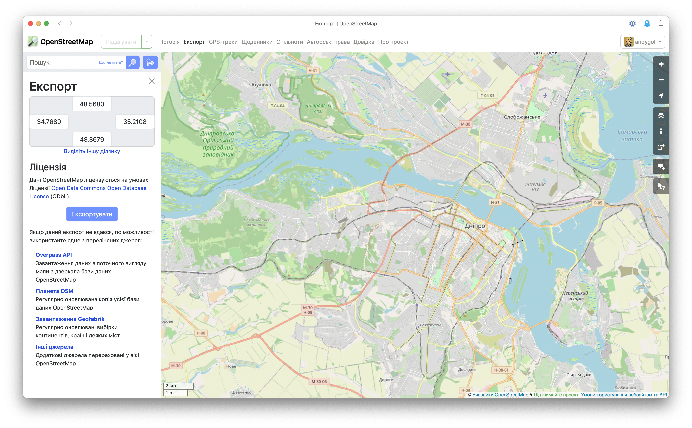
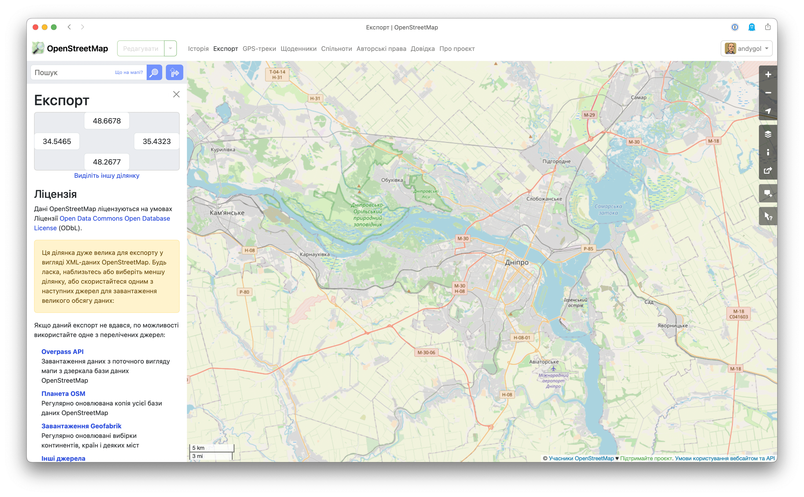
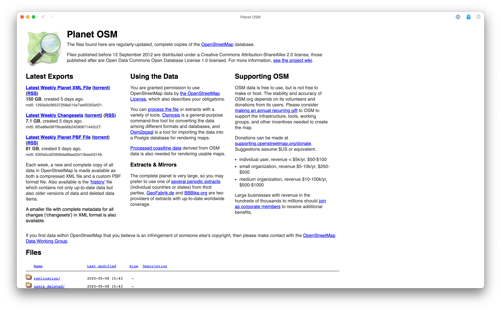
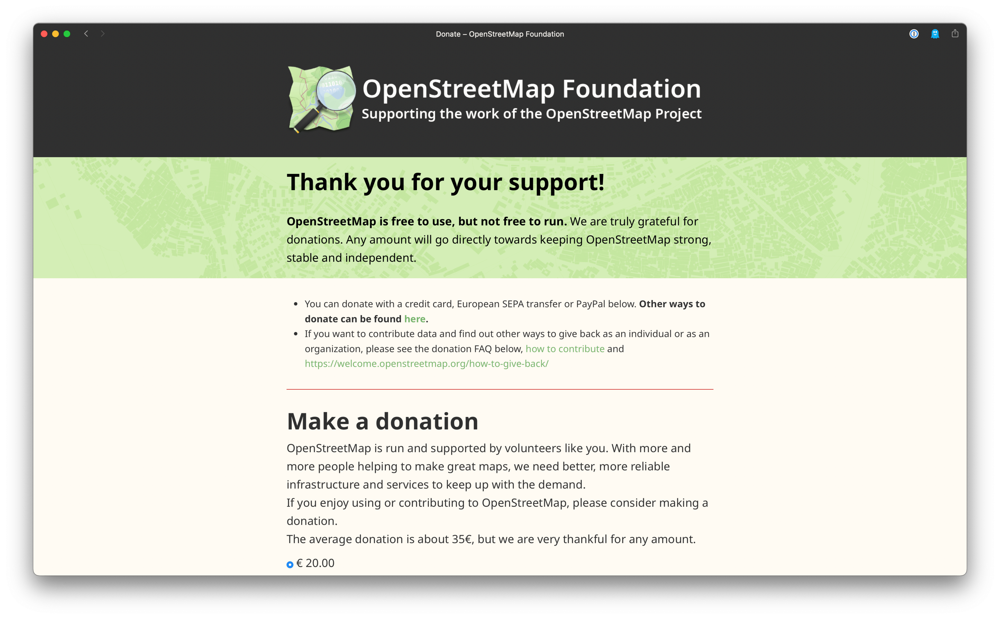
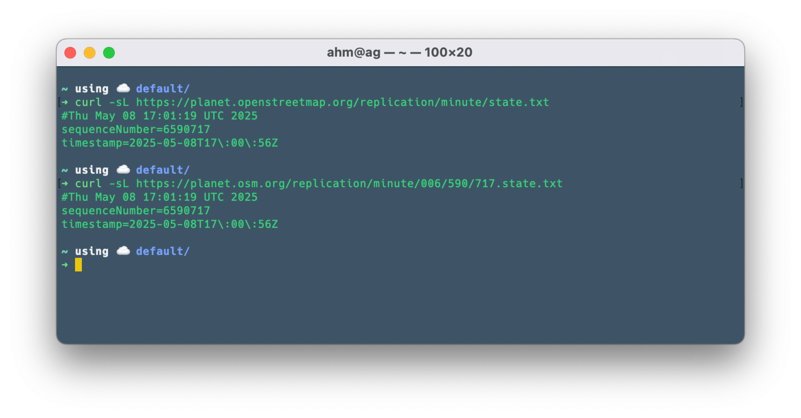
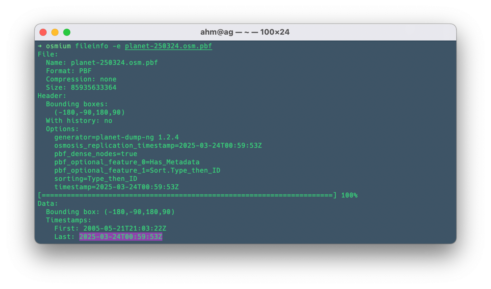
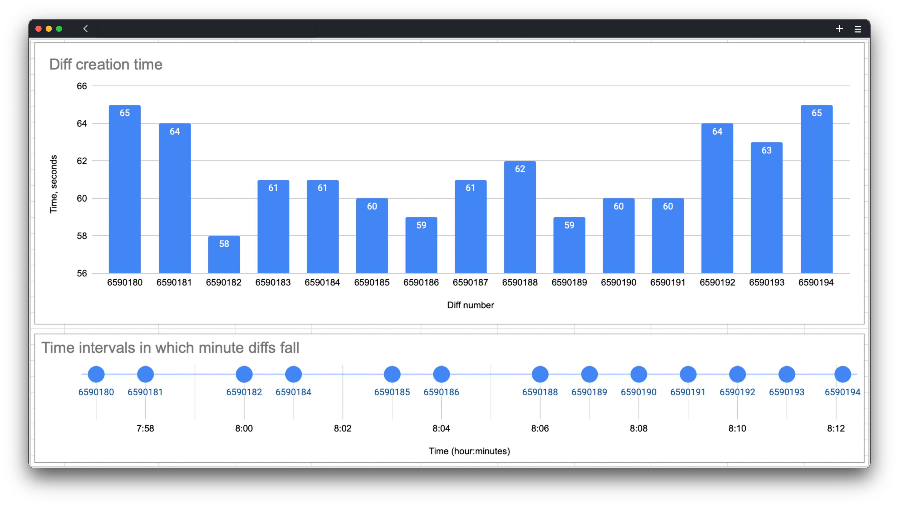

OpenStreetMap is a great example of a collaborative project for building an open geospatial data repository. Collecting the data is only part of the process. It’s collected so that it can be used. You can obtain data for the current map area using the [Export](https://www.openstreetmap.org/export) menu.

[](https://www.openstreetmap.org/export#map=12/48.4680/34.9894)

However, the ability to download data for the current area has some limitations. You won’t be able to do it if you are viewing the map at zoom level z11 or lower 👇. See the message in the yellow rectangle?

[](https://www.openstreetmap.org/export#map=11/48.4681/34.9894)

## Planet OSM

If you need data for a larger area or even for the entire planet, head over to where the project offers data for download — the planet dump, <https://planet.openstreetmap.org/>

[](https://planet.osm.org)

Here you can download data for the whole planet, either as a [data snapshot](https://planet.openstreetmap.org/planet/) for a specific date or as a [full history dump](https://planet.openstreetmap.org/planet/full-history/), which are generated weekly.

This data is provided free of charge by the project, but you can [support the project](https://supporting.openstreetmap.org/) by donating or becoming a member of the OpenStreetMap Foundation.

[](https://supporting.openstreetmap.org/donate/)

## Diff Files

For those less familiar with the project, diffs are [sets of changes](https://planet.openstreetmap.org/replication/) that occurred in the data and are published by OpenStreetMap every day, hour, and minute. These files list all changes made to the database within a selected time period.

Developers can use these diffs to update their local copies of the database, which are then used for geocoding, map rendering, and other tools in near real-time.

One of the key features that enables tracking changes in this massive database is the concept of "minute diffs". At first glance, the name suggests almost instant updates of every change made. But is that really the case?
Sounds ideal, right? But there are a few nuances worth considering:

- **"Near" real time** is the key phrase. Although change files are generated every minute, their actual availability may be delayed. Depending on server load, the generation and publication process may take a bit longer. So, while you may see changes within a few minutes, it won’t always be exactly one minute.
- **Processing diffs** is not instant. Getting the diff file is only the first step. Then the software must download, parse, and apply the changes to the local database copy. This process also takes some time, depending on the size of the change file and your hardware’s performance. During peak editing times on OpenStreetMap, these files can become significantly larger, slowing down the update process.
- **Applying the diffs** in the right order is essential. To ensure data consistency, changes must be applied in the correct order. This means if you miss several minute diffs (e.g., due to network issues), you’ll need to process them sequentially before your database is up to date again.

## Using Diffs

You've obtained the planet dump and loaded it into your map rendering or routing service. That’s just the beginning. In today’s fast-paced world, information changes rapidly, and those who keep up with those changes will have a significant advantage.

The planet dump file in OpenStreetMap is generated weekly.
> As of this writing, May 8, 2025, `planet-latest.osm.bz2` was created on _2025-05-02 23:50_ and its size was 150G; you can also get the data in binary pbf format — `planet-latest.osm.pbf`, _2025-05-02 23:50_, 81G; `planet-250428.osm.pbf`, _2025-05-02 23:50_, 81G.
>
> This latest dump contains data as of _April 25, 2025_, and was published on _May 2, 2025_.

This means that at the time of publication, the dump is already 7 days out of date. Add a couple more days before you get around to downloading it, and your data may be 1–2 weeks outdated at the start of deployment. Then add the time needed to load the dump into your system and you might find that your data is already 3–5 weeks stale by the time you begin using it (when talking about the full-planet scale). To catch up and get current data, you should use replication files: <https://planet.openstreetmap.org/replication/>, our daily, hourly, and minute diffs.

### Replication Process

Each diff file is accompanied by an additional metadata file describing the diff — `state.txt`



The `state.txt` file contains the timestamp and the sequence number of the diff. Using this number, you can retrieve the corresponding diff file (`717.osc.gz`, _2025-05-08 17:01_, 101K). For convenience, the sequence number is split into triplets: `006/590/717`.

The latest diff information is available in the root of the respective replication type. For minute diffs, this is: <https://planet.openstreetmap.org/replication/minute/state.txt>.

To synchronize your local data with the current OpenStreetMap data, you need to determine the last timestamp present in your local dump. For example, in a dump dated March 24, 2025, the last timestamp was _2025-03-24T00:59:53Z_.



Now that you have this timestamp, you need to find the corresponding diff file (daily or hourly) and its number. This can help:

```sh
https://replicate-sequences.osm.mazdermind.de/?2013-01-01T10:00:00Z
```

or

```sh
curl "https://replicate-sequences.osm.mazdermind.de/?$(date -u -d "@$(stat -c "%Y" planet-latest.osm.pbf)" +"%FT%TZ")"
```

### Finding Diffs Manually

For daily and hourly diffs, you can also use next approach:

- Convert the initial timestamp (from the dump) to Unix epoch time:

  ```sh
  date -d "2025-03-24T00:59:53Z" +%s
  # or explicitly specify the format
  date -u -j -f "%Y-%m-%dT%H:%M:%SZ" "2025-03-24T00:59:53Z" +%s
  ```

  This gives you the Unix time in seconds: `1742777993`.
- Retrieve the latest `state.txt` timestamp and sequence number (daily or hourly)
- Calculate the time difference (in days or hours), subtract this value from the sequence number, and get the download link for the diff file from which to begin syncing your local data

```sh
DUMP_EPOCH_TS=$(date -d "2025-03-24T00:59:53Z" +%s)
REFERENCE_DATE=$(wget -q -O - https://planet.openstreetmap.org/replication/day/state.txt 2>/dev/null | grep "timestamp" | cut -d'=' -f2 | sed 's/T/ /;s/Z//; s/\\//g')
REFERENCE_SEQ=$(wget -q -O - https://planet.openstreetmap.org/replication/day/state.txt 2>/dev/null | grep "sequenceNumber" | cut -d'=' -f2 )
LAST_EPOCH_TS=$(date -d "$REFERENCE_DATE" +%s)

# Example for calculating difference in days (86400 seconds = 24 hours)
# Use 3600 instead for hourly diffs
DIFF_TS=$(( ($LAST_EPOCH_TS - DUMP_EPOCH_TS) / 86400 ))
TARGET_SEQ=$(( (10#$REFERENCE_SEQ - $DIFF_TS) + 1 ))
seq_padded=$(printf "%09d" "$TARGET_SEQ")
url="https://planet.openstreetmap.org/replication/day/${seq_padded:0:3}/${seq_padded:3:3}/${seq_padded:6:3}.state.txt"
```

The `$url` variable will contain a link to the `state.txt` file needed to begin the replication process. This file is required for `osmosis` or similar tools. (For more details on the replication process, see: <https://wiki.openstreetmap.org/wiki/Planet.osm/diffs>)

The approach described above works well for daily and hourly diffs but does not work for minute diffs.

### Issues with Minute Diff Calculations

The approach described above for calculating the diff file number to begin replication does not work for minute diffs. Why? Because minute diffs can take more than 60 seconds to generate, resulting in "slippage" in the timeline.

For example, if you take the range of minute diffs from 6590000 to 6590227, you get 233 minutes but only 227 diff files.



On the charts, you can see how long it took to generate each minute diff and which minutes they were created in. You can observe that at 7:59, 8:02, and 8:05 no diffs were created — slippage occurred.

| Sequence    | Timestamp          | Epoch,<br>seconds | Epoch,<br>minutes  | Time, <br> sec | Clock |
|------------|--------------------|-------------------|--------------------|----------------|-------|
6590**194** | 2025-05-08 8:12:08 | 1746681128 | 29111352 | 65 | 8:12
6590**193** | 2025-05-08 8:11:05 | 1746681065 | 29111351 | 63 | 8:11
6590**192** | 2025-05-08 8:10:01 | 1746681001 | 29111350 | 64 | 8:10
6590**191** | 2025-05-08 8:09:01 | 1746680941 | 29111349 | 60 | 8:09
6590**190** | 2025-05-08 8:08:01 | 1746680881 | 29111348 | 60 | 8:08
6590**189** | 2025-05-08 8:07:02 | 1746680822 | 29111347 | 59 | 8:07
6590**188** | 2025-05-08 **8:06:00** | 1746680760 | 29111346 | 62 | **8:06**
6590**187** | 2025-05-08 8:04:59 | 1746680699 | 29111344 | 61 | 8:04
6590**186** | 2025-05-08 8:04:00 | 1746680640 | 29111344 | 59 | 8:04
6590**185** | 2025-05-08 **8:03:00** | 1746680580 | 29111343 | 60 | **8:03**
6590**184** | 2025-05-08 8:01:59 | 1746680519 | 29111341 | 61 | 8:01
6590**183** | 2025-05-08 8:00:58 | 1746680458 | 29111340 | 61 | 8:00
6590**182** | 2025-05-08 **8:00:00** | 1746680400 | 29111340 | 58 | **8:00**
6590**181** | 2025-05-08 7:58:56 | 1746680336 | 29111338 | 64 | 7:58
6590**180** | 2025-05-08 7:57:51 | 1746680271 | 29111337 | 65 | 7:57

This table also shows that there were 3 ‘slippages’ within 15 minutes.

Is this critical for everyday use? Since this has been happening for a long time, it seems that it is not. Existing change handling tools don't care about this. Yes, it can cause excessive traffic if you go further back in time than necessary for minute diffs, but it won't affect the final result. You will get your own dataset that will be synchronised with OpenStreetMap data with a lag of up to 2 minutes.

### Can this be fixed? Maybe.

Processing time-based data is always a non-trivial task. To fix this situation:

- The `timestamp` field of the diff metadata should contain the **start** time (the moment in time when the diff creation process started), which should ideally be an integer (or very close to it) time in minutes, hours, and days:
  - 13:00:00, 13:01:00, 13:02:00 for minutes;
  - 14:00:00, 15:00:00 - for hours; and
  - 00:00:00 for days.
- The end time of the diff creation process will be the time of the modification of the file itself, although it can also be specified in the metadata of the change set (this is the time currently contained in `timestamp`).
- The creation of the next diff should start at the specified time, regardless of whether the previous diff has finished. For some time, the process of creating them can take place in parallel.
- If there are no changes, create an empty diff file to maintain a monotonous order of change numbering so that there are no gaps in the time series.

If you are annoyed with this situation, you can submit suggestions for fixing it to the project maintainers, and it may be fixed. It's hard to say how soon.

## Recap

Diffs remain an extremely valuable tool for keeping local copies of OpenStreetMap data up to date. However, it is important to understand their limitations and not to take the name literally, especially with minute diffs.

For developers who use minute diffs, this means that they need to have a reliable infrastructure for processing them, take into account possible delays, and be prepared to process large amounts of data during periods of active editing.

For ordinary users, this is just an interesting fact about how the open source map they love works behind the scenes. The next time you make a small edit and don't see it on your map server instantly, don't worry — your 'minute' diff might just be on its way!

What do you think of minute diffs? Have you experienced any delays in data updates? Share your experience in the comments!
