This guide contains a detailed description of how to add a static IP address to a Multipass virtual machine on macOS. A general description of how to do this can be found in the official documentation in the [Configure static IPs](https://documentation.ubuntu.com/multipass/latest/how-to-guides/manage-instances/configure-static-ips/) section, however on macOS without certain modifications it is not possible to follow these recommendations.



<a id="default-eth"></a>

## Adding IP address to the first network interface of the virtual machine

### Finding Multipass bridge

To access virtual machines, Multipass (on macOS) creates a bridge named `bridge100`. This bridge is used to provide virtual machines with access to the host network. IP addresses are assigned via DHCP, and when a virtual machine is (re)created, it is assigned the next available IP address from the bridge network.

Running the `multipass networks` command should show you a list of available network interfaces.

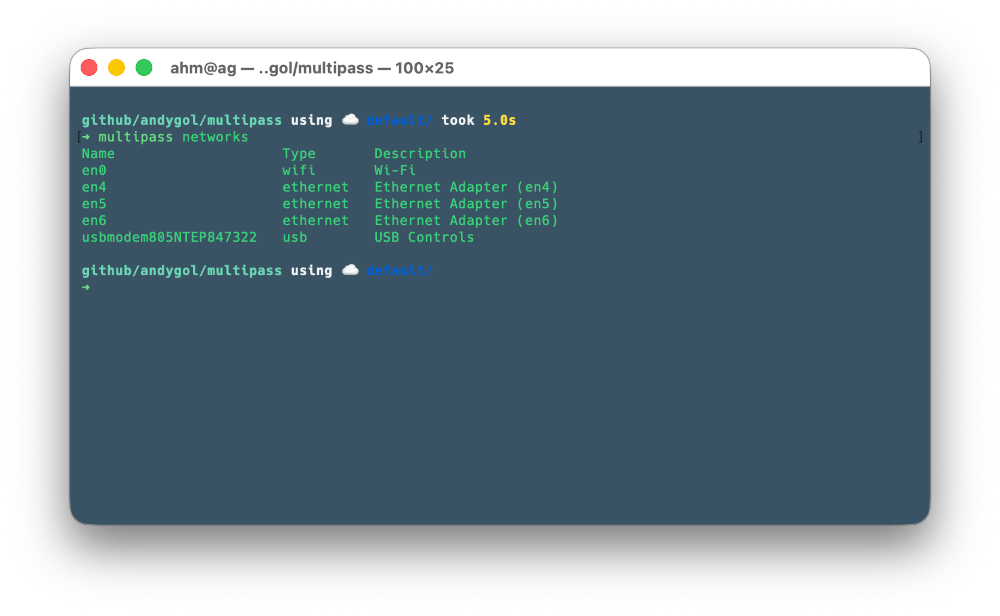

As you can see in this list, our bridge is not there. The result of `multipass networks` confirms the main limitation of Multipass on macOS: it "sees" only physical network adapters (Wi-Fi, Ethernet, USB). Created virtual bridges (bridge100) are ignored because they do not have the hardware profile that the Apple virtualization driver expects.

Let's try to find the bridge another way.

```bash
# Find bridge (usually bridge100)
ifconfig | grep -A 2 "^bridge"
```

The response should be similar to the following:

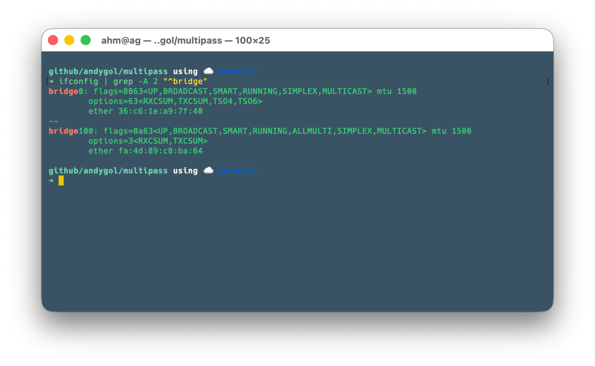

**Remember the bridge name** (for example, `bridge100`). We will use it further.

In my case, the bridge is available at address `192.168.2.1/24` and the DHCP server allocates addresses to virtual machines from the range `192.168.2.X`.

`ifconfig -v bridge100`

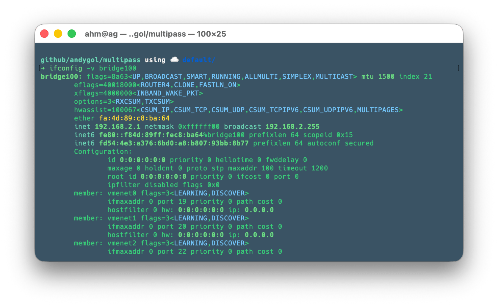

### Configuring bridge on the host

Assume that we need to provide virtual machines with static IP addresses for the network `10.10.0.0/24`. For this, we will create an alias to our existing bridge.

```bash
# Add IP address to bridge
sudo ifconfig bridge100 10.10.0.1/24 alias

# Check that it was added
ifconfig bridge100 | grep "inet "
```

**Expected result:**

```console
inet 192.168.2.1 netmask 0xffffff00 broadcast 192.168.2.255
inet 10.10.0.1 netmask 0xffffff00 broadcast 10.10.0.255
```

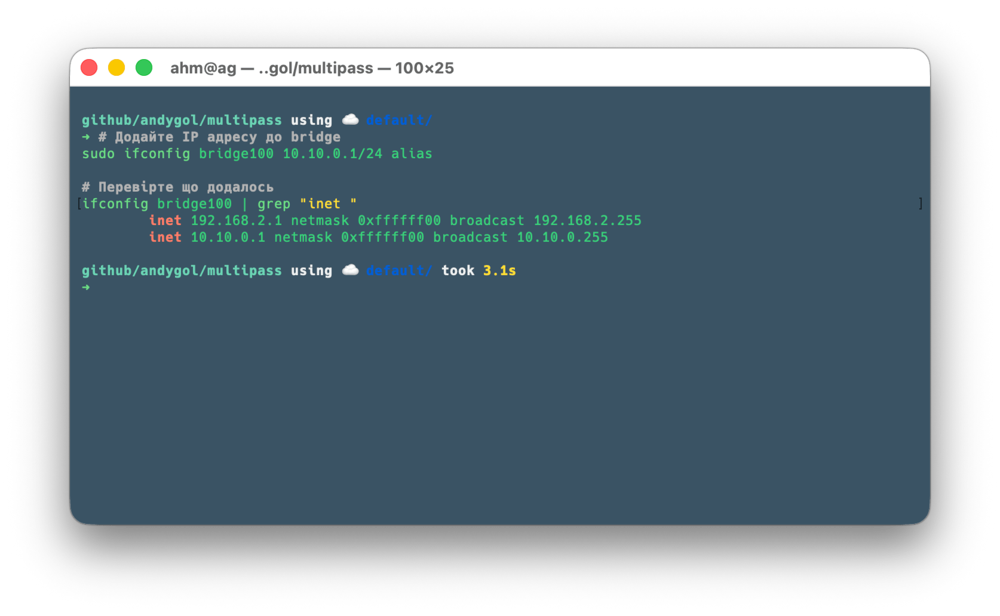

or using a script

```bash
TARGET_BRIDGE=$(ifconfig -v | grep -B 20 "member: vmenet" | grep "bridge" | awk -F: '{print $1}' | head -n 1)

if [ -z "$TARGET_BRIDGE" ]; then
    echo "Error: bridge not found. Check if VM is running."
else
    echo "VM found on $TARGET_BRIDGE. Assigning 10.10.0.1..."
    sudo ifconfig $TARGET_BRIDGE 10.10.0.1/24 alias
fi
```

### Creating cloud-init configuration for VM

Let's create the following cloud-init configuration file that contains settings for the network `10.10.0.0/24`

```bash
cat > multipass-static-ip.yaml << 'EOF'
#cloud-config

write_files:
  - path: /etc/netplan/60-static-ip.yaml
    permissions: '0600'
    content: |
      network:
        version: 2
        ethernets:
          default:
            dhcp4: true
            addresses:
              - 10.10.0.10/24
            routes:
              - to: default
                via: 10.10.0.1
                metric: 200

runcmd:
  - netplan apply

hostname: test-vm
EOF
```

To configure the network in Ubuntu, we use [Netplan](https://netplan.io). We add the settings for it to the file `/etc/netplan/60-static-ip.yaml`. The file contents are located in the `content:` field. Note the line `permissions: '0600'`, which sets read-write permissions for the root user only. If the permissions are too permissive, Netplan will notify you and will not apply the settings. The `netplan apply` command applies the settings from the `/etc/netplan/` folder. The `hostname` field contains the name for our virtual machine, which will be added to the `/etc/hostname` file.

### Launching VM and checking operation

Let's create our virtual machine

```bash
# Create VM with cloud-init configuration
multipass launch --name test-vm --cloud-init multipass-static-ip.yaml
```

Multipass will create a virtual machine with the name specified in the `--name/-n` parameter and will use the [`cloud-init`](https://cloud-init.io) settings from the file specified in `--cloud-init`.

Let's check the network settings of our virtual machine

```bash
# Check IP addresses on VM
multipass exec -n test-vm -- ip addr show enp0s1

# or use netplan
multipass exec -n test-vm -- netplan status

# Should show two IPs:
# - 192.168.2.x (DHCP)
# - 10.10.0.10 (static)
```

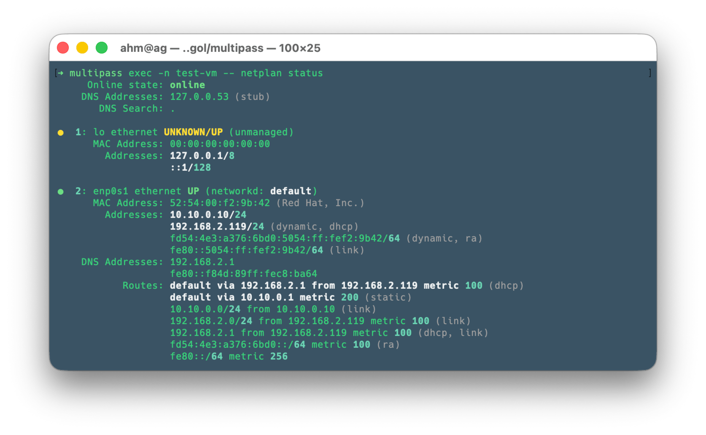

Now it's time to check the connection

```bash
# From host to VM
ping -c 4 10.10.0.10
```

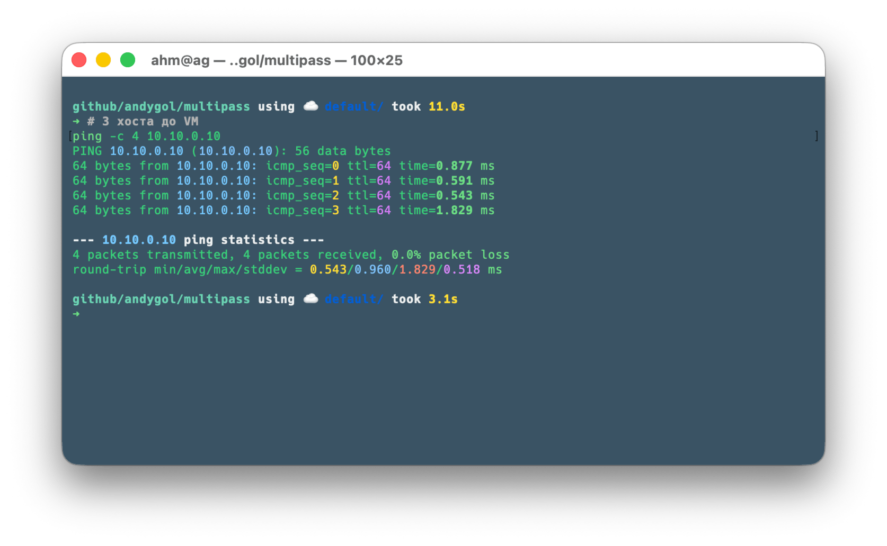

```bash
# From VM to host
multipass exec -n test-vm -- ping -c 4 10.10.0.1
```

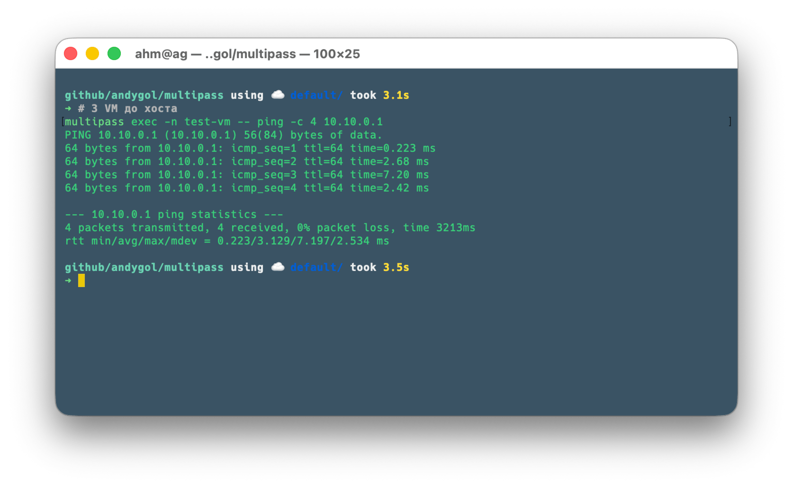

```bash
# Check internet access from VM
multipass exec -n test-vm -- ping -c 4 8.8.8.8
```

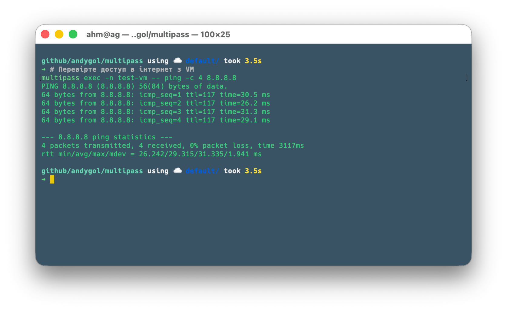

✅ **Static IP address works!**

### Technical details

```bash
# Output list of configuration files
multipass exec -n test-vm -- sudo ls -la /etc/netplan

# Get merged network configuration
multipass exec -n test-vm -- sudo netplan get
```

We see that in the `/etc/netplan` directory there are files `50-cloud-init.yaml`, which is created by cloud-init during virtual machine initialization, and the file `60-static-ip.yaml`, which we passed in the settings.

Running the `sudo netplan get` command will give us the merged network configuration. Compare it with the content of the `50-cloud-init.yaml` file.

```bash
# Get content of 50-cloud-init.yaml
multipass exec -n test-vm -- sudo cat /etc/netplan/50-cloud-init.yaml
```

Pay attention to the name of the network interface that `cloud-init` uses. This is the one we used in our settings (not `enp0s1`).

```yaml
network:
  version: 2
  ethernets:
    default: # network interface name
      match:
        macaddress: "52:54:00:ae:24:22"
      dhcp-identifier: "mac"
      dhcp4: true
```

<a id="enp0s2"></a>

## Adding static IP address to the second network interface of the virtual machine

In addition to adding a static IP address to the first network interface, we can do this for other network interfaces of the virtual machine. For this, on the host, you need to add/create the corresponding network bridge.

### Multipass bridge for the second network interface

Let's launch a temporary VM to create a new bridge (bridge101)

```bash
multipass launch --name sandbox-vm --network name=en0,mode=manual
```

The parameter `--network name=en0,mode=manual` will create a new network interface `enp0s2` in the virtual machine, which will be bound to a new bridge. However, after creation, this interface will be inactive because no IP address was assigned to it.

The (dis)advantage of this approach is that after deleting all virtual machines bound to this bridge, it will be automatically removed from the system. It exists as long as there are virtual machines bound to it.

This command allows you to find the name of this bridge:

```bash
ifconfig -v | grep -B 20 "member: vmenet" | grep "bridge" | awk -F: '{print $1}' | tail -n 1
```

Most likely the name will be `bridge101`.

Let's add an alias to the bridge

```bash
# Add IP address to bridge
sudo ifconfig bridge101 10.10.1.1/24 alias

# Check that it was added
ifconfig bridge101 | grep "inet "
```

**Expected result:**

```console
inet 10.10.1.1 netmask 0xffffff00 broadcast 10.10.1.255
```

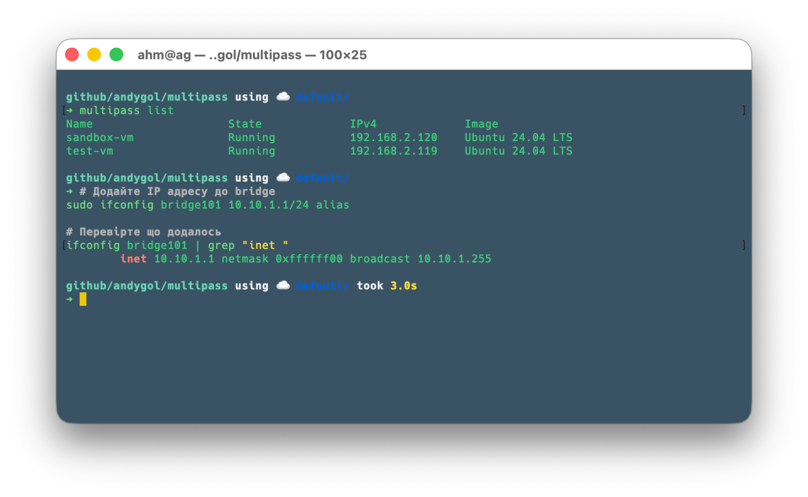

or

```bash
TARGET_BRIDGE=$(ifconfig -v | grep -B 20 "member: vmenet" | grep "bridge" | awk -F: '{print $1}' | tail -n 1)

if [ -z "$TARGET_BRIDGE" ]; then
    echo "Error: bridge not found. Check if VM is running."
else
    echo "VM found on $TARGET_BRIDGE. Assigning 10.10.1.1..."
    sudo ifconfig $TARGET_BRIDGE 10.10.1.1/24 alias
fi
```

### Creating cloud-init configuration for the second network interface VM

Just like in the first case, let's create a cloud-init configuration for setting up the virtual machine's network interface.

```bash
cat > multipass-static-ip1.yaml << 'EOF'
#cloud-config

write_files:
  - path: /etc/netplan/60-custom-network.yaml
    permissions: '0600'
    content: |
      network:
        version: 2
        ethernets:
          enp0s2:
            addresses:
              - 10.10.1.20/24
            # WE REMOVE "via: 10.10.0.1" (default gateway)
            # Instead, we just allow direct access to the 10.10.1.0/24 network
            routes:
              - to: 10.10.1.0/24
                scope: link
runcmd:
  - netplan apply
EOF
```

### Launching and checking the virtual machine operation

Let's launch a virtual machine named `test-vm1`.

```bash
# Create a VM with cloud-init configuration
multipass launch --name test-vm1 --network name=en0,mode=manual --cloud-init multipass-static-ip1.yaml
```

Wait for the VM creation and launch process to complete. After that, we can delete our temporary virtual machine, which we used to have the system create a new network bridge.

```bash
multipass delete sandbox-vm --purge
```

Creating the `test-vm1` virtual machine is the same as creating `test-vm`, with the difference that it will have two network interfaces.

Now let's check the virtual machine's network interface settings

```bash
# Check the IP addresses on the VM
multipass exec -n test-vm1 -- ip addr show

# or use netplan
multipass exec -n test-vm1 -- netplan status
```

You should see two IPs:

- 192.168.2.x (DHCP) on enp0s1
- 10.10.1.20 (static) on enp0s2

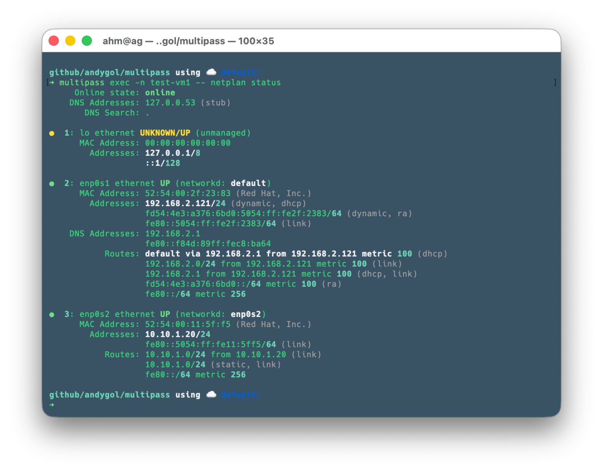

Let's check the connection

```bash
# From host to VM1
ping -c 4 10.10.1.20
```

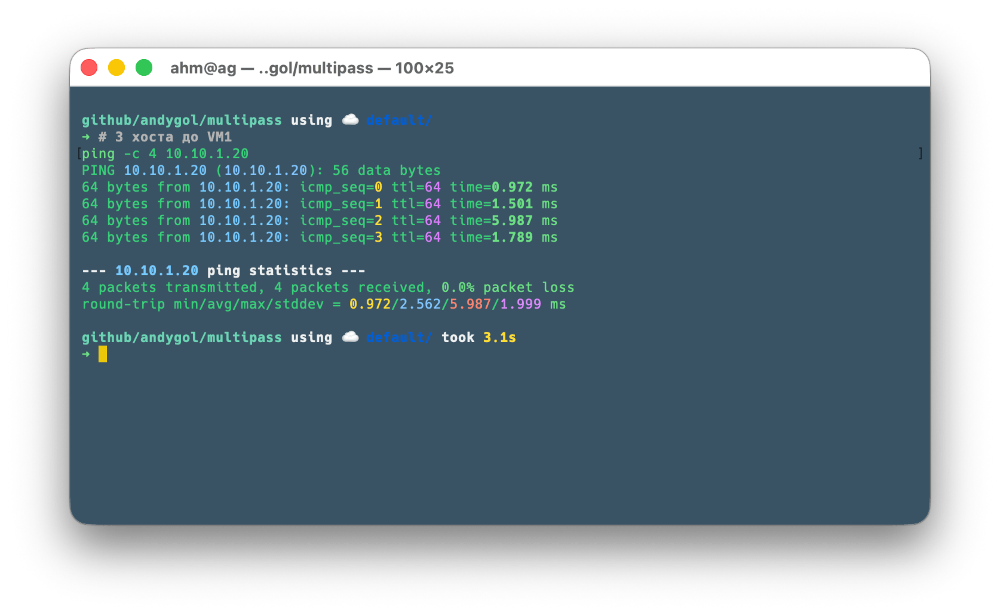

```bash
# From VM1 to host
multipass exec -n test-vm1 -- ping -c 4 10.10.1.1
```

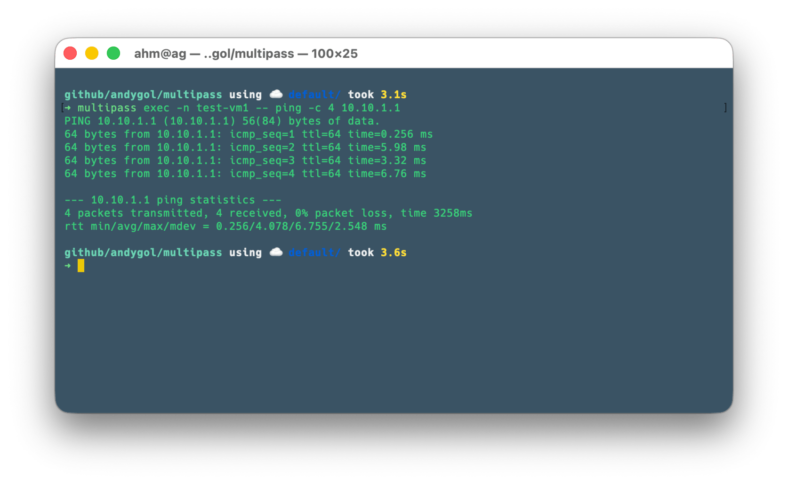

```bash
# Traffic between VM and VM1
multipass exec -n test-vm1 -- ping -c 4 10.10.0.10
multipass exec -n test-vm -- ping -c 4 10.10.1.20
```

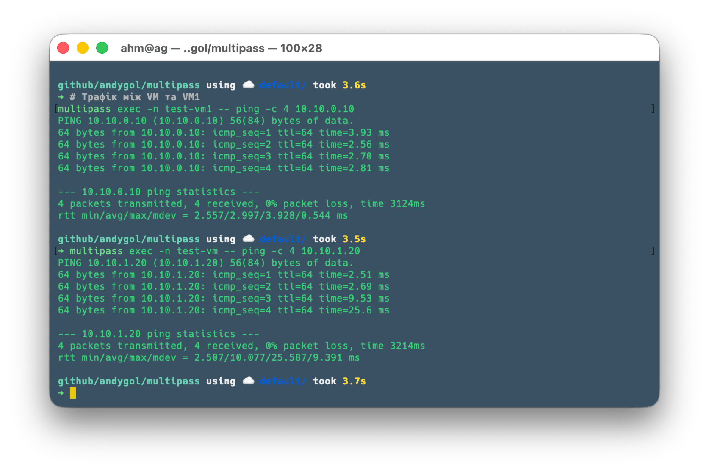

```bash
# Check Internet access from VM1
multipass exec -n test-vm1 -- ping -c 4 8.8.8.8
```

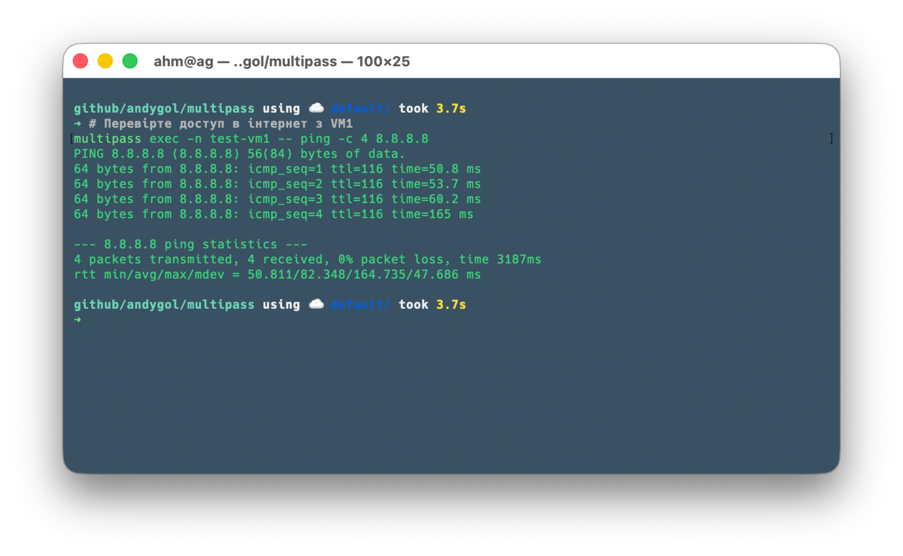

✅ **The static IP address on the second network interface is working!**

## Cleaning up

Delete virtual machines with the command `multipass delete <name-vm> --purge` or all at once with `multipass delete --all --purge`.

After deleting all virtual machines that were attached to the `bridge101` bridge, it will be removed automatically.

The result of executing `ifconfig -v bridge101` will be

```console
ifconfig: interface bridge101 does not exist
```

To remove the alias from `bridge100`, execute `sudo ifconfig bridge100 -alias 10.10.0.1`. You can also clear the cache with `sudo arp -d -a`.

## Summary

With these instructions, you can add static addresses to Multipass virtual machines. This can be useful when you need to use a pool of pre-allocated addresses.

⚠️ This guide was created and tested for macOS. Working with other operating systems may differ depending on the features and approaches you use.
