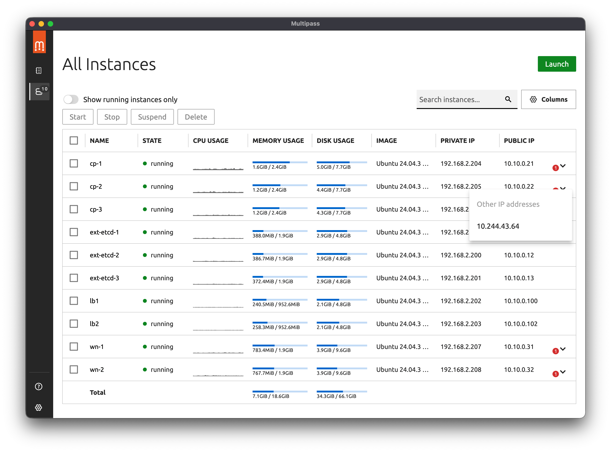
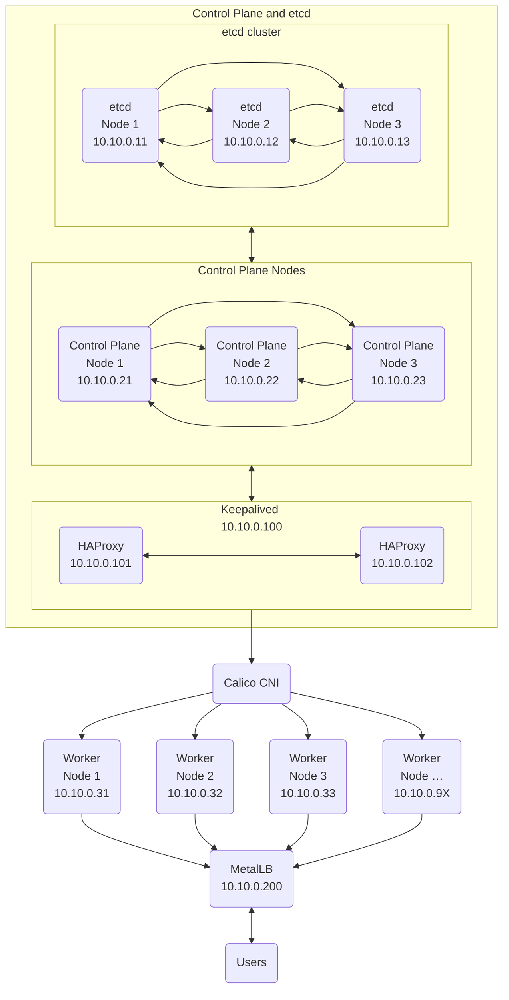

In this guide, we will explore the steps to deploy a High Availability (HA) Kubernetes cluster with an external etcd topology on a local machine running macOS. We will use Multipass to create virtual machines, cloud-init for their initialization, kubeadm for cluster initialization, HAProxy as a load balancer for control plane nodes, Calico as a Container Network Interface ([CNI](https://www.cni.dev)), and [MetalLB for load balancing traffic to worker nodes](/en/blog/2025/12/12/k8s-cluster-with-kubeadm/#step-7-install-metallb).

This guide is intended both for self-study and for taking the first steps in deploying a production-level cluster. Each step is explained in detail, with descriptions of components and their roles.



## Cluster Architecture

Highly available Kubernetes clusters are used in production environments to ensure the continuous operation of applications. Redundancy of key cluster components allows avoiding downtime in case of failure of individual control plane nodes or etcd.



### Components

We will deploy the cluster using kubeadm on virtual machines running Ubuntu, created by Multipass and initialized using cloud-init.

- **Multipass** — is a tool for quickly creating Ubuntu virtual machines in a cloud-like fashion on Linux, macOS, and Windows. It provides a simple yet powerful command-line interface that allows you to quickly access Ubuntu or create your own local mini-cloud.

  Local development and testing can be challenging, but [Multipass](https://multipass.run/) simplifies these processes by automating the deployment and teardown of infrastructure. Multipass has a library of ready-to-use images that can be used to launch specialized virtual machines or your own custom virtual machines, configured using the powerful cloud-init interface.

  Developers can use Multipass to prototype cloud deployments and create new, customized Linux development environments on any machine. Multipass is the fastest way for Mac and Windows users to get an Ubuntu command line in their systems. You can also use it as a sandbox to try new things without affecting the host machine and without the need for dual-booting.

- **Cloud-init** — is an industry-standard method of initialization, present in many distributions, for creating cloud instances on various platforms. It is supported by all major public cloud service providers, private cloud infrastructure providers, and bare-metal installations.

  During boot, [cloud-init](https://cloud-init.io) detects the cloud it is running in and initializes the system accordingly. Cloud instances are automatically provided with networking, storage, SSH keys, packages, and other pre-configured system components on first boot.

  Cloud-init provides the necessary linkage between the cloud instance startup and its connection so that it works as expected.

  For cloud users, cloud-init provides cloud instance configuration management at first boot without the need to manually install required components. For cloud service providers, it provides instance initialization that can be integrated with your cloud.

  If you want to learn more about what cloud-init is, why it is needed, and how it works, read the [detailed description](https://cloudinit.readthedocs.io/en/latest/explanation/introduction.html#introduction) in its documentation.

- **Kubeadm** — is a tool designed to provide the `kubeadm init` and `kubeadm join` commands as the best "quick practical ways" to create Kubernetes clusters.

  [Kubeadm](https://andygol-k8s.netlify.app/docs/reference/setup-tools/kubeadm/) performs the necessary actions to get a minimal viable cluster up and running. By design, it only deals with the cluster deployment process, creating machine instances is out of its scope. Installing various additional components, such as the Kubernetes Dashboard, monitoring tools, and cloud-specific overlays, is also not part of its tasks.

- **Etcd with external topology**. [Etcd](https://andygol-etcd.netlify.app/) is a distributed key-value store with high consistency that provides a reliable way to store data that needs to be accessed by a distributed system or a cluster of machines. It correctly handles leader elections during network partitions and can withstand machine failures, even leader nodes.

  Kubernetes uses etcd to store all of its configuration and cluster state. This includes information about nodes, pods, network configuration, secrets, and other Kubernetes resources. The high-availability topology of a Kubernetes cluster involves two placement options for etcd: [stacked etcd topology](https://andygol-k8s.netlify.app/docs/setup/production-environment/tools/kubeadm/ha-topology/#stacked-etcd-topology) and [external etcd topology](https://andygol-k8s.netlify.app/docs/setup/production-environment/tools/kubeadm/ha-topology/#external-etcd-topology). In this guide, we will focus on the external etcd topology, where etcd is deployed separately from the Kubernetes control plane nodes. This provides better isolation, scalability, and flexibility in managing the cluster.

- **HAProxy**. To distribute traffic to the control plane nodes, we will use the load balancer [HAProxy](https://www.haproxy.org/). This will allow us to ensure high availability of the Kubernetes API server. In addition, we will deploy local HAProxy instances on each control plane node to access the etcd cluster nodes.

- **Calico**. Since **kubeadm** does not create the network in which pods operate, we will use [Calico](https://projectcalico.org/), a popular tool that implements the Container Network Interface (CNI) and provides network policies. It is a unified platform for all Kubernetes networking, network security, and observability needs, working with any Kubernetes distribution. Calico simplifies network security enforcement using network policies.

### Cluster Topology



## Prerequisites

To deploy the cluster, we will need:

- A local computer with **Multipass** installed. For macOS, it can be installed using `brew install multipass`
- **kubectl** — The Kubernetes command-line tool, [kubectl](https://andygol-k8s.netlify.app/docs/tasks/tools/#kubectl), allows you to run commands against Kubernetes clusters. You can use kubectl to deploy applications, inspect and manage cluster resources, and view logs (`brew install kubectl`)
- Basic knowledge of [Kubernetes](https://andygol-k8s.netlify.app/docs/concepts/overview/) and [Linux](https://wikipedia.org/wiki/Linux)
- **yq** ([mikefarah's version](https://mikefarah.gitbook.io/yq)) — a lightweight and portable command-line processor for YAML, JSON, INI, and XML.

## SSH Key Setup

Secure Shell, SSH (English: Secure Shell) is a network protocol that allows remote management of a computer. It encrypts all traffic, including the authentication process and the transmission of passwords and secrets. To access the virtual machines, you need to set up SSH keys. We will use these keys to connect to all created virtual machines and transfer files between them.

### Generating an SSH Key

To generate a key pair (public and private), run the following command:

```bash
# Create a new pair of SSH keys (if you don't have one)
ssh-keygen -t rsa -b 4096 -C "k8s-cluster" -f ~/.ssh/k8s_cluster_key

# View the public key
cat ~/.ssh/k8s_cluster_key.pub
```

### Updating cloud-init Configuration

Use the obtained public key in the `snipets/cloud-init-users.yaml` file in the `ssh-authorized-keys` section:

```yaml
users:
  - name: k8sadmin
    ssh_authorized_keys:
      # Replace with your actual public key
      - ssh-rsa AAAAB3NzaC1yc2EAAAADAQABAAABAQC...
```

You can also use variable substitution at runtime

```bash
$ multipass launch --cloud-init - <<EOF
users:
  - name: username
    sudo: ALL=(ALL) NOPASSWD:ALL
    ssh_authorized_keys:
      - $( cat ~/.ssh/id_rsa.pub )
EOF
```

### Accessing Virtual Machines via SSH

After deployment, we can access the virtual machines using the following commands:

```bash
multipass shell <vm-name>
# or
ssh -i ~/.ssh/k8s_cluster_key k8sadmin@<vm-ip>
```

Multipass has a built-in `shell` command that allows us to connect to any created virtual machine without additional SSH configuration. However, it uses the default user `ubuntu`. If you want to connect as the `k8sadmin` user, which we will create using cloud-init, use `ssh -i ~/.ssh/k8s_cluster_key k8sadmin@<vm-ip>`.

## Environment Preparation

Create a project directory and the necessary files.

```bash
mkdir k8s-ha-cluster
cd k8s-ha-cluster
```

## Creating Scripts and Configurations

### Virtual Machine Parameters

To deploy the virtual machines, we need the following parameters:

| Node | Quantity | `cpus` | `memory` | `disk` | `network` |
| :-- | :--: | :--: | :-- | :-- | :-- |
| etcd | 3+ or<br>(2n+1)<sup>[[1]][etcd-quorum]</sup> | 2 | 2G | 5G | name=en0,mode=manual |
| control plane | 3 | 2 | 2.5G | 8G | name=en0,mode=manual |
| worker nodes | 3+ | 2 | 2G | 10G | name=en0,mode=manual |
| HAProxy+Keepalived | 2 | 1 | 1G | 5G | name=en0,mode=manual |

[etcd-quorum]: <https://andygol-etcd.netlify.app/docs/v3.5/faq/#what-is-failure-tolerance>

### Cloud-init Configurations

We will use pre-created cloud-init virtual machine configuration snippets to speed up their deployment.

#### User Creation

Let's create the user `k8sadmin` settings in `snipets/cloud-init-user.yaml`:

```yaml
# Create the directory if it doesn't exist
mkdir -p snipets

cat << EOF > snipets/cloud-init-user.yaml
# User settings
users:
  - name: k8sadmin
    sudo: "ALL=(ALL) NOPASSWD:ALL"
    groups: sudo,users,containerd
    homedir: /home/k8sadmin
    shell: /bin/bash
    lock_passwd: false
    ssh_authorized_keys:
      # Your SSH key
      - $( cat ~/.ssh/k8s_cluster_key.pub )
EOF
```

We have already discussed the user configuration in the SSH key settings. You can read about other parameters in the [Including users and groups](https://cloudinit.readthedocs.io/en/latest/reference/examples.html#including-users-and-groups) section of the cloud-init documentation.

#### Base Configuration for Cluster Nodes

The base cloud-init configuration for our cluster nodes will be in `snipets/cloud-init-base.yaml`:

```yaml
#cloud-config

# Add user settings from snipets/cloud-init-users.yaml here

# Commands that run early in the boot stage to prepare the GPG key
bootcmd:
  - mkdir -p /etc/apt/keyrings
  - curl -fsSL https://pkgs.k8s.io/core:/stable:/v1.34/deb/Release.key | gpg --dearmor -o /etc/apt/keyrings/kubernetes-apt-keyring.gpg

# Apt repository configuration
apt:
  sources:
    kubernetes.list:
      source: "deb [signed-by=/etc/apt/keyrings/kubernetes-apt-keyring.gpg] https://pkgs.k8s.io/core:/stable:/v1.34/deb/ /"

# System update
package_update: true
package_upgrade: true
```

To install the components necessary for the cluster operation, we need to [use the Kubernetes project repository](https://andygol-k8s.netlify.app/docs/setup/production-environment/tools/kubeadm/install-kubeadm/#k8s-install-0). In the [ `bootcmd` section](https://cloudinit.readthedocs.io/en/latest/reference/yaml_examples/boot_cmds.html#run-commands-in-early-boot), which is very similar to `runcmd`, but the commands from which are executed at the very beginning of the boot process, we obtain the GPG key and save it to `/etc/apt/keyrings`, and then add the Kubernetes repository to the [apt sources list](https://cloudinit.readthedocs.io/en/latest/reference/examples.html#additional-apt-configuration-and-repositories) in the `apt` section. The `package_update` and `package_upgrade` lines ensure that the latest system updates are obtained during boot, equivalent to running `apt-get update` and `apt-get upgrade`.

In the `packages` section, we will specify all the necessary packages to be installed on each virtual machine of the cluster.

```yaml
# Install basic packages
packages:
  - apt-transport-https
  - ca-certificates
  - curl
  - gnupg
  - lsb-release
  - containerd
  - kubelet
  - kubeadm
  - kubectl # Except for worker nodes
```

In addition to system service packages, we also [install](https://cloudinit.readthedocs.io/en/latest/reference/examples.html#install-arbitrary-packages) `containerd`, `kubelet`, `kubeadm`, and `kubectl`, which are the core components for the operation of the Kubernetes cluster.

`containerd` is the container runtime engine used by Kubernetes to run containerized applications. `kubelet` is the agent that runs on each node in the Kubernetes cluster and is responsible for running containers in pods. `kubeadm` is the tool for quickly deploying the Kubernetes cluster, and `kubectl` is the command-line tool for interacting with the Kubernetes cluster.

```yaml
# User configuration
users:
  - name: k8sadmin
    groups: sudo,users,containerd
```

Our user is a member of the `containerd` group, which we will use to access the `/run/containerd/containerd.sock` socket, enabling the use of `crictl` without the need to use `sudo`.

The `write_files` instruction in cloud-init allows [creating files with specified content](https://cloudinit.readthedocs.io/en/latest/reference/examples.html#writing-out-arbitrary-files) during the initialization of the virtual machine. We will use it to create files for configuring kernel modules for Kubernetes operation, enabling IP forwarding, creating settings for `crictl`, and a script that we will use to initialize and start `kubelet`. (See the `write_files` section in the `cloud-init-base.yaml` file)

After we have created all the necessary files using `write_files`, we can [execute the specified commands](https://cloudinit.readthedocs.io/en/latest/reference/examples.html#run-commands-on-first-boot) for system configuration in the `runcmd` section. Here we can specify the commands that we would have to execute manually after the first system boot. In our case, we will freez the versions of `kubeadm`, `kubelet`, and `kubectl`, disable swap, create a configuration file for `containerd`, and start it, as well as enable and start the `kubelet` service. (See the `runcmd` section in the `cloud-init-base.yaml` file)

Create two files:

- <a id="cloud-init-config-yaml"></a>`snipets/cloud-init-config.yaml` — to assign a static IP address to our virtual machines

  ```yaml
  cat << EOF > snipets/cloud-init-config.yaml
  #cloud-config
  timezone: Europe/Kyiv

  write_files:
    # Assigning a static IP address
    # Variant with alias for bridge101 for the second network interface
    - path: /etc/netplan/60-static-ip.yaml
      # Explicitly specify the value type
      # permissions: !!str "0755" # https://github.com/canonical/multipass/issues/4176
      permissions: !!str '0600'
      content: |
        network:
          version: 2
          ethernets:
            enp0s2:
              # Here you specify the IP address of the specific virtual machine
              addresses:
                # - 10.10.0.24/24
              routes:
                - to: 10.10.0.0/24
                  scope: link
  runcmd:
    # Applying settings for using a static IP address
    - netplan apply

    # Setting vim as the default editor (optional)
    - update-alternatives --set editor /usr/bin/vim.basic
  EOF
  ```

  ☝️ You can also specify that you want to use `vim` as your default editor here. If you prefer `nano`, comment out or remove the line `- update-alternatives --set editor /usr/bin/vim.basic`

- and, the file `snipets/cloud-init-base.yaml` with basic settings for the cluster virtual machines

  ```yaml
  cat << 'EOF' > snipets/cloud-init-base.yaml
  # Runs at an early boot stage to prepare the GPG key
  bootcmd:
    - mkdir -p /etc/apt/keyrings
    - curl -fsSL https://pkgs.k8s.io/core:/stable:/v1.34/deb/Release.key | gpg --dearmor -o /etc/apt/keyrings/kubernetes-apt-keyring.gpg

  # Apt repository configuration
  apt:
    sources:
      kubernetes.list:
        source: "deb [signed-by=/etc/apt/keyrings/kubernetes-apt-keyring.gpg] https://pkgs.k8s.io/core:/stable:/v1.34/deb/ /"

  # System update
  package_update: true
  package_upgrade: true

  # Install basic packages
  packages:
    - apt-transport-https
    - ca-certificates
    - curl
    - gnupg
    - lsb-release
    - containerd
    - kubelet
    - kubeadm
    - kubectl

  write_files:
    # Kernel module settings for Kubernetes
    - path: /etc/modules-load.d/k8s.conf
      # permissions: !!str '0644'
      content: |
        overlay
        br_netfilter

    # Enabling IPv4 packet forwarding
    # https://andygol-k8s.netlify.app/docs/setup/production-environment/container-runtimes/#prerequisite-ipv4-forwarding-optional
    - path: /etc/sysctl.d/k8s.conf
      # permissions: !!str '0644'
      content: |
        net.bridge.bridge-nf-call-iptables  = 1
        net.bridge.bridge-nf-call-ip6tables = 1
        net.ipv4.ip_forward                 = 1

    # Config for crictl
    # https://github.com/containerd/containerd/blob/main/docs/cri/crictl.md#install-crictl
    # https://github.com/kubernetes-sigs/cri-tools/blob/master/docs/crictl.md
    - path: /etc/crictl.yaml
      # permissions: !!str '0644'
      content: |
        runtime-endpoint: unix:///run/containerd/containerd.sock
        image-endpoint: unix:///run/containerd/containerd.sock
        timeout: 10
        debug: false

    # Setting group for containerd socket
    - path: /etc/systemd/system/containerd.service.d/override.conf
      content: |
        [Service]
        ExecStartPost=/bin/sh -c "chgrp containerd /run/containerd/containerd.sock && chmod 660 /run/containerd/containerd.sock"

    # Script to start kubelet
    - path: /usr/local/bin/kubelet-start.sh
      permissions: !!str "0755"
      content: |
        #!/bin/bash

        echo "Starting kubelet service and waiting for readiness (timeout 300s)..."

        # Enable and start the service
        sudo systemctl enable --now kubelet

        WAIT_LIMIT=300       # Maximum wait time in seconds
        ELAPSED_TIME=0       # Time already passed
        SLEEP_INTERVAL=1     # Initial interval (1 second)

        while ! systemctl is-active --quiet kubelet; do
            if [ "$ELAPSED_TIME" -ge "$WAIT_LIMIT" ]; then
                echo "--------------------------------------------------------------" >&2
                echo "BROKEN-DOWN: kubelet did not start within $WAIT_LIMIT seconds." >&2
                echo "Last error logs:"                                               >&2
                journalctl -u kubelet -n 20 --no-pager                                >&2
                echo "--------------------------------------------------------------" >&2
                exit 1
            fi

            echo "Waiting for kubelet... (elapsed $ELAPSED_TIME/$WAIT_LIMIT sec,"
            echo "next attempt in ${SLEEP_INTERVAL}sec)"

            sleep $SLEEP_INTERVAL

            # Update counters
            ELAPSED_TIME=$((ELAPSED_TIME + SLEEP_INTERVAL))

            # Double the interval for the next time (progressive)
            # But do not make the interval longer than 20 seconds, to not "oversleep" readiness
            SLEEP_INTERVAL=$((SLEEP_INTERVAL * 2))
            if [ "$SLEEP_INTERVAL" -gt 20 ]; then
                SLEEP_INTERVAL=20
            fi
        done

        echo "Kubelet successfully started in $ELAPSED_TIME seconds. Continuing..."

  runcmd:
    # Freezing the versions of Kubernetes packages
    - apt-mark hold kubelet kubeadm kubectl

    # Loading kernel modules
    - modprobe overlay
    - modprobe br_netfilter

    # Applying sysctl parameters
    - sysctl --system

    # Configuring containerd
    #
    # Setting the systemd cgroup driver
    # https://andygol-k8s.netlify.app/docs/setup/production-environment/container-runtimes/#containerd-systemd
    # https://github.com/containerd/containerd/blob/main/docs/cri/config.md#cgroup-drivercrictl pull
    #
    # Overriding the pause image
    # https://andygol-k8s.netlify.app/docs/setup/production-environment/container-runtimes/#override-pause-image-containerd

    - mkdir -p /etc/containerd
    - containerd config default | tee /etc/containerd/config.toml
    - sed -i 's|SystemdCgroup = false|SystemdCgroup = true|g; s|sandbox_image = "registry.k8s.io/pause.*"|sandbox_image = "registry.k8s.io/pause:3.10.1"|' /etc/containerd/config.toml
    - [ systemctl, daemon-reload ]
    - [ systemctl, restart, containerd ]
    - [ systemctl, enable, containerd ]

    # Disabling swap
    # https://andygol-k8s.netlify.app/docs/concepts/cluster-administration/swap-memory-management/#swap-and-control-plane-nodes
    # https://andygol-k8s.netlify.app/docs/setup/production-environment/tools/kubeadm/install-kubeadm/#swap-configuration
    - swapoff -a
    - sed -i '/ swap / s/^/#/' /etc/fstab

    # Enabling kubelet
    - /usr/local/bin/kubelet-start.sh
  EOF
  ```

  The default access rights for files created by cloud-init are `0644`. If you want to specify them explicitly, uncomment the corresponding lines `# permissions: !!str ‘0644’`. We specify the data type explicitly (`!!str ‘0644’`) due to the issue described in ticket [# 4176](https://github.com/canonical/multipass/issues/4176).

#### Configuration for etcd nodes

For etcd nodes, we will use the base configuration with additional settings specific to etcd. Create the file `snipets/cloud-init-etcd.yaml`:

```yaml
# Extend cloud-init-base.yaml with the following settings

cat << EOF > snipets/cloud-init-etcd.yaml
write_files:
  # https://andygol-k8s.netlify.app/docs/setup/production-environment/tools/kubeadm/setup-ha-etcd-with-kubeadm/#setup-up-the-cluster
  - path: /etc/systemd/system/kubelet.service.d/kubelet.conf
    content: |
      apiVersion: kubelet.config.k8s.io/v1beta1
      kind: KubeletConfiguration
      authentication:
        anonymous:
          enabled: false
        webhook:
          enabled: false
      authorization:
        mode: AlwaysAllow
      cgroupDriver: systemd
      address: 127.0.0.1
      containerRuntimeEndpoint: unix:///var/run/containerd/containerd.sock
      staticPodPath: /etc/kubernetes/manifests

  - path: /etc/systemd/system/kubelet.service.d/20-etcd-service-manager.conf
    content: |
      [Service]
      ExecStart=
      ExecStart=/usr/bin/kubelet --config=/etc/systemd/system/kubelet.service.d/kubelet.conf
      Restart=always
EOF
```

We will use the basic settings we created earlier and add etcd-specific settings in the `write_files` section, where we create a configuration file for `kubelet` that configures it to work with etcd, as described in the section “Configuring a highly available etcd cluster with kubeadm” section of the Kubernetes documentation.

#### Configuring the HAProxy balancer node

For the control panel traffic load balancer nodes, we will create the file `snipets/cloud-init-haproxy.yaml`, which will install the `haproxy` and `keepalived` packages from the standard repository and add the settings. To create a virtual machine for HAProxy, we will use the basic settings from `configs/cloud-init-user.yaml` and extend them with `write_files:` instructions to create the balancer configuration files — `/etc/haproxy/haproxy.cfg`, `/etc/keepalived/keepalived.conf`. (See the section “[Configuring the load balancer for control plane nodes (HAProxy+Keepalived)](#configuring-the-load-balancer-for-control-plane-nodes-haproxykeepalived).”)

### Choosing a network topology

For this demonstration, we will choose a compact network. (10.10.0.0/24)

```none
10.10.0.0/24      - Main subnet (256 addresses)
├─ 10.10.0.1      - Gateway/Bridge (on the host machine)
├─ 10.10.0.10-19  - etcd (3+ nodes)
├─ 10.10.0.20-29  - Control Plane (3+ masters)
├─ 10.10.0.30-50  - Workers (up to 20 workers)
└─ 10.10.0.100    - HAProxy/Keepalived (two nodes 10.10.0.101/10.10.0.102)
```

To assign static addresses to Multipass virtual machines, we will use one of the options described in the article "[Adding a static IP address to Multipass virtual machines on macOS](/en/blog/2025/12/26/static-ip-for-multipass-vm/#adding-static-ip-address-to-the-second-network-interface-of-the-virtual-machine)".

Add the appropriate section to the cloud-init file with the static network address configuration on the second network interface (see [`snipets/cloud-init-config.yaml`](#cloud-init-config-yaml)).

## Creating an etcd cluster

Let's start by creating an etcd cluster, where our highly available Kubernetes cluster will store the configuration and desired state of system objects.

### Deploying the first node of the etcd cluster

Let's start deploying our cluster by creating the first etcd node.

```bash
export VM_IP="10.10.0.11/24"

multipass launch --name ext-etcd-1 \
  --cpus 2 --memory 2G --disk 5G \
  --network name=en0,mode=manual \
  --cloud-init <( yq eval-all '
      # Merge all files into a single object
      . as $item ireduce ({}; . *+ $item) |

      # Remove kubectl from the list of packages
      del(.packages[] | select(. == “kubectl”)) |

      # Update the network configuration
      with(.write_files[] | select(.path == “/etc/netplan/60-static-ip.yaml”);
        .content |= (
          from_yaml |
          .network.ethernets.enp0s2.addresses += [strenv(VM_IP)] |
          to_yaml
        )
      ) ' \
      snipets/cloud-init-config.yaml \
      snipets/cloud-init-user.yaml \
      snipets/cloud-init-base.yaml \
      snipets/cloud-init-etcd.yaml )
```

The command `multipass launch --name ext-etcd-1` will start deploying a virtual machine with the name specified in the `--name/-n` parameter, in this case **ext-etcd-1**; The parameters `--cpus 2 --memory 2G --disk 5G` specify the number of processor cores, memory, and disk space, respectively; `--network name=en0,mode=manual` will create another network interface for the virtual machine, whose IP address will be assigned via the `VM_IP` variable.

Since etcd actively writes data to disk, database performance directly depends on the performance of the disk subsystem. For production use, SSD storage systems are strongly recommended. The minimum disk space should be at least 2 GB by default. Accordingly, to avoid placing data in swap, the amount of RAM should cover this quota. 8 GB is the recommended maximum for typical deployments. Requirements for etcd machines for small industrial clusters: 2 vCPUs, 8 GB of memory, and 50-80 GB SSD. (See <https://andygol-etcd.netlify.app/docs/v3.5/op-guide/hardware/#small-cluster>, <https://andygol-etcd.netlify.app/docs/v3.5/faq/#system-requirements>)

We will merge cloud-init parameters on the fly by combining our template files `snipets/cloud-init-config.yaml`, `snipets/cloud-init-user.yaml`, `snipets/cloud-init-base.yaml`, `snipets/cloud-init-etcd.yaml` using **yq**.

If you did not create a temporary virtual machine to initialize `bridge101` and did not [add an alias for it](/en/blog/2025/12/26/static-ip-for-multipass-vm/#multipass-bridge-for-the-second-network-interface), after deploying the virtual machine, it's time to do the following. Run the following on your host:

```bash
# Define the name of the bridge. Most likely, the name will be bridge101.
ifconfig -v | grep -B 20 “member: vmenet” | grep “bridge” | awk -F: ‘{print $1}’ | tail -n 1

# Add the address
sudo ifconfig bridge101 10.10.0.1/24 alias

# Check that it has been added
ifconfig bridge101 | grep “inet ”
```

If you did this 👆 after creating a temporary virtual machine, you can now delete it

```bash
multipass delete <temp-vm> --purge
```

#### Configuring the first etcd node

Let's log into our node using SSH.

```bash
ssh -i ~/.ssh/k8s_cluster_key k8sadmin@10.10.0.11
```

Since we don't have any CA certificates yet, we need to generate them.

```bash
sudo kubeadm init phase certs etcd-ca
```

We will get two files, `ca.crt` and `ca.key`, in the `/etc/kubernetes/pki/etcd/` folder.

<a id="etcd-kubeadmcfg-yaml"></a>Now let's create a configuration file for kubeadm `kubeadmcfg.yaml` using the appropriate values in the variables `ETCD_HOST` (IP address of the virtual machine) and `ETCD_NAME` (its short name). Note the value of the `ETCD_INITIAL_CLUSTER_STATE` variable, which indicates that we are creating a new etcd cluster. We will add other nodes to it later.

```bash
ETCD_HOST=$(hostname -I | awk '{print $2}')
ETCD_NAME=$(hostname -a)
ETCD_INITIAL_CLUSTER=${ETCD_INITIAL_CLUSTER:-"${ETCD_NAME}=https://${ETCD_HOST}:2380"}
ETCD_INITIAL_CLUSTER_STATE=${ETCD_INITIAL_CLUSTER_STATE:-"new"}
cat << EOF > $HOME/kubeadmcfg.yaml
---
apiVersion: "kubeadm.k8s.io/v1beta4"
kind: InitConfiguration
nodeRegistration:
    name: ${ETCD_NAME}
localAPIEndpoint:
    advertiseAddress: ${ETCD_HOST}
---
apiVersion: "kubeadm.k8s.io/v1beta4"
kind: ClusterConfiguration
etcd:
    local:
        serverCertSANs:
        - "${ETCD_HOST}"
        peerCertSANs:
        - "${ETCD_HOST}"
        extraArgs:
        - name: initial-cluster
          value: ${ETCD_INITIAL_CLUSTER}
        - name: initial-cluster-state
          value: ${ETCD_INITIAL_CLUSTER_STATE}
        - name: name
          value: ${ETCD_NAME}
        - name: listen-peer-urls
          value: https://${ETCD_HOST}:2380
        - name: listen-client-urls
          value: https://${ETCD_HOST}:2379,https://127.0.0.1:2379
        - name: advertise-client-urls
          value: https://${ETCD_HOST}:2379
        - name: initial-advertise-peer-urls
          value: https://${ETCD_HOST}:2380
EOF
```

Using the created `kubeadmcfg.yaml` file, which we placed in the home directory of the `k8sadmin` user, we will generate etcd certificates and create a static pod manifest for the etcd cluster node.

```bash
# 1. Certificate issuance
sudo kubeadm init phase certs etcd-server --config=$HOME/kubeadmcfg.yaml
sudo kubeadm init phase certs etcd-peer --config=$HOME/kubeadmcfg.yaml
sudo kubeadm init phase certs etcd-healthcheck-client --config=$HOME/kubeadmcfg.yaml
sudo kubeadm init phase certs apiserver-etcd-client --config=$HOME/kubeadmcfg.yaml
```

Now we should have the following keys and certificates available

```none
/home/k8sadmin
└── kubeadmcfg.yaml
---
/etc/kubernetes/pki
├── apiserver-etcd-client.crt
├── apiserver-etcd-client.key
└── etcd
    ├── ca.crt
    ├── ca.key
    ├── healthcheck-client.crt
    ├── healthcheck-client.key
    ├── peer.crt
    ├── peer.key
    ├── server.crt
    └── server.key
```

After creating the appropriate certificates, it's time to create a static pod manifest. As a result, we should have a file `/etc/kubernetes/manifests/etcd.yaml`.

```bash
# 2. Creating a static pod manifest
sudo kubeadm init phase etcd local --config=$HOME/kubeadmcfg.yaml
```

Once we have the `/etc/kubernetes/manifests/etcd.yaml` manifest, the node's `kubelet` should pick it up, download the container image, and start the pod with `etcd`, after which the first node of our cluster should respond to health checks.

```bash
crictl exec $(crictl ps --label io.kubernetes.container.name=etcd --quiet) etcdctl \
   --cert /etc/kubernetes/pki/etcd/peer.crt \
   --key /etc/kubernetes/pki/etcd/peer.key \
   --cacert /etc/kubernetes/pki/etcd/ca.crt \
   --endpoints https://10.10.0.11:2379 \
   endpoint health -w table
```

```console
+-------------------------+--------+------------+-------+
|        ENDPOINT         | HEALTH |    TOOK    | ERROR |
+-------------------------+--------+------------+-------+
| https://10.10.0.11:2379 |   true | 7.777048ms |       |
+-------------------------+--------+------------+-------+
```

### Deploying subsequent etcd cluster nodes

To deploy the next etcd cluster nodes: `ext-etcd-2`, `ext-etcd-3`, and so on (as needed), change the value of `VM_IP` to `“10.10.0.12/24”` and the virtual machine name in the `--name` parameter to `ext-etcd-2`, respectively.

```bash
export VM_IP="10.10.0.12/24"

multipass launch --name ext-etcd-2 \
  --cpus 2 --memory 2G --disk 5G \
  --network name=en0,mode=manual \
  --cloud-init <( yq eval-all '
      # Merge all files into a single object
      . as $item ireduce ({}; . *+ $item) |

      # Remove kubectl from the package list
      del(.packages[] | select(. == “kubectl”)) |

      # Update network configuration
      with(.write_files[] | select(.path == “/etc/netplan/60-static-ip.yaml”);
        .content |= (
          from_yaml |
          .network.ethernets.enp0s2.addresses += [strenv(VM_IP)] |
          to_yaml
        )
      ) ' \
      snipets/cloud-init-config.yaml \
      snipets/cloud-init-user.yaml \
      snipets/cloud-init-base.yaml \
      snipets/cloud-init-etcd.yaml )
```

After completing the deployment of the node, let's check if we have SSH access to it:

```bash
ssh -i ~/.ssh/k8s_cluster_key k8sadmin@10.10.0.12 -- ls -la
```

#### Configuring etcd nodes and joining them to the cluster

On our etcd node `ext-etcd-1`, which is already running, we will execute the following command to get instructions for joining the node `ext-etcd-2` to the etcd cluster. After the `member add` command, we will specify the name of the node to be joined and the path to it in the `--peer-urls` parameter.

```bash
crictl exec $(crictl ps --label io.kubernetes.container.name=etcd --quiet) etcdctl \
   --cert /etc/kubernetes/pki/etcd/peer.crt \
   --key /etc/kubernetes/pki/etcd/peer.key \
   --cacert /etc/kubernetes/pki/etcd/ca.crt \
   --endpoints https://10.10.0.11:2379 \
   member add ext-etcd-2 --peer-urls=https://10.10.0.12:2380
```

`etcdctl` will register a new member of the etcd cluster, and in response we will receive its ID and the string `“ext-etcd-1=https://10.10.0.11:2380,ext-etcd-2=https://10.10.0.12:2380”` with a complete list of cluster nodes (including the new member).

```console
Member e3e9330902f761c3 added to cluster 3f0c3972eda275cb

ETCD_NAME="ext-etcd-2"
ETCD_INITIAL_CLUSTER="ext-etcd-1=https://10.10.0.11:2380,ext-etcd-2=https://10.10.0.12:2380"
ETCD_INITIAL_ADVERTISE_PEER_URLS="https://10.10.0.12:2380"
ETCD_INITIAL_CLUSTER_STATE="existing"
```

#### Creating kubeadmcfg.yaml

[Create the configuration file `~/kubeadmcfg.yaml`](#etcd-kubeadmcfg-yaml) on the `ext-etcd-2` node, replacing the variable values with those you just obtained after executing the `… member add …` command.

The next mandatory step is to copy the CA files from `ext-etcd-1` to `ext-etcd-2`. For convenience, the steps for transferring CA files have been combined into a script that you need to create on your host machine.

```bash
cat << ‘EOF’ > copy-etcd-ca.sh
#!/bin/bash

# --- Default settings (change as needed) ---
DEFAULT_KEY="~/.ssh/k8s_cluster_key"
DEFAULT_SRC="10.10.0.11"
DEFAULT_DEST=“10.10.0.12”
USER="k8sadmin"
CERT_PATH="/etc/kubernetes/pki/etcd"

# --- Assigning arguments ---
# $1 - first argument (source host), $2 - second (destination host), $3 - third (path to key)
SRC_HOST=${1:-$DEFAULT_SRC}
DEST_HOST=${2:-$DEFAULT_DEST}
KEY=${3:-$DEFAULT_KEY}

echo “Parameters used:”
echo “  Source:      ${SRC_HOST}”
echo “  Destination: ${DEST_HOST}”
echo “  SSH Key:     ${KEY}”
echo “---------------------------------------”

# 1. Preparing files on the source
echo “[1/4] Preparing files on ${SRC_HOST}...”
ssh -i “${KEY}” “${USER}@${SRC_HOST}” “sudo cp $CERT_PATH/ca.* /tmp/ && sudo chown ${USER}:${USER} /tmp/ca.*” || exit 1

# 2. Transferring files between hosts
echo “[2/4] Copying from ${SRC_HOST} to $DEST_HOST...”
scp -i “${KEY}” “${USER}@${SRC_HOST}:/tmp/ca.*” “${USER}@$DEST_HOST:/tmp/” || exit 1

# 3. Placing files on the target host
echo “[3/4] Placing files on $DEST_HOST...”
ssh -i “${KEY}” “${USER}@$DEST_HOST” "sudo mkdir -p $CERT_PATH && sudo mv /tmp/ca.* $CERT_PATH/ && sudo chown root:root $CERT_PATH/ca.* && sudo chmod 600 $CERT_PATH/ca.key" || exit 1

# 4. Cleanup
echo “[4/4] Deleting temporary files...”
ssh -i “${KEY}” “${USER}@${SRC_HOST}” “rm /tmp/ca.*”

echo “ca.crt and ca.key files successfully transferred from ${SRC_HOST} to $DEST_HOST”
EOF

chmod +x copy-etcd-ca.sh
```

Transfer the CA files from host `10.10.0.11` to `10.10.0.12` using the command (specify your parameters if necessary):

```bash
./сopy-etcd-ca.sh 10.10.0.11 10.10.0.12
```

Now, let's generate key and certificate files using the created `kubeadmcfg.yaml` file on the `ext-etcd-2` node.

```bash
# 1. Certificate issuance
sudo kubeadm init phase certs etcd-server --config=$HOME/kubeadmcfg.yaml
sudo kubeadm init phase certs etcd-peer --config=$HOME/kubeadmcfg.yaml
sudo kubeadm init phase certs etcd-healthcheck-client --config=$HOME/kubeadmcfg.yaml
sudo kubeadm init phase certs apiserver-etcd-client --config=$HOME/kubeadmcfg.yaml
```

After creating the necessary key files and certificates for the second etcd node, delete the file with the CA private key `/etc/kubernetes/pki/etcd/ca.key`, as it is no longer needed here.

```bash
# 2. Delete /etc/kubernetes/pki/etcd/ca.key
sudo rm -f /etc/kubernetes/pki/etcd/ca.key
```

Now that we have the necessary certificates in place, let's create a manifest for deploying a static pod.

```bash
sudo kubeadm init phase etcd local --config=$HOME/kubeadmcfg.yaml
```

In a minute or two, we will review the list of nodes in our etcd cluster.

```bash
crictl exec $(crictl ps --label io.kubernetes.container.name=etcd --quiet) etcdctl \
  --cert /etc/kubernetes/pki/etcd/peer.crt \
  --key /etc/kubernetes/pki/etcd/peer.key \
  --cacert /etc/kubernetes/pki/etcd/ca.crt \
  --endpoints https://10.10.0.11:2379  member list -w table
```

```console
+------------------+---------+------------+-------------------------+-------------------------+------------+
|        ID        | STATUS  |    NAME    |       PEER ADDRS        |      CLIENT ADDRS       | IS LEARNER |
+------------------+---------+------------+-------------------------+-------------------------+------------+
| 86041dd24c0806ff | started | ext-etcd-1 | https://10.10.0.11:2380 | https://10.10.0.11:2379 |      false |
| e3e9330902f761c3 | started | ext-etcd-2 | https://10.10.0.12:2380 | https://10.10.0.12:2379 |      false |
+------------------+---------+------------+-------------------------+-------------------------+------------+
```

To add the next cluster node, repeat the same steps as for `ext-etcd-2`. Note that the `ETCD_INITIAL_CLUSTER_STATE` variable must have the value `“existing”`, and in the `ETCD_INITIAL_CLUSTER` variable for creating `~/kubeadmcfg.yaml` on the `ext-etcd-3` node, you will need to specify all the nodes that are to be members of the cluster. For the `ext-etcd-3` node with IP `10.10.0.13`, this variable will look like this:

```bash
ETCD_INITIAL_CLUSTER="ext-etcd-1=https://10.10.0.11:2380,ext-etcd-2=https://10.10.0.12:2380,ext-etcd-3=https://10.10.0.13:2380"
ETCD_INITIAL_CLUSTER_STATE="existing"
```

#### Canceling node joining to the cluster

If for any reason you do not want to join a node to the etcd cluster, you need to cancel the previous join command. To do this, you need to remove this node from the list of cluster members by its **ID**. Even if the node is not yet running, it is already registered in the cluster in the `unstarted` state.

Find the ID of the desired node. It can be found in the first line of the join command output, or by obtaining a list of all cluster members:

```bash
crictl exec $(crictl ps --label io.kubernetes.container.name=etcd --quiet) etcdctl \
   --cert /etc/kubernetes/pki/etcd/peer.crt \
   --key /etc/kubernetes/pki/etcd/peer.key \
   --cacert /etc/kubernetes/pki/etcd/ca.crt \
   --endpoints https://10.10.0.11:2379 \
   member list
```

In the output, you will see a line that looks something like this: \
`62f5145363dbf1b5, unstarted, ext-etcd-2, https://10.10.0.12:2380, ...`

or in tabular form

```console
+------------------+-----------+------------+-------------------------+-------------------------+------------+
|        ID        |  STATUS   |    NAME    |       PEER ADDRS        |      CLIENT ADDRS       | IS LEARNER |
+------------------+-----------+------------+-------------------------+-------------------------+------------+
| 167ef81a292916d4 |   started | ext-etcd-2 | https://10.10.0.12:2380 | https://10.10.0.12:2379 |      false |
| 62f5145363dbf1b5 | unstarted |            | https://10.10.0.14:2380 |                         |      false |
| 86041dd24c0806ff |   started | ext-etcd-1 | https://10.10.0.11:2380 | https://10.10.0.11:2379 |      false |
| ba9a6c0afb514fec |   started | ext-etcd-3 | https://10.10.0.13:2380 | https://10.10.0.13:2379 |      false |
+------------------+-----------+------------+-------------------------+-------------------------+------------+
```

Copy the ID (here, `62f5145363dbf1b5`) and execute this command to delete it:

```bash
etcdctl \
   --cert /etc/kubernetes/pki/etcd/peer.crt \
   --key /etc/kubernetes/pki/etcd/peer.key \
   --cacert /etc/kubernetes/pki/etcd/ca.crt \
   --endpoints https://10.10.0.11:2379 \
   member remove <ID_ВУЗЛА>
```

💡 The same applies to removing any node from the list of cluster members. If you want to replace one cluster node with another, first remove the “old” node, then add the new node.

**Why is this important?**

If you simply leave the node in the `unstarted` state, etcd will constantly try to contact it, which can lead to increased latency or problems with reaching a quorum in the future.

**Tip**: Before attempting to rejoin, make sure that the old etcd data directory (data-dir) has been deleted on the new node (10.10.0.12) so that it can start synchronization from scratch as a new member of the cluster.

#### Removing data-dir

The path to the data directory (data-dir) depends on how etcd is installed (via kubeadm or as a separate service).

1. If etcd runs as a Static Pod (most common case, kubeadm)

   Review the pod manifest on the node where etcd is already running:

   ```bash
   grep "data-dir" /etc/kubernetes/manifests/etcd.yaml
   ```

   The standard path in this case is usually: **`/var/lib/etcd`**

2. If etcd runs as a system service (Systemd)

   If you installed etcd manually or via binary files, check the service configuration:

   ```bash
   systemctl cat etcd | grep data-dir
   ```

   Or look in the configuration file (if it exists): `/etc/etcd/etcd.conf`.

3. Checking via running process information

   You can see the path directly in the arguments of the running process:

   ```bash
   ps -ef | grep etcd | grep data-dir
   ```

When you delete the false node entry (as described above) and want to try again:

- Clear the directory on the node before restarting it

```bash
  rm -rf /var/lib/etcd/*
  ```

  _Note: Make sure you are deleting data on the correct node._

- **Check access permissions**: After clearing, make sure that the user running etcd (usually `etcd` or `root`) has write permissions for this directory.

## Configuring the load balancer for control plane nodes (HAProxy+Keepalived)

In a Kubernetes cluster with HA architecture, **the load balancer must be started BEFORE the first control plane node is initialized**.

This is the “first brick rule”: we cannot build a wall if we have not determined where it will stand. `controlPlaneEndpoint` is an entry point that must be accessible from the first second of the cluster's life.

The sequence of actions we will follow:

1. **Deploy HAProxy+Keepalived (10.10.0.100)**
   - It is not necessary to have “live” backends (control plane nodes) at this point, but the balancer must listen on port 6443 and be accessible on the network.
2. **Add control plane nodes to the HAProxy config.**
   - We haven't run `kubeadm init` on the first node yet, but we'll add it and the IPs of other nodes to the HAProxy backends.
3. **Run `kubeadm init` on the first control plane node.**
   - When `kubeadm` tries to “knock” on `10.10.0.100:6443`, the balancer will redirect this request to the very first node (where the API server just came up), and the initialization operation will complete successfully.
4. **Let's join the other Control Plane nodes.**
   - Let's use `kubeadm join ... --control-plane`.

### Temporary “hack” (if you can't set up HAProxy right now)

If you are unable to deploy a separate machine for the balancer right now, you can use an “IP address maneuver”:

- **Temporarily assign IP 10.10.0.100 to the first Control Plane node** as an additional one (via alias).
- Run `kubeadm init`. The system will see “itself” at this address and complete the configuration.
- Later, when you deploy the real HAProxy, move this IP there.

### Configuring HAProxy+Keepalived

To make our load balancer truly fault-tolerant (High Availability), we need to configure **Keepalived**. It will allow two **HAProxy** nodes to share a single “floating” IP address (Virtual IP — VIP).

#### Netplan configuration

We will leave the address `10.10.0.100` for Keepalived, and in the network settings section of the HAProxy virtual machine (we will have two of them), we will do the following:

```yaml
  - path: /etc/netplan/60-static-ip.yaml
    permissions: !!str ‘0600’
    content: |
      network:
        version: 2
        ethernets:
          enp0s2:
            addresses:
              - 10.10.0.101/24 # Real IP of node LB1 (for the second one it will be .102)
            routes:
              - to: 10.10.0.0/24
                scope: link
```

We will specify the address `10.10.0.101` for the primary balancer and `10.10.0.102` for the backup.

#### Keepalived configuration

Add the following block to `write_files`. This configuration will force Keepalived to monitor the status of HAProxy and transfer the VIP to another node if the service or machine goes down.

```yaml
write_files:
  - path: /etc/keepalived/keepalived.conf
    content: |
      vrrp_script check_haproxy {
          script “killall -0 haproxy” # Check if the process is alive
          interval 2
          weight 2
      }

      vrrp_instance VI_1 {
          state MASTER              # On the second node, specify BACKUP
          interface enp0s2          # Name of your interface
          virtual_router_id 51      # Must be the same for both LBs
          priority 101              # On the second node, specify 100
          advert_int 1

          authentication {
              auth_type PASS
              auth_pass k8s_secret  # Shared password
          }

          virtual_ipaddress {
              10.10.0.100/24        # Your VIP address for Cluster Endpoint
          }

          track_script {
              check_haproxy
          }
      }
```

#### Kernel configuration (Sysctl)

In order for HAProxy to “sit” on the IP address `10.10.0.100`, which does not yet belong to it (until Keepalived raises it), you need to enable `nonlocal_bind`.

Let's add this to `write_files`:

```yaml
write_files:
  - path: /etc/sysctl.d/99-kubernetes-lb.conf
    content: |
      net.ipv4.ip_nonlocal_bind = 1
```

And let's add commands to `runcmd` for application:

```yaml
runcmd:
  - sysctl --system
  - netplan apply
  - systemctl enable --now haproxy
  - systemctl enable --now keepalived
```

#### How it works together

1. **HAProxy** listens on port 6443, but it only “sees” traffic coming to the VIP `10.10.0.100`.
2. **Keepalived** keeps the address `10.10.0.100` on the active node (MASTER).
3. When we run `kubeadm init --control-plane-endpoint “10.10.0.100:6443”`, the request goes to the VIP -> hits HAProxy -> is redirected to the first available Control Plane node.
4. If the first balancer goes down, the second (BACKUP) will instantly take over the IP `10.10.0.100`, and our Kubernetes cluster will continue to work without any connection interruptions.

To deploy a fault-tolerant balancer, we need to put together settings from:

- `snipets/cloud-init-config.yaml` — time zone settings and network settings
- `snipets/cloud-init-user.yaml` — we will use the **k8sadmin** user, whose `containerd` group we will replace with `haproxy`
- `snipets/cloud-init-lb.yaml` — settings specific to deploying and launching balancer nodes

Let's create `snipets/cloud-init-lb.yaml`

```yaml
cat << 'EOF' > snipets/cloud-init-lb.yaml

package_update: true
package_upgrade: true

packages:
  - haproxy
  - keepalived

write_files:
  - path: /etc/sysctl.d/99-haproxy.conf
    content: |
      net.ipv4.ip_nonlocal_bind = 1

  - path: /etc/haproxy/haproxy.cfg
    content: |
      global
          log /dev/log local0
          user haproxy
          group haproxy
          daemon
          stats socket /run/haproxy/admin.sock mode 660 level admin

      defaults
          log     global
          mode    tcp
          option  tcplog
          timeout connect 5000
          timeout client  50000
          timeout server  50000

      frontend k8s-api
          bind *:6443
          default_backend k8s-api-backend

      backend k8s-api-backend
          balance roundrobin
          option tcp-check
          timeout server 2h
          timeout client 2h
          # Here we specify the parameters of control plane node that we know
          server cp-1 10.10.0.21:6443 check check-ssl verify none fall 3 rise 2
          server cp-2 10.10.0.22:6443 check check-ssl verify none fall 3 rise 2
          server cp-3 10.10.0.23:6443 check check-ssl verify none fall 3 rise 2

      listen stats
          bind *:8404
          mode http
          stats enable
          stats uri /stats

  - path: /etc/keepalived/keepalived.conf
    content: |
      vrrp_script check_haproxy {
          script "killall -0 haproxy"
          interval 2
          weight 2
      }
      vrrp_instance VI_1 {
          state ${LB_STATE} # lb1 will be MASTER, lb2 will be BACKUP
          interface enp0s2
          virtual_router_id 51
          priority ${LB_PRIORITY} # for lb1 it will be 101, for lb2 it will be 100
          advert_int 1
          authentication {
              auth_type PASS
              auth_pass k8s_pwd # Replace k8s_pwd with a strong password
          }
          virtual_ipaddress {
              ${LB_IP} # general balancer address 10.10.0.100/24
          }
          track_script {
              check_haproxy
          }
      }

runcmd:
  - sysctl --system
  - systemctl enable --now haproxy
  - systemctl enable --now keepalived
EOF
```

### Deploying HAProxy+Keepalived

Let's create virtual machines for HAProxy+Keepalived:

To create a fault-tolerant balancer, we need two almost identical commands to run. The main difference between them is in the Keepalived settings (`state` and `priority`) and the individual IP addresses of the nodes.

Let's start the first balancer node

```bash
# Real IP address for the interface (netplan)
export VM_IP="10.10.0.101/24"

# Parameters for keepalived.conf
export LB_IP="10.10.0.100/24"
export LB_STATE="MASTER"
export LB_PRIORITY="101"

multipass launch --name lb1 \
  --cpus 1 --memory 1G --disk 5G \
  --network name=en0,mode=manual \
  --cloud-init <(yq eval-all '
    # 1. Merging all files into a single object
    . as $item ireduce ({}; . *+ $item) |

    # 2. Running netplan apply after sysctl
    .runcmd |= (
      filter(. != "netplan apply") |
      (to_entries | .[] | select(.value == "sysctl --system") | .key) as $idx |
      .[:$idx+1] + ["netplan apply"] + .[$idx+1:]
    ) |
    .runcmd[].headComment = "" |

    # 3. Replacing a user group
    with(.users[] | select(.name == "k8sadmin");
      .groups |= sub("containerd", "haproxy")
    ) |

    #4. Configuring IP for application via Netplan
    with(.write_files[] | select(.path == "/etc/netplan/60-static-ip.yaml");
      .content |= (from_yaml | .network.ethernets.enp0s2.addresses += [strenv(VM_IP)] | to_yaml)
    ) |

    # 5. Replace variables ${LB_...} in all write_files files
    with(.write_files[];
      .content |= sub("\${LB_STATE}", strenv(LB_STATE)) |
      .content |= sub("\${LB_PRIORITY}", strenv(LB_PRIORITY)) |
      .content |= sub("\${LB_IP}", strenv(LB_IP))
    )
  ' \
  snipets/cloud-init-config.yaml \
  snipets/cloud-init-user.yaml \
  snipets/cloud-init-lb.yaml)
```

And the second node of the balancer

```bash
# Real IP address for the interface (netplan)
export VM_IP="10.10.0.102/24"

# Parameters for keepalived.conf
export LB_IP="10.10.0.100/24"
export LB_STATE="BACKUP"
export LB_PRIORITY="100"

multipass launch --name lb1 \
  --cpus 1 --memory 1G --disk 5G \
  --network name=en0,mode=manual \
  --cloud-init <(yq eval-all '
    # 1. Merging all files into a single object
    . as $item ireduce ({}; . *+ $item) |

    # 2. Running netplan apply after sysctl
    .runcmd |= (
      filter(. != "netplan apply") |
      (to_entries | .[] | select(.value == "sysctl --system") | .key) as $idx |
      .[:$idx+1] + ["netplan apply"] + .[$idx+1:]
    ) |
    .runcmd[].headComment = "" |

    # 3. Replacing a user group
    with(.users[] | select(.name == "k8sadmin");
      .groups |= sub("containerd", "haproxy")
    ) |

    #4. Configuring IP for application via Netplan
    with(.write_files[] | select(.path == "/etc/netplan/60-static-ip.yaml");
      .content |= (from_yaml | .network.ethernets.enp0s2.addresses += [strenv(VM_IP)] | to_yaml)
    ) |

    # 5. Replace variables ${LB_...} in all write_files files
    with(.write_files[];
      .content |= sub("\${LB_STATE}", strenv(LB_STATE)) |
      .content |= sub("\${LB_PRIORITY}", strenv(LB_PRIORITY)) |
      .content |= sub("\${LB_IP}", strenv(LB_IP))
    )
  ' \
  snipets/cloud-init-config.yaml \
  snipets/cloud-init-user.yaml \
  snipets/cloud-init-lb.yaml)
```

After launching, let's check for the presence of IP `10.10.0.100`.

Let's go to any machine and check if the address `10.10.0.100` has appeared:

```bash
multipass exec lb1 -- ip addr show enp0s2
```

#### What to do after launch?

- **Check statistics**: Open `http://10.10.0.100:8404/stats` in your browser. You will see that the backends (our control plane nodes) are marked in red (because they have not been initialized yet) — this is normal.

- **Launch Kubernetes**: Now we can run `kubeadm init` on the first Control Plane node. Since VIP `10.10.0.100` is already active and HAProxy is listening on port `6443`, there will be no timeout error.

## Deploying the Control Plane

Let's gather the cloud-init settings for deploying our control plane nodes. They will be similar to the ones we used to create etcd nodes, but with some differences.

According to the [recommendations](https://andygol-k8s.netlify.app/docs/setup/production-environment/tools/kubeadm/install-kubeadm/#before-you-begin), we will allocate at least 2 CPU cores and 2 GB of RAM to the control panel node. For the first control panel node, we will use the IP address `10.10.0.21`. We will also install HAProxy as a local load balancer for accessing etcd nodes.

### Configuring a local load balancer for access to etcd nodes

To access etcd nodes, we will deploy a local load balancer. Each API server will refer to its own load balancer (`127.0.0.1:2379`). This approach is called **“Sidecar Load Balancing”** (or local proxy). It provides maximum fault tolerance: even if the network between nodes starts to “storm,” each API server will have its own local path to etcd.

Since we are doing this for a Kubernetes cluster, the best way to implement this is to use [Static Pods](https://andygol-k8s.netlify.app/docs/tasks/configure-pod-container/static-pod/). The node manager (kubelet) will start and maintain HAProxy itself.

#### Preparing the HAProxy configuration

For the control panel nodes, create a file with HAProxy settings `/etc/haproxy-lbaas/haproxy.cfg` to balance traffic to etcd nodes.

```yaml
cat << EOF > snipets/cloud-init-cp-haproxy.yaml
write_files:
  # Configuring HAProxy to access etcd nodes
  - path: /etc/haproxy-lbaas/haproxy.cfg
    content: |
      global
          log /dev/log local0
          user haproxy
          group haproxy

      defaults
          log global
          mode tcp
          option tcplog
          timeout connect 5000ms
          timeout client 50000ms
          timeout server 50000ms

      frontend etcd-local
          bind 127.0.0.1:2379
          description "Local proxy for etcd cluster"
          default_backend etcd-cluster

      backend etcd-cluster
          option tcp-check
          # Important: we use roundrobin for load balancing
          balance roundrobin
          server etcd-1 10.10.0.11:2379 check inter 2000 rise 2 fall 3
          server etcd-2 10.10.0.12:2379 check inter 2000 rise 2 fall 3
          server etcd-3 10.10.0.13:2379 check inter 2000 rise 2 fall 3
EOF
```

#### Creating a Static Pod for HAProxy

Let's make `kubelet` run HAProxy. Let's create a manifest in the static pods folder (by default, this is `/etc/kubernetes/manifests/`).

Let's create the file `/etc/kubernetes/manifests/etcd-proxy.yaml` with the HAProxy static pod manifest:

```yaml
cat << EOF > snipets/cloud-init-cp-haproxy-manifest.yaml
write_files:
  # Manifest of static HAProxy proxy for balancing traffic to etcd nodes
  - path: /etc/kubernetes/manifests/etcd-haproxy.yaml
    content: |
      apiVersion: v1
      kind: Pod
      metadata:
        name: etcd-haproxy
        namespace: kube-system
        labels:
          component: etcd-haproxy
          tier: control-plane
      spec:
        containers:
        - name: etcd-haproxy
          image: haproxy:2.8-alpine # Використовуємо легкий образ
          resources:
            requests:
              cpu: 100m
              memory: 100Mi
          volumeMounts:
          - name: haproxy-config
            mountPath: /usr/local/etc/haproxy/haproxy.cfg
            readOnly: true
        hostNetwork: true # Важливо: под має бачити 127.0.0.1 хоста
        volumes:
        - name: haproxy-config
          hostPath:
            path: /etc/haproxy-lbaas/haproxy.cfg
            type: File
EOF
```

#### Deploying the first control panel node

Let's deploy the first control panel node `cp-1` with IP `10.10.0.21/24`

```bash
export VM_IP="10.10.0.21/24"

multipass launch --name cp-1 \
  --cpus 2 --memory 2.5G --disk 8G \
  --network name=en0,mode=manual \
  --cloud-init <( yq eval-all '
      # Merge all files into a single object
      . as $item ireduce ({}; . *+ $item) |

      # Update network configuration
      with(.write_files[] | select(.path == "/etc/netplan/60-static-ip.yaml");
        .content |= (
          from_yaml |
          .network.ethernets.enp0s2.addresses += [strenv(VM_IP)] |
          to_yaml
        )
      ) ' \
      snipets/cloud-init-config.yaml \
      snipets/cloud-init-user.yaml \
      snipets/cloud-init-base.yaml \
      snipets/cloud-init-cp-haproxy.yaml \
      snipets/cloud-init-cp-haproxy-manifest.yaml)
```

After spinning up the control panel node, copy the following files from any etcd node to the **first node** of the control panel (this will not be necessary for other control panel nodes during the first two hours after initialization until the Secret with keys is removed by the system).

```bash
# 1. Prepare the files on the source node (10.10.0.11):
# Copy them to a temporary folder and change the owner to the current user so that scp can read them.
ssh -i ~/.ssh/k8s_cluster_key k8sadmin@10.10.0.11 " \
  mkdir -p /tmp/cert/ && \
  sudo cp /etc/kubernetes/pki/etcd/ca.crt /tmp/cert/ && \
  sudo cp /etc/kubernetes/pki/apiserver-etcd-client.* /tmp/cert/ && \
  sudo chown k8sadmin:k8sadmin /tmp/cert/* "

# 2. Transferring files between nodes via your local terminal:
# Use quotation marks to handle wildcards (*) on the remote side
scp -i ~/.ssh/k8s_cluster_key -r 'k8sadmin@10.10.0.11:/tmp/cert/' 'k8sadmin@10.10.0.21:/tmp'

# 3. Placing files on the target node (10.10.0.21):
# Create a folder (if it does not exist), move the files, and restore root privileges.
ssh -i ~/.ssh/k8s_cluster_key k8sadmin@10.10.0.21 " \
  sudo mkdir -p /etc/kubernetes/pki/etcd/ && \
  sudo mv /tmp/cert/ca.crt /etc/kubernetes/pki/etcd/ && \
  sudo chown root:root /etc/kubernetes/pki/etcd/ca.crt && \
  sudo mv /tmp/cert/apiserver-etcd-client.* /etc/kubernetes/pki/ && \
  sudo chown root:root /etc/kubernetes/pki/apiserver-etcd-client.*"

#4. Cleaning temporary files:
ssh -i ~/.ssh/k8s_cluster_key k8sadmin@10.10.0.11 "rm -rf /tmp/cert"
ssh -i ~/.ssh/k8s_cluster_key k8sadmin@10.10.0.21 "rm -rf /tmp/cert"
```

#### Checking the use of Static Pods HAProxy

We placed the `etcd-proxy.yaml` manifest in `/etc/kubernetes/manifests/`. However, `kubelet` ignores this folder until it receives a command to start (this will happen after the control panel node is initialized).

In addition, during the `preflight` phase, the `kubeadm` command attempts to verify the availability of etcd **before** any cluster components start running. Since our HAProxy is supposed to run as a Pod, it is not yet running, port `127.0.0.1:2379` is closed, and we will get a `connection refused` error when attempting to initialize the control plane node.

```log
[preflight] Running pre-flight checks
	[WARNING ExternalEtcdVersion]: Get "https://127.0.0.1:2379/version": dial tcp 127.0.0.1:2379: connect: connection refused
```

1. **Checking via cURL (the fastest way)**

   Since we are using TLS, we will need the certificates that we have already prepared for kubeadm. Let's try to access etcd via the local port:

   ```bash
   sudo curl --cacert /etc/kubernetes/pki/etcd/ca.crt \
        --cert /etc/kubernetes/pki/apiserver-etcd-client.crt \
        --key /etc/kubernetes/pki/apiserver-etcd-client.key \
        https://127.0.0.1:2379/health
   ```

   **Expected result:** `{“health”:“true”}`. If we get this response, it means that HAProxy is successfully forwarding traffic to one of the nodes in our etcd cluster.

2. **Checking the status of Static Pod**

   Let's check if the HAProxy container has started at all. Since `kubectl` may not work if etcd is unavailable, use the container runtime tool (in our case, crictl):

   ```bash
   # For containerd (standard for modern K8s)
   sudo crictl ps | grep etcd-haproxy

   # View proxy logs
   sudo crictl logs $(sudo crictl ps -q --name etcd-haproxy)
   ```

   The HAProxy logs should contain entries about successful health checks (Health check passed) for backend nodes 10.10.0.11, .12, .13.

3. **Checking via system sockets**

   Let's make sure that HAProxy is actually listening on port 2379 on the local interface:

   ```bash
   sudo ss -tulpn | grep 2379
   ```

   We should see that the process (haproxy) is listening on `127.0.0.1:2379`.

### Configuring kubeadm

Let's create a file named `kubeadm-config.yaml` in the home directory of the `k8sadmin` user on the first node to initialize the control panel.

```bash
ssh -i ~/.ssh/k8s_cluster_key k8sadmin@10.10.0.21 "cat << 'EOF' > \$HOME/kubeadm-config.yaml
---
apiVersion: kubeadm.k8s.io/v1beta4
kind: ClusterConfiguration
kubernetesVersion: \"v1.34.3\"
controlPlaneEndpoint: \"10.10.0.100:6443\"
etcd:
  external:
    endpoints:
      - https://127.0.0.1:2379
    caFile: /etc/kubernetes/pki/etcd/ca.crt
    certFile: /etc/kubernetes/pki/apiserver-etcd-client.crt
    keyFile: /etc/kubernetes/pki/apiserver-etcd-client.key
networking:
  serviceSubnet: \"10.96.0.0/16\"
  podSubnet: \"10.244.0.0/16\"
  dnsDomain: \"cluster.local\"
EOF"
```

### Starting initialization and bypassing ExternalEtcdVersion verification

When `kubeadm init` starts, it attempts to verify access to the external etcd cluster. However, we have “wrapped” access to the cluster in a local HAProxy, which `kubelet` runs as a static pod. However, at this point, we have not yet started `kube-apiserver`, which will take over the management of `kubelet`, which in turn will start the pod with `haproxy`. Therefore, we need to disable “preflight checks” for etcd (`--ignore-preflight-errors=ExternalEtcdVersion`). To initialize the cluster on the control plane node, run the following command:

```bash
sudo kubeadm init \
  --config $HOME/kubeadm-config.yaml \
  --upload-certs \
  --ignore-preflight-errors=ExternalEtcdVersion
```

**What to look for during initialization:**

After running the command, watch for the `[control-plane] Creating static pod manifest for “kube-apiserver”` step. If the API server starts successfully, it means that it was able to connect to `etcd` through your local proxy.

**If the command stops again with an error**, check if there are any processes left in the system from previous attempts:

```bash
# If you need to completely reset the status before a new attempt
sudo kubeadm reset -f
# After the reset, you will need to restart kubelet again to bring up the proxy.
sudo systemctl restart kubelet
```

Under normal circumstances, you will see the following log of `kubeadm init` running

<details markdown="1">
<summary><strong>View log</strong></summary>

```log
[init] Using Kubernetes version: v1.34.3
[preflight] Running pre-flight checks
	[WARNING ExternalEtcdVersion]: Get "https://127.0.0.1:2379/version": dial tcp 127.0.0.1:2379: connect: connection refused
[preflight] Pulling images required for setting up a Kubernetes cluster
[preflight] This might take a minute or two, depending on the speed of your internet connection
[preflight] You can also perform this action beforehand using 'kubeadm config images pull'
[certs] Using certificateDir folder "/etc/kubernetes/pki"
[certs] Generating "ca" certificate and key
[certs] Generating "apiserver" certificate and key
[certs] apiserver serving cert is signed for DNS names [cp-1 kubernetes kubernetes.default kubernetes.default.svc kubernetes.default.svc.cluster.local] and IPs [10.96.0.1 192.168.2.176 10.10.0.100]
[certs] Generating "apiserver-kubelet-client" certificate and key
[certs] Generating "front-proxy-ca" certificate and key
[certs] Generating "front-proxy-client" certificate and key
[certs] External etcd mode: Skipping etcd/ca certificate authority generation
[certs] External etcd mode: Skipping etcd/server certificate generation
[certs] External etcd mode: Skipping etcd/peer certificate generation
[certs] External etcd mode: Skipping etcd/healthcheck-client certificate generation
[certs] External etcd mode: Skipping apiserver-etcd-client certificate generation
[certs] Generating "sa" key and public key
[kubeconfig] Using kubeconfig folder "/etc/kubernetes"
[kubeconfig] Writing "admin.conf" kubeconfig file
[kubeconfig] Writing "super-admin.conf" kubeconfig file
[kubeconfig] Writing "kubelet.conf" kubeconfig file
[kubeconfig] Writing "controller-manager.conf" kubeconfig file
[kubeconfig] Writing "scheduler.conf" kubeconfig file
[control-plane] Using manifest folder "/etc/kubernetes/manifests"
[control-plane] Creating static Pod manifest for "kube-apiserver"
[control-plane] Creating static Pod manifest for "kube-controller-manager"
[control-plane] Creating static Pod manifest for "kube-scheduler"
[kubelet-start] Writing kubelet environment file with flags to file "/var/lib/kubelet/kubeadm-flags.env"
[kubelet-start] Writing kubelet configuration to file "/var/lib/kubelet/instance-config.yaml"
[patches] Applied patch of type "application/strategic-merge-patch+json" to target "kubeletconfiguration"
[kubelet-start] Writing kubelet configuration to file "/var/lib/kubelet/config.yaml"
[kubelet-start] Starting the kubelet
[wait-control-plane] Waiting for the kubelet to boot up the control plane as static Pods from directory "/etc/kubernetes/manifests"
[kubelet-check] Waiting for a healthy kubelet at http://127.0.0.1:10248/healthz. This can take up to 4m0s
[kubelet-check] The kubelet is healthy after 501.932756ms
[control-plane-check] Waiting for healthy control plane components. This can take up to 4m0s
[control-plane-check] Checking kube-apiserver at https://192.168.2.176:6443/livez
[control-plane-check] Checking kube-controller-manager at https://127.0.0.1:10257/healthz
[control-plane-check] Checking kube-scheduler at https://127.0.0.1:10259/livez
[control-plane-check] kube-controller-manager is healthy after 1.515332016s
[control-plane-check] kube-scheduler is healthy after 19.381430245s
[control-plane-check] kube-apiserver is healthy after 21.504025006s
[upload-config] Storing the configuration used in ConfigMap "kubeadm-config" in the "kube-system" Namespace
[kubelet] Creating a ConfigMap "kubelet-config" in namespace kube-system with the configuration for the kubelets in the cluster
[upload-certs] Storing the certificates in Secret "kubeadm-certs" in the "kube-system" Namespace
[upload-certs] Using certificate key:
7a088e936453ab3143f25cdb9827b8cac60888c75f91b9d6c2d08d23a32a2bc9
[mark-control-plane] Marking the node cp-1 as control-plane by adding the labels: [node-role.kubernetes.io/control-plane node.kubernetes.io/exclude-from-external-load-balancers]
[mark-control-plane] Marking the node cp-1 as control-plane by adding the taints [node-role.kubernetes.io/control-plane:NoSchedule]
[bootstrap-token] Using token: z28v5d.4vm6rzekoibear23
[bootstrap-token] Configuring bootstrap tokens, cluster-info ConfigMap, RBAC Roles
[bootstrap-token] Configured RBAC rules to allow Node Bootstrap tokens to get nodes
[bootstrap-token] Configured RBAC rules to allow Node Bootstrap tokens to post CSRs in order for nodes to get long term certificate credentials
[bootstrap-token] Configured RBAC rules to allow the csrapprover controller automatically approve CSRs from a Node Bootstrap Token
[bootstrap-token] Configured RBAC rules to allow certificate rotation for all node client certificates in the cluster
[bootstrap-token] Creating the "cluster-info" ConfigMap in the "kube-public" namespace
[kubelet-finalize] Updating "/etc/kubernetes/kubelet.conf" to point to a rotatable kubelet client certificate and key
[addons] Applied essential addon: CoreDNS
[addons] Applied essential addon: kube-proxy

Your Kubernetes control-plane has initialized successfully!

To start using your cluster, you need to run the following as a regular user:

  mkdir -p $HOME/.kube
  sudo cp -i /etc/kubernetes/admin.conf $HOME/.kube/config
  sudo chown $(id -u):$(id -g) $HOME/.kube/config

Alternatively, if you are the root user, you can run:

  export KUBECONFIG=/etc/kubernetes/admin.conf

You should now deploy a pod network to the cluster.
Run "kubectl apply -f [podnetwork].yaml" with one of the options listed at:
  https://kubernetes.io/docs/concepts/cluster-administration/addons/

You can now join any number of control-plane nodes running the following command on each as root:

  kubeadm join 10.10.0.100:6443 --token z28v5d.4vm6rzekoibear23 \
	--discovery-token-ca-cert-hash sha256:4c23033729b477d1fc30ae4b4041fe7dae70fa8defd5ecb57c571e969e00f8e0 \
	--control-plane --certificate-key 7a088e936453ab3143f25cdb9827b8cac60888c75f91b9d6c2d08d23a32a2bc9

Please note that the certificate-key gives access to cluster sensitive data, keep it secret!
As a safeguard, uploaded-certs will be deleted in two hours; If necessary, you can use
"kubeadm init phase upload-certs --upload-certs" to reload certs afterward.

Then you can join any number of worker nodes by running the following on each as root:

kubeadm join 10.10.0.100:6443 --token z28v5d.4vm6rzekoibear23 \
	--discovery-token-ca-cert-hash sha256:4c23033729b477d1fc30ae4b4041fe7dae70fa8defd5ecb57c571e969e00f8e0
```

</details><br>

After starting initialization with error ignoring, it is important to ensure that the API server was able to connect to the database and is not simply “hanging” in a waiting state.

**Main check: API server status**

If `kubeadm init` has passed the preflight stage, it will attempt to start `kube-apiserver`. If the API server cannot communicate with etcd through our proxy, it will continuously restart.

Let's check the API server logs:

```bash
sudo tail -f /var/log/pods/kube-system_kube-apiserver-*/kube-apiserver/*.log
```

<details markdown="1">
<summary><strong>View API server log</strong></summary>

```bash
k8sadmin@cp-1:~$ sudo tail -f /var/log/pods/kube-system_kube-apiserver-cp-1_70e58895431aff7a0cb441009519f1c6/kube-apiserver/0.log
2026-01-07T11:10:20.602046303+02:00 stderr F W0107 09:10:20.601902       1 logging.go:55] [core] [Channel #359 SubChannel #360]grpc: addrConn.createTransport failed to connect to {Addr: "127.0.0.1:2379", ServerName: "127.0.0.1:2379", BalancerAttributes: {"<%!p(pickfirstleaf.managedByPickfirstKeyType={})>": "<%!p(bool=true)>" }}. Err: connection error: desc = "transport: authentication handshake failed: context canceled"
2026-01-07T11:10:20.617773217+02:00 stderr F W0107 09:10:20.617570       1 logging.go:55] [core] [Channel #363 SubChannel #364]grpc: addrConn.createTransport failed to connect to {Addr: "127.0.0.1:2379", ServerName: "127.0.0.1:2379", BalancerAttributes: {"<%!p(pickfirstleaf.managedByPickfirstKeyType={})>": "<%!p(bool=true)>" }}. Err: connection error: desc = "transport: Error while dialing: dial tcp 127.0.0.1:2379: operation was canceled"
2026-01-07T11:10:20.634721419+02:00 stderr F W0107 09:10:20.634607       1 logging.go:55] [core] [Channel #367 SubChannel #368]grpc: addrConn.createTransport failed to connect to {Addr: "127.0.0.1:2379", ServerName: "127.0.0.1:2379", BalancerAttributes: {"<%!p(pickfirstleaf.managedByPickfirstKeyType={})>": "<%!p(bool=true)>" }}. Err: connection error: desc = "transport: authentication handshake failed: context canceled"
2026-01-07T11:10:20.644114716+02:00 stderr F W0107 09:10:20.644002       1 logging.go:55] [core] [Channel #371 SubChannel #372]grpc: addrConn.createTransport failed to connect to {Addr: "127.0.0.1:2379", ServerName: "127.0.0.1:2379", BalancerAttributes: {"<%!p(pickfirstleaf.managedByPickfirstKeyType={})>": "<%!p(bool=true)>" }}. Err: connection error: desc = "transport: Error while dialing: dial tcp 127.0.0.1:2379: operation was canceled"
2026-01-07T11:10:20.662781139+02:00 stderr F W0107 09:10:20.662426       1 logging.go:55] [core] [Channel #375 SubChannel #376]grpc: addrConn.createTransport failed to connect to {Addr: "127.0.0.1:2379", ServerName: "127.0.0.1:2379", BalancerAttributes: {"<%!p(pickfirstleaf.managedByPickfirstKeyType={})>": "<%!p(bool=true)>" }}. Err: connection error: desc = "transport: Error while dialing: dial tcp 127.0.0.1:2379: operation was canceled"
2026-01-07T11:10:20.675026234+02:00 stderr F W0107 09:10:20.674872       1 logging.go:55] [core] [Channel #379 SubChannel #380]grpc: addrConn.createTransport failed to connect to {Addr: "127.0.0.1:2379", ServerName: "127.0.0.1:2379", BalancerAttributes: {"<%!p(pickfirstleaf.managedByPickfirstKeyType={})>": "<%!p(bool=true)>" }}. Err: connection error: desc = "transport: authentication handshake failed: context canceled"
2026-01-07T11:10:20.860920026+02:00 stderr F W0107 09:10:20.860664       1 logging.go:55] [core] [Channel #383 SubChannel #384]grpc: addrConn.createTransport failed to connect to {Addr: "127.0.0.1:2379", ServerName: "127.0.0.1:2379", BalancerAttributes: {"<%!p(pickfirstleaf.managedByPickfirstKeyType={})>": "<%!p(bool=true)>" }}. Err: connection error: desc = "transport: Error while dialing: dial tcp 127.0.0.1:2379: operation was canceled"
2026-01-07T11:11:10.4594371+02:00 stderr F I0107 09:11:10.459184       1 controller.go:667] quota admission added evaluator for: replicasets.apps
2026-01-07T11:19:59.613078541+02:00 stderr F I0107 09:19:59.612638       1 cidrallocator.go:277] updated ClusterIP allocator for Service CIDR 10.96.0.0/16
```

</details><br>

This log indicates a very important stage: our `kube-apiserver` **has successfully started**, but the initialization process went through a “struggle” to connect to etcd.

Here's what happened:

1. **Error stage (Handshake failed)**

   The first lines of the log show errors: `transport: authentication handshake failed: context canceled and dial tcp 127.0.0.1:2379: operation was canceled`.

   This means that:

   - The API server tried to connect to your HAProxy (`127.0.0.1:2379`).
   - The connection was established, but the TLS handshake was interrupted.

   **Reason**: This happened at the same moment when `kubeadm` was still generating or substituting certificates, or when HAProxy had not yet established a stable session with the etcd backend nodes. This is normal behavior during a “cold” start of the control panel.

2. **Success phase (Stabilization)**

   Note the last lines: `I0107 09:11:10.459184 ... quota admission added evaluator for: replicasets.apps`, `I0107 09:19:59.612638 ... updated ClusterIP allocator for Service CIDR 10.96.0.0/16`

   This is a win:

   - **The API server is alive**. If it couldn't connect to etcd, it would just crash (CrashLoopBackOff) and you wouldn't see any logs about `cidrallocator`.

   The `ClusterIP allocator` message means that the API server has already started writing data to etcd and managing cluster resources.

   The interval between entries (10 minutes) shows stable background operation of the controllers.

3. **Component status**

   The fact that you see folders for `kube-controller-manager` and `kube-scheduler` in `/var/log/pods/` confirms that `kubeadm` has successfully completed the manifest creation phase and all three core Control Plane components are running.

   ```bash
   k8sadmin@cp-1:~$ sudo ls -la /var/log/pods/
   total 28
   drwxr-x---  7 root root   4096 Jan  8 22:23 .
   drwxr-xr-x 11 root syslog 4096 Jan  8 22:23 ..
   drwxr-xr-x  3 root root   4096 Jan  8 22:23 kube-system_etcd-haproxy-cp-1_e2b3a81fe56706e845a17ba096c5dfad
   drwxr-xr-x  3 root root   4096 Jan  8 22:23 kube-system_kube-apiserver-cp-1_e74afa6943effdf6bbdcfc384bd87bb6
   drwxr-xr-x  3 root root   4096 Jan  8 22:23 kube-system_kube-controller-manager-cp-1_b635ba5e5439cc2c581bf61ca1e6fb9e
   drwxr-xr-x  3 root root   4096 Jan  8 22:23 kube-system_kube-proxy-9qh54_9e21026d-0d6e-4f8c-a071-842149ffd24e
   drwxr-xr-x  3 root root   4096 Jan  8 22:23 kube-system_kube-scheduler-cp-1_0cf013b3f4c49c84241ee3a56735a15d
   ```

**What to check now?**

Since the API server is responding, run the following commands to finally verify that the first node is working:

1. **Checking nodes**: `kubectl get nodes` (_You should see cp-1 in NotReady status — this is normal because we haven't installed Calico yet_).

2. **Proxy health check (via HAProxy)**: `kubectl get --raw /healthz/etcd` (_Should return `ok`_).

3. **Check etcd access points**: `kubectl describe pod kube-apiserver-cp-1 -n kube-system | grep etcd` (**Make sure that only `https://127.0.0.1:2379` appears there**).

4. **Check HAProxy**: follow the link <http://10.10.0.100:8404/stats> to the load balancer dashboard in the control panel (_In the k8s-api-backend section, the status of the first control panel node should be UP_)

Next, it is recommended to deploy CNI plugins for the event network.

## Installing Calico

We will use Calico to create a pods network. The article “[Install Calico networking and network policy for on-premises deployments](https://docs.tigera.io/calico/latest/getting-started/kubernetes/self-managed-onprem/onpremises)” describes in detail the process of installing Calico on your own equipment.

We will use Tigera Operator and custom resource definitions (CRDs). We will apply the following two manifests:

```bash
kubectl create -f https://raw.githubusercontent.com/projectcalico/calico/v3.31.3/manifests/operator-crds.yaml
kubectl create -f https://raw.githubusercontent.com/projectcalico/calico/v3.31.3/manifests/tigera-operator.yaml
```

Then we will download the file with the custom resources needed to configure Calico.

```bash
curl -O https://raw.githubusercontent.com/projectcalico/calico/v3.31.3/manifests/custom-resources-bpf.yaml
```

and specify the CIDR of the pod network as we specified it when initializing the first control panel node — `10.244.0.0/16` (the default value in Calico is `cidr: 192.168.0.0/16`).

After making the changes, apply the manifest to install Calico

```bash
kubectl create -f custom-resources-bpf.yaml
```

Track the installation using the command `watch kubectl get tigerastatus`. After a few minutes (6-7 minutes), all Calico components will have a value of `True` in the `AVAILABLE` column.

```console
NAME                            AVAILABLE   PROGRESSING   DEGRADED   SINCE
apiserver                       True        False         False      4m9s
calico                          True        False         False      3m29s
goldmane                        True        False         False      3m39s
ippools                         True        False         False      6m4s
kubeproxy-monitor               True        False         False      6m15s
whisker                         True        False         False      3m19s
```

Once the Calico components are available, the control plane node will transition to the `READY` state.

### What to do first: deploy Calico or run kubeadm join?

Technically, you can do either, but option #1 (CNI before Join) is best practice.

#### Option 1: CNI first, then Join (Recommended)

When you install CNI immediately after initializing the first node (`cp-1`), the cluster network becomes operational immediately.

- **Node Status**: The first node quickly transitions to `Ready` status.
- **CoreDNS**: CoreDNS pods, which typically hang in `Pending` status without a network, start up.
- **Joining new nodes**: When you join `cp-2` and `cp-3`, they immediately receive network settings. System pods on new nodes will be able to start communicating with each other faster.
- **Convenience**: You can see the actual health status of each new node immediately after it joins.

#### Option 2: Join first, then CNI

This is also a working scenario, but it looks more “alarming” during the process.

- **Node status**: All nodes (`cp-1`, `cp-2`, `cp-3`) will be in `NotReady` state.
- **CoreDNS**: All system network components will be waiting.
- **Joining**: `kubeadm join` will be successful because CNI is not required for the joining process itself (TLS Bootstrap and config copying) — the physical network between nodes is used here.
- **Risks**: If a problem arises with the network communication of the pods themselves during the join (for example, health checks of system components), it will be more difficult for you to understand whether this is a `join` problem or simply the absence of CNI.

We recommend following this order:

1. `kubeadm init` on **cp-1**.
2. Required `kubeconfig` settings.
3. **CNI installation** (e.g., Cilium, Calico, or Flannel).
4. Check `kubectl get nodes` (should be `Ready`).
5. Transfer certificates to new nodes (if necessary).
6. `kubeadm join` for **cp-2** and **cp-3**.

## Deploying and joining the subsequent control panel nodes

Let's use the ready-made command for the first control panel node. Replace the IP address with the appropriate one for each node:

- **cp-2.yaml** — `10.10.0.22`
- **cp-3.yaml** — `10.10.0.23`

Let's create virtual machines:

```bash
export VM_IP="10.10.0.22/24"

multipass launch --name cp-2 \
  --cpus 2 --memory 2.5G --disk 8G \
  --network name=en0,mode=manual \
  --cloud-init <( yq eval-all '
      # Merge all files into a single object
      . as $item ireduce ({}; . *+ $item) |

      # Update network configuration
      with(.write_files[] | select(.path == "/etc/netplan/60-static-ip.yaml");
        .content |= (
          from_yaml |
          .network.ethernets.enp0s2.addresses += [strenv(VM_IP)] |
          to_yaml
        )
      ) ' \
      snipets/cloud-init-config.yaml \
      snipets/cloud-init-user.yaml \
      snipets/cloud-init-base.yaml \
      snipets/cloud-init-cp-haproxy.yaml \
      snipets/cloud-init-cp-haproxy-manifest.yaml)
```

Once the node is ready, we will join it as another control panel node. Using the output obtained during the initialization of the first control panel node, we will add the `--ignore-preflight-errors=ExternalEtcdVersion` parameter to it, just as we did during the initialization of the first control panel node:

```bash
sudo kubeadm join 10.10.0.100:6443 --token z28v5d.4vm6rzekoibear23 \
        --discovery-token-ca-cert-hash sha256:4c23033729b477d1fc30ae4b4041fe7dae70fa8defd5ecb57c571e969e00f8e0 \
        --control-plane --certificate-key 7a088e936453ab3143f25cdb9827b8cac60888c75f91b9d6c2d08d23a32a2bc9 \
        --ignore-preflight-errors=ExternalEtcdVersion
```

The log of joining the second control panel node will look like this

<details markdown="1">
<summary><strong>View the log of joining the second node</strong></summary>

```log
k8sadmin@cp-2:~$ sudo kubeadm join 10.10.0.100:6443 --token z28v5d.4vm6rzekoibear23 \
        --discovery-token-ca-cert-hash sha256:4c23033729b477d1fc30ae4b4041fe7dae70fa8defd5ecb57c571e969e00f8e0 \
        --control-plane --certificate-key 7a088e936453ab3143f25cdb9827b8cac60888c75f91b9d6c2d08d23a32a2bc9 \
        --ignore-preflight-errors=ExternalEtcdVersion
[preflight] Running pre-flight checks
[preflight] Reading configuration from the "kubeadm-config" ConfigMap in namespace "kube-system"...
[preflight] Use 'kubeadm init phase upload-config kubeadm --config your-config-file' to re-upload it.
[preflight] Running pre-flight checks before initializing the new control plane instance
[preflight] Pulling images required for setting up a Kubernetes cluster
[preflight] This might take a minute or two, depending on the speed of your internet connection
[preflight] You can also perform this action beforehand using 'kubeadm config images pull'
[download-certs] Downloading the certificates in Secret "kubeadm-certs" in the "kube-system" Namespace
[download-certs] Saving the certificates to the folder: "/etc/kubernetes/pki"
[certs] Using certificateDir folder "/etc/kubernetes/pki"
[certs] Generating "apiserver" certificate and key
[certs] apiserver serving cert is signed for DNS names [cp-2 kubernetes kubernetes.default kubernetes.default.svc kubernetes.default.svc.cluster.local] and IPs [10.96.0.1 192.168.2.177 10.10.0.100]
[certs] Generating "apiserver-kubelet-client" certificate and key
[certs] Generating "front-proxy-client" certificate and key
[certs] Valid certificates and keys now exist in "/etc/kubernetes/pki"
[certs] Using the existing "sa" key
[kubeconfig] Generating kubeconfig files
[kubeconfig] Using kubeconfig folder "/etc/kubernetes"
[kubeconfig] Writing "admin.conf" kubeconfig file
[kubeconfig] Writing "controller-manager.conf" kubeconfig file
[kubeconfig] Writing "scheduler.conf" kubeconfig file
[control-plane] Using manifest folder "/etc/kubernetes/manifests"
[control-plane] Creating static Pod manifest for "kube-apiserver"
[control-plane] Creating static Pod manifest for "kube-controller-manager"
[control-plane] Creating static Pod manifest for "kube-scheduler"
[check-etcd] Skipping etcd check in external mode
[kubelet-start] Writing kubelet configuration to file "/var/lib/kubelet/instance-config.yaml"
[patches] Applied patch of type "application/strategic-merge-patch+json" to target "kubeletconfiguration"
[kubelet-start] Writing kubelet configuration to file "/var/lib/kubelet/config.yaml"
[kubelet-start] Writing kubelet environment file with flags to file "/var/lib/kubelet/kubeadm-flags.env"
[kubelet-start] Starting the kubelet
[control-plane-join] Using external etcd - no local stacked instance added
[kubelet-check] Waiting for a healthy kubelet at http://127.0.0.1:10248/healthz. This can take up to 4m0s
[kubelet-check] The kubelet is healthy after 1.005951104s
[kubelet-start] Waiting for the kubelet to perform the TLS Bootstrap
[mark-control-plane] Marking the node cp-2 as control-plane by adding the labels: [node-role.kubernetes.io/control-plane node.kubernetes.io/exclude-from-external-load-balancers]
[mark-control-plane] Marking the node cp-2 as control-plane by adding the taints [node-role.kubernetes.io/control-plane:NoSchedule]
[control-plane-check] Waiting for healthy control plane components. This can take up to 4m0s
[control-plane-check] Checking kube-apiserver at https://192.168.2.177:6443/livez
[control-plane-check] Checking kube-controller-manager at https://127.0.0.1:10257/healthz
[control-plane-check] Checking kube-scheduler at https://127.0.0.1:10259/livez
[control-plane-check] kube-controller-manager is healthy after 2.950097ms
[control-plane-check] kube-scheduler is healthy after 6.396945ms
[control-plane-check] kube-apiserver is healthy after 501.413278ms

This node has joined the cluster and a new control plane instance was created:

* Certificate signing request was sent to apiserver and approval was received.
* The Kubelet was informed of the new secure connection details.
* Control plane label and taint were applied to the new node.
* The Kubernetes control plane instances scaled up.


To start administering your cluster from this node, you need to run the following as a regular user:

	mkdir -p $HOME/.kube
	sudo cp -i /etc/kubernetes/admin.conf $HOME/.kube/config
	sudo chown $(id -u):$(id -g) $HOME/.kube/config

Run 'kubectl get nodes' to see this node join the cluster.
```

</details><br>

If a long time has passed between creating the first control panel node and joining subsequent nodes, you may encounter this error.

```log
[preflight] You can also perform this action beforehand using 'kubeadm config images pull'
[download-certs] Downloading the certificates in Secret "kubeadm-certs" in the "kube-system" Namespace
error: error execution phase control-plane-prepare/download-certs: error downloading certs: error downloading the secret: Secret "kubeadm-certs" was not found in the "kube-system" Namespace. This Secret might have expired. Please, run `kubeadm init phase upload-certs --upload-certs` on a control plane to generate a new one
```

Since we use **External Etcd**, the standard `upload-certs` procedure does not work as described in most instructions, because Kubernetes does not store keys to external databases in its secrets for security reasons.

If we need to add the next node or restore the current one, we need to perform a few additional steps.

This method is used when automatic key loading (`--certificate-key`) is not possible or the secret with the keys has expired.

1. **Preparing the file system on the new node**

   On the new node (for example, `cp-4`), create the necessary folders for certificates and manifests.

   ```bash
   # На новому вузлі
   sudo mkdir -p /etc/kubernetes/pki/etcd
   sudo mkdir -p /etc/kubernetes/manifests
   ```

2. **Manual transfer of certificates**

   We need to copy **9 files** from any working control panel node (for example, from `cp-1`) to the new node. The paths must match exactly.

   File on source (cp-1)|Where to place on new (cp-4)|Description
   --|--|--
   `/etc/kubernetes/pki/ca.crt`|`/etc/kubernetes/pki/ca.crt`|Cluster CA
   `/etc/kubernetes/pki/ca.key`|`/etc/kubernetes/pki/ca.key`|CA key
   `/etc/kubernetes/pki/sa.pub`|`/etc/kubernetes/pki/sa.pub`|ServiceAccount key (public)
   `/etc/kubernetes/pki/sa.key`|`/etc/kubernetes/pki/sa.key`|ServiceAccount key (private)
   `/etc/kubernetes/pki/front-proxy-ca.crt`|`/etc/kubernetes/pki/front-proxy-ca.crt`|CA for API aggregation
   `/etc/kubernetes/pki/front-proxy-ca.key`|`/etc/kubernetes/pki/front-proxy-ca.key`|Front Proxy Key
   `/etc/kubernetes/pki/apiserver-etcd-client.crt`|`/etc/kubernetes/pki/apiserver-etcd-client.crt`|Client certificate for etcd
   `/etc/kubernetes/pki/apiserver-etcd-client.key`|`/etc/kubernetes/pki/apiserver-etcd-client.key`|Client key for etcd
   `/etc/kubernetes/pki/etcd/ca.crt`|`/etc/kubernetes/pki/etcd/ca.crt`|CA for etcd itself

   **Important**: After copying, set the correct permissions for the key files (.key), otherwise kubeadm may complain about security:

   ```bash
   sudo chmod 600 \
     /etc/kubernetes/pki/apiserver-etcd-client.key \
     /etc/kubernetes/pki/ca.key \
     /etc/kubernetes/pki/front-proxy-ca.key  \
     /etc/kubernetes/pki/sa.key
   ```

   **Note**: If you do not want to manually copy all 9 key and certificate files, but only copy the files `/etc/kubernetes/pki/etcd/ca.crt`, `/etc/kubernetes/pki/apiserver-etcd-client.key`, and `/etc/kubernetes/pki/apiserver -etcd-client.crt` files to the target machine, you can first run the join command with the `--certificate-key` parameter (as in the case of Stacked Etcd), which will help copy most of the necessary files managed by the apiserver. After that, manually copy the three files for etcd and run the join command without the `--certificate-key` parameter.

   To speed up the copying process, you can use the following script

   ```bash
   cat << 'EOF' > k8s-transit.sh
   #!/bin/bash

   # How to use
   #  “Usage: $0 <SRC_IP> <DST_IP> <USER> [SSH_KEY_PATH]”
   #  “Example: k8s-transit.sh 10.10.0.21 10.10.0.178 k8sadmin ~/.ssh/id_rsa”

   # --- DEFAULT VALUES ---
   DEFAULT_SRC="10.10.0.21"
   DEFAULT_DST="10.10.0.178"
   DEFAULT_USR="k8sadmin"
   DEFAULT_KEY="~/.ssh/k8s_cluster_key"
   # ---------------------------

   SRC=${1:-$DEFAULT_SRC}
   DST=${2:-$DEFAULT_DST}
   USR=${3:-$DEFAULT_USR}
   KEY_PATH=${4:-$DEFAULT_KEY}

   # Create an option for the SSH key
   SSH_OPTS=""
   if [ -f "$(eval echo $KEY_PATH)" ]; then
       SSH_OPTS="-i $KEY_PATH"
   fi

   echo “🚀 Using configuration:”
   echo “   Source (SRC):      $SRC”
   echo “   Destination (DST): $DST”
   echo “   User:              $USR”
   echo "   SSH key:           ${KEY_PATH:-'default'}"
   echo "----------------------------------------------------"

   # List of files
   FILES=(
       "/etc/kubernetes/pki/ca.crt"
       "/etc/kubernetes/pki/ca.key"
       "/etc/kubernetes/pki/sa.pub"
       "/etc/kubernetes/pki/sa.key"
       "/etc/kubernetes/pki/front-proxy-ca.crt"
       "/etc/kubernetes/pki/front-proxy-ca.key"
       "/etc/kubernetes/pki/apiserver-etcd-client.crt"
       "/etc/kubernetes/pki/apiserver-etcd-client.key"
       "/etc/kubernetes/pki/etcd/ca.crt"
   )

   # 1. Making the folders
   ssh $SSH_OPTS -t $USR@$DST "sudo mkdir -p /etc/kubernetes/pki/etcd"

   # 2. File transfer
   for FILE in "${FILES[@]}"; do
       echo "Transfer: $FILE"
       ssh $SSH_OPTS $USR@$SRC "sudo cat $FILE" | ssh $SSH_OPTS $USR@$DST "sudo tee $FILE > /dev/null"
   done

   # 3. Owner and access rights settings
   echo "🔒 Change owner to root and set permissions to $DST..."
   ssh $SSH_OPTS -t $USR@$DST " \
       sudo chown -R root:root /etc/kubernetes/pki && \
       sudo chmod 644 /etc/kubernetes/pki/*.crt /etc/kubernetes/pki/sa.pub && \
       sudo chmod 600 /etc/kubernetes/pki/*.key /etc/kubernetes/pki/sa.key"

   echo "✅ Successfully completed!"
   EOF

   chmod +x k8s-transit.sh
   ```

3. **Configuring access to etcd (Local Proxy)**

   Since we are using an architecture where each node communicates with etcd through a local proxy (HAProxy), let's make sure that the proxy manifest is already on the new node.

   If not, copy the `etcd-haproxy.yaml` file from `cp-1` to the `/etc/kubernetes/manifests/` directory on the new node. _This ensures that as soon as kubelet starts, it will establish a connection to the database._

4. **Generating the Join command (on the running node)**

   On the running node (`cp-1`), generate a token and hash. We don't need a certificate key because we already transferred the files manually.

   ```bash
   # On cp-1
   kubeadm token create --print-join-command
   ```

   _As a result, we will get a command that looks like this:_ `kubeadm join 10.10.0.100:6443 --token <token> --discovery-token-ca-cert-hash <hash>`

5. **Start the join (on the new node)**

   Run the command on the new node, adding the `--control-plane` flag. **⚠️ Do not add** `--certificate-key`.

   ```bash
   # On the new node
   sudo kubeadm join 10.10.0.100:6443 \
      --token <your_token> \
      --discovery-token-ca-cert-hash sha256:<your_hash> \
      --control-plane \
      --ignore-preflight-errors=ExternalEtcdVersion
   ```

   <details markdown="1">
   <summary><strong>View node joining log</strong></summary>

   ```log
   k8sadmin@cp-4:~$ sudo kubeadm join 10.10.0.100:6443 --token efwfq8.puh8nqqk3a3dqqdx --discovery-token-ca-cert-hash sha256:4c23033729b477d1fc30ae4b4041fe7dae70fa8defd5ecb57c571e969e00f8e0 --control-plane --ignore-preflight-errors=ExternalEtcdVersion
   [preflight] Running pre-flight checks
   [preflight] Reading configuration from the "kubeadm-config" ConfigMap in namespace "kube-system"...
   [preflight] Use 'kubeadm init phase upload-config kubeadm --config your-config-file' to re-upload it.
   [preflight] Running pre-flight checks before initializing the new control plane instance
   [preflight] Pulling images required for setting up a Kubernetes cluster
   [preflight] This might take a minute or two, depending on the speed of your internet connection
   [preflight] You can also perform this action beforehand using 'kubeadm config images pull'
   [certs] Using certificateDir folder "/etc/kubernetes/pki"
   [certs] Generating "front-proxy-client" certificate and key
   [certs] Generating "apiserver" certificate and key
   [certs] apiserver serving cert is signed for DNS names [cp-4 kubernetes kubernetes.default kubernetes.default.svc kubernetes.default.svc.cluster.local] and IPs [10.96.0.1 192.168.2.179 10.10.0.100]
   [certs] Generating "apiserver-kubelet-client" certificate and key
   [certs] Valid certificates and keys now exist in "/etc/kubernetes/pki"
   [certs] Using the existing "sa" key
   [kubeconfig] Generating kubeconfig files
   [kubeconfig] Using kubeconfig folder "/etc/kubernetes"
   [kubeconfig] Writing "admin.conf" kubeconfig file
   [kubeconfig] Writing "controller-manager.conf" kubeconfig file
   [kubeconfig] Writing "scheduler.conf" kubeconfig file
   [control-plane] Using manifest folder "/etc/kubernetes/manifests"
   [control-plane] Creating static Pod manifest for "kube-apiserver"
   [control-plane] Creating static Pod manifest for "kube-controller-manager"
   [control-plane] Creating static Pod manifest for "kube-scheduler"
   [check-etcd] Skipping etcd check in external mode
   [kubelet-start] Writing kubelet configuration to file "/var/lib/kubelet/instance-config.yaml"
   [patches] Applied patch of type "application/strategic-merge-patch+json" to target "kubeletconfiguration"
   [kubelet-start] Writing kubelet configuration to file "/var/lib/kubelet/config.yaml"
   [kubelet-start] Writing kubelet environment file with flags to file "/var/lib/kubelet/kubeadm-flags.env"
   [kubelet-start] Starting the kubelet
   [control-plane-join] Using external etcd - no local stacked instance added
   [kubelet-check] Waiting for a healthy kubelet at http://127.0.0.1:10248/healthz. This can take up to 4m0s
   [kubelet-check] The kubelet is healthy after 503.676345ms
   [kubelet-start] Waiting for the kubelet to perform the TLS Bootstrap
   [mark-control-plane] Marking the node cp-4 as control-plane by adding the labels: [node-role.kubernetes.io/control-plane node.kubernetes.io/exclude-from-external-load-balancers]
   [mark-control-plane] Marking the node cp-4 as control-plane by adding the taints [node-role.kubernetes.io/control-plane:NoSchedule]
   [control-plane-check] Waiting for healthy control plane components. This can take up to 4m0s
   [control-plane-check] Checking kube-apiserver at https://192.168.2.179:6443/livez
   [control-plane-check] Checking kube-controller-manager at https://127.0.0.1:10257/healthz
   [control-plane-check] Checking kube-scheduler at https://127.0.0.1:10259/livez
   [control-plane-check] kube-scheduler is healthy after 9.840373ms
   [control-plane-check] kube-controller-manager is healthy after 11.326085ms
   [control-plane-check] kube-apiserver is healthy after 21.681901ms

   This node has joined the cluster and a new control plane instance was created:

   * Certificate signing request was sent to apiserver and approval was received.
   * The Kubelet was informed of the new secure connection details.
   * Control plane label and taint were applied to the new node.
   * The Kubernetes control plane instances scaled up.


   To start administering your cluster from this node, you need to run the following as a regular user:

   	mkdir -p $HOME/.kube
   	sudo cp -i /etc/kubernetes/admin.conf $HOME/.kube/config
   	sudo chown $(id -u):$(id -g) $HOME/.kube/config

   Run 'kubectl get nodes' to see this node join the cluster.
   ```

   </details><br>

If you have **Stacked Etcd**, the following command will be sufficient to obtain new instructions for joining nodes to the cluster. In this architecture, `kubeadm` fully automates the process: it downloads all the necessary certificates (including those required to create a new etcd member node) into the `kubeadm-certs` secret.

```bash
# On node cp-1
ssh -i ~/.ssh/k8s_cluster_key k8sadmin@10.10.0.21
sudo -sE
$(kubeadm token create --print-join-command) --control-plane --certificate-key $(kubeadm init phase upload-certs --upload-certs | tail -1)
```

This works for Stacked Etcd:

- `upload-certs`: Unlike External Etcd, in Stacked mode `kubeadm` knows about all local etcd certificates and packs them into a bundle.

- `--certificate-key`: You get a decryption key that allows the new node to automatically download this package to its `/etc/kubernetes/pki/` directory.

- **Automation**: The new node does not need to copy anything manually — it will create both Kubernetes certificates and a local copy of etcd, joining it to the existing participants.

This command works great, but: `kubeadm init phase upload-certs --upload-certs` uploads certificates to the secret for only **2 hours**.

If you plan to add nodes later, you will have to run this command again. If you are doing this “here and now,” this is the ideal and fastest way.

**Tip**: If there have already been failed attempts to join on the new node, be sure to run `sudo kubeadm reset -f` before running the new command.

### Disconnecting and replacing a control panel node

Removing a control panel node if it fails or to replace it has a significant advantage in an architecture with **External Etcd**: since the database is outside the Kubernetes nodes, you only risk API availability, not data integrity.

To remove a control plane node (for example, `cp-2`) from the cluster, follow these steps.

1. **Prepare the cluster**

   Perform these steps on another healthy node (for example, `cp-1`) or communicate with the control panel via the HAProxy balancer address.

   - **Remove the load from the node**: Allow current tasks to complete and prevent new pods from being assigned

   ```bash
   kubectl cordon cp-2
   kubectl drain cp-2 --ignore-daemonsets --delete-emptydir-data
   ```

   - **Remove the node from the Kubernetes registry**: This will delete the Node object and associated certificates (if auto-rotation is used).

   ```bash
   kubectl delete node cp-2
   ```

2. **Cleaning up the node itself (on cp-2)**

   Now go to the node you want to disconnect.

   - **Resetting kubeadm settings**: This will remove static pod manifests (`kube-apiserver`, `controller-manager`, etc.) and configuration files in `/etc/kubernetes`.

     ```bash
     sudo kubeadm reset -f
     ```

   - **Clearing IPVS/Iptables:**

     ```bash
     sudo iptables -F && sudo iptables -t nat -F && sudo iptables -t mangle -F && sudo iptables -X

     # If you used IPVS:
     sudo ipvsadm --clear
     ```

   - **Removing residual files**: It is recommended to delete the certificate folder to avoid conflicts when reconnecting.

     ```bash
     sudo rm -rf /etc/kubernetes/pki
     ```

3. **Cleaning up Etcd**

   This is where the main difference between the architectures comes into play.

   **For External Etcd**:

   Since etcd runs separately, **nothing needs to be done**. The external etcd cluster doesn't even know that the API server on `cp-2` has stopped working. You have simply removed one of the database clients.

   **For Stacked Etcd:**

   This is the most important step. Since etcd was running locally on `cp-2`, it was part of the quorum. If you simply shut down the node, the etcd cluster will consider it “down” and wait for it to return, which can negatively affect the quorum.

   1. You need to log in to another master node.
   2. Find the etcd member ID for cp-2:

      ```bash
      kubectl exec -n kube-system etcd-cp-1 -- etcdctl \
        --endpoints=https://127.0.0.1:2379 \
        --cacert=/etc/kubernetes/pki/etcd/ca.crt \
        --cert=/etc/kubernetes/pki/etcd/server.crt \
        --key=/etc/kubernetes/pki/etcd/server.key \
        member list
      ```

   3. Remove this ID:

      ```bash
      kubectl exec -n kube-system etcd-cp-1 -- etcdctl \
        --endpoints=https://127.0.0.1:2379 \
        --cacert=/etc/kubernetes/pki/etcd/ca.crt \
        --cert=/etc/kubernetes/pki/etcd/server.crt \
        --key=/etc/kubernetes/pki/etcd/server.key \
        member remove <MEMBER_ID>
      ```

4. **Load Balancer Update**

   If you have an external balancer in front of your control panel (e.g., HAProxy or cloud LB), be sure to **remove the `cp-2` IP address from the backend configuration**.

   If you are using local HAProxy on each node (as we configured earlier), the other nodes will simply stop referring to `cp-2`, but the configuration on the worker nodes should be updated so that they do not waste time trying to connect to the missing control panel node.

5. **Replacing a node (if necessary)**

   If you want to replace `cp-2` with a new node with the same name:

- Prepare a new OS.
- Follow the steps from the previous instructions (copy 9 certificate files + proxy manifest).
- Run `kubeadm join`.

## Deploying Worker Nodes

To deploy worker nodes, we will use the settings from `snipets/cloud-init-config.yaml`, `snipets/cloud-init-user.yaml`, and `snipets/cloud-init-base.yaml`. During the file merging process, we will remove `kubectl` from the list of packages to install. For worker nodes, we will use IP addresses from the range 10.10.0.30 — 10.10.0.99.

```bash
export VM_IP="10.10.0.31/24"

multipass launch --name wn-1 \
  --cpus 2 --memory 2G --disk 10G \
  --network name=en0,mode=manual \
  --cloud-init <( yq eval-all '
      # Merge all files into a single object
      . as $item ireduce ({}; . *+ $item) |

      # Removing kubectl from the package list
      del(.packages[] | select(. == "kubectl")) |

      # Update network configuration
      with(.write_files[] | select(.path == "/etc/netplan/60-static-ip.yaml");
        .content |= (
          from_yaml |
          .network.ethernets.enp0s2.addresses += [strenv(VM_IP)] |
          to_yaml
        )
      ) ' \
      snipets/cloud-init-config.yaml \
      snipets/cloud-init-user.yaml \
      snipets/cloud-init-base.yaml )
```

Once the virtual machine has been provisioned, we will log into it via ssh.

```bash
ssh -i ~/.ssh/k8s_cluster_key k8sadmin@10.10.0.31
```

And let's join it to the cluster using the command we received during the initialization of the control panel:

```bash
sudo kubeadm join 10.10.0.100:6443 --token jfugsz.51c9pp44fwifcu94 \
  --discovery-token-ca-cert-hash sha256:736ca5cf47fca3f4c1fd9c414f6ba70e4fefdb2f52deec5e2526f5ebccf838d6
```

The Calico operator (tigera-operator) will register the node in the event network, and in a minute or two, the status of the working node will change to READY. The node is ready to receive a workload.

## Installing MetalLB

For instructions on installing MetalLB to balance access to worker nodes, refer to the article "[Deploying a Kubernetes cluster on a local computer: A Complete Step-by-Step Guide](/en/blog/2025/12/12/k8s-cluster-with-kubeadm/#step-7-install-metallb)".

Your cluster is now ready to accept workloads.

## Testing the cluster

```bash
multipass exec cp1 -- kubectl get nodes
multipass exec cp1 -- kubectl get pods -A
```

## Summary

This guide demonstrates a complete deployment of an HA Kubernetes cluster with an external etcd topology. The cluster is ready to use and can be easily scaled. All steps follow the DRY principle and can be adapted to different environments.

---

## Appendices

### Network architecture for HA Kubernetes with external etcd

<details markdown="1">
<summary><strong>Look…</strong></summary>

#### Recommended network topology — Subnet: 10.10.0.0/22 ​​(1024 addresses)

This subnet is large enough for expansion and is logically divided into blocks:

```text
┌─────────────────────────────────────────────────────────┐
│ 10.10.0.0/22      - Kubernetes home subnet.             │
├─────────────────────────────────────────────────────────┤
│ 10.10.0.0/26      - Infrastructure (64 addresses)       │
│   10.10.0.1       - Gateway (macOS host)                │
│   10.10.0.2       - DNS (optional)                      │
│   10.10.0.10      - HAProxy/Load Balancer               │
│   10.10.0.11-20   - Infrastructure reserve.             │
├─────────────────────────────────────────────────────────┤
│ 10.10.0.64/26     - etcd cluster (64 addresses)         │
│   10.10.0.65      - etcd-1                              │
│   10.10.0.66      - etcd-2                              │
│   10.10.0.67      - etcd-3                              │
│   10.10.0.68-70   - Reserve for additional etcd         │
├─────────────────────────────────────────────────────────┤
│ 10.10.0.128/25    - Control Plane (128 addresses)       │
│   10.10.0.129     - k8s-master-1                        │
│   10.10.0.130     - k8s-master-2                        │
│   10.10.0.131     - k8s-master-3                        │
│   10.10.0.132-140 - Reserve for additional masters      │
├─────────────────────────────────────────────────────────┤
│ 10.10.1.0/24      - Worker Nodes (256 addresses)        │
│   10.10.1.10      - k8s-worker-1                        │
│   10.10.1.11      - k8s-worker-2                        │
│   10.10.1.12      - k8s-worker-3                        │
│   10.10.1.13      - k8s-worker-4                        │
│   10.10.1.14      - k8s-worker-5                        │
│   10.10.1.15-100  - Reserve for additional workers      │
├─────────────────────────────────────────────────────────┤
│ 10.10.2.0/24   - Pod Network (256 addresses) - optional │
│   Used for testing.                                     │
├─────────────────────────────────────────────────────────┤
│ 10.10.3.0/24   - Service Network - optional             │
│   Used for testing.                                     │
└─────────────────────────────────────────────────────────┘
```

**Detailed IP address plan**

#### 1. Infrastructure (10.10.0.0/26)

| IP address   | Hostname        | Role                     |
|--------------|-----------------|--------------------------|
| 10.10.0.1    | macOS-host      | Gateway/Bridge           |
| 10.10.0.10   | haproxy-lb      | Load Balancer (optional) |

#### 2. etcd Cluster (10.10.0.64/26)

| IP address   | Hostname   | Role        | vCPU | RAM  | Disk |
|--------------|------------|-------------|------|------|------|
| 10.10.0.65   | etcd-1     | etcd member | 2    | 2GB  | 20GB |
| 10.10.0.66   | etcd-2     | etcd member | 2    | 2GB  | 20GB |
| 10.10.0.67   | etcd-3     | etcd member | 2    | 2GB  | 20GB |

**Minimum etcd configuration:** 3 nodes for quorum

#### 3. Control Plane (10.10.0.128/25)

| IP address   | Hostname      | Role                    | vCPU | RAM  | Disk |
|--------------|---------------|-------------------------|------|------|------|
| 10.10.0.129  | k8s-master-1  | Control Plane (Primary) | 2    | 4GB  | 40GB |
| 10.10.0.130  | k8s-master-2  | Control Plane           | 2    | 4GB  | 40GB |
| 10.10.0.131  | k8s-master-3  | Control Plane           | 2    | 4GB  | 40GB |

**Minimum HA configuration:** 3 master nodes

#### 4. Worker Nodes (10.10.1.0/24)

| IP address   | Hostname       | Role          | vCPU | RAM  | Disk |
|--------------|----------------|---------------|------|------|------|
| 10.10.1.10   | k8s-worker-1   | Worker Node   | 2    | 4GB  | 50GB |
| 10.10.1.11   | k8s-worker-2   | Worker Node   | 2    | 4GB  | 50GB |
| 10.10.1.12   | k8s-worker-3   | Worker Node   | 2    | 4GB  | 50GB |

**Recommendation:** Minimum 2-3 workers for testing, can scale to 100+

#### Kubernetes internal networks (do not conflict with VMs)

```yaml
# Pod Network (CNI - Calico/Flannel/Weave)
--pod-network-cidr=192.168.0.0/16

# Service Network
--service-cidr=172.16.0.0/16

# Cluster DNS
--cluster-dns=172.16.0.10
```

These networks are **virtual** and do not conflict with VM addresses 10.10.x.x

### Alternative subnet options

#### Option 1: Compact topology (10.10.10.0/24)

For a small cluster (up to 10 nodes):

```text
10.10.10.0/24 - Main subnet (256 addresses)
├─ 10.10.10.1      - Gateway
├─ 10.10.10.10-12  - etcd (3 nodes)
├─ 10.10.10.20-22  - Control Plane (3 masters)
└─ 10.10.10.30-50  - Workers (up to 20 workers)
```

#### Option 2: Extended topology (10.10.0.0/16)

For a large production cluster:

```text
10.10.0.0/16 - All subnet (65536 addresses)
├─ 10.10.1.0/24   - Infrastructure
├─ 10.10.10.0/24  - etcd cluster
├─ 10.10.20.0/24  - Control Plane
├─ 10.10.30.0/22  - Workers (1024 addresses)
└─ 10.10.40.0/22  - Reserve for expansion
```

#### Option 3: Classic private network (172.16.0.0/16)

Alternative if 10.10.x.x is already taken:

```text
172.16.0.0/16
├─ 172.16.1.0/24   - Infrastructure + etcd
├─ 172.16.2.0/24   - Control Plane
└─ 172.16.10.0/23  - Workers (512 addresses)
```

### DNS records (recommended)

Add to `/etc/hosts` on macOS:

```bash
# Kubernetes HA Cluster
10.10.0.1       gateway.k8s.local
10.10.0.10      lb.k8s.local haproxy.k8s.local

# etcd cluster
10.10.0.65      etcd-1.k8s.local
10.10.0.66      etcd-2.k8s.local
10.10.0.67      etcd-3.k8s.local

# Control Plane
10.10.0.129     master-1.k8s.local k8s-master-1
10.10.0.130     master-2.k8s.local k8s-master-2
10.10.0.131     master-3.k8s.local k8s-master-3

# Workers
10.10.1.10      worker-1.k8s.local k8s-worker-1
10.10.1.11      worker-2.k8s.local k8s-worker-2
10.10.1.12      worker-3.k8s.local k8s-worker-3

# API endpoint (points to LB or any master)
10.10.0.10      api.k8s.local kubernetes.k8s.local
```

</details><br>

---

## Troubleshooting

<details markdown="1">
<summary><strong>Look…</strong></summary>

### Fix `--pod-network-cidr`

Q: After installing CNI plugin (Flannel), I noticed that I forgot to use `--pod-network-cidr=10.244.0.0/16` when initializing an HA cluster with three control planes. How can I fix this without deleting the cluster?

<details markdown="1">
<summary><strong>Answer</strong></summary>

To fix the CIDR of the Pod network in a running HA cluster (3 control planes) without completely reinstalling it, you need to update the `kube-apiserver` configuration, the `kubeadm` settings in `ClusterConfiguration`, the `kube-proxy` settings, and the configuration of Flannel itself.

#### 1. Update the ClusterConfiguration

Kubernetes stores the initialization settings in the ConfigMap. These need to be changed so that future operations (such as joining new nodes) use the correct CIDR.

1. Увше ConfigMap:

   ```bash
   kubectl edit configmap kubeadm-config -n kube-system
   ```

2. Find the `networking` section and change or add the `podSubnet` parameter:

   ```yaml
   networking:
     podSubnet: 10.244.0.0/16
   ```

#### 2. Update Control Plane Manifests (on all 3 nodes)

On each of the three control plane nodes, you need to update the static manifest `kube-controller-manager` so that it correctly allocates IP addresses to the nodes.

1. Open the file: `sudo vim /etc/kubernetes/manifests/kube-controller-manager.yaml`
2. Find the `--cluster-cidr` flag and set it:

   ```yaml
   - --cluster-cidr=10.244.0.0/16
   - --allocate-node-cidrs=true
   ```

3. After saving the file, Kubelet will automatically restart the component. Repeat this on **all three** master nodes.

#### 3. Update kube-proxy settings

`kube-proxy` uses CIDR to configure IPTables/IPVS rules.

1. Edit the ConfigMap for kube-proxy:

   ```bash
   kubectl edit configmap kube-proxy -n kube-system
   ```

2. Find the `clusterCIDR` parameter and change it:

   ```yaml
   clusterCIDR: "10.244.0.0/16"
   ```

3. Restart all kube-proxy Pods to apply the changes:

   ```bash
   kubectl rollout restart daemonset kube-proxy -n kube-system
   ```

   Everything should work now. If it doesn't, skip to the next steps.

#### 4. Reinstall Flannel with the correct CIDR

Since Flannel is already installed with incorrect (or no) settings, it needs to be reconfigured.

1. Download the latest Flannel manifest from the official repository:

   ```bash
   curl -sLO https://github.com/flannel-io/flannel/releases/latest/download/kube-flannel.yml
   ```

2. Check the net-conf.json section in the downloaded file. It should contain:

   ```json
   "Network": "10.244.0.0/16"
   ```

3. Remove the old Flannel and install the updated one:

   ```bash
   kubectl delete -f kube-flannel.yml # if you have the old file
   kubectl apply -f kube-flannel.yml
   ```

#### 5. Update Node Specs (PodCIDR)

This is the most critical step. Each node in the cluster already has an old (or empty) `podCIDR` assigned to it in its properties. These need to be updated manually.

For each node (master and worker), run:

```bash
kubectl patch node <node-name> -p '{"spec":{"podCIDR":"10.244.X.0/24", "podCIDRs":["10.244.X.0/24"]}}'
```

_Where X is a unique number for each node (e.g. 0, 1, 2)._

#### 6. Final Reboot

For the changes to take effect and Pods to receive addresses from the new range:

1. **Reboot the nodes** one by one or delete all existing Pods in all namespaces so that they are recreated with the new IPs.
2. Check the network status:

```bash
kubectl get nodes -o jsonpath='{.items[*].spec.podCIDR}'
```

**Important**: If you already have workloads running, their IP addresses will not change automatically until the Pods are recreated. On an HA cluster, this process can be done one by one for each node (cordon -> drain -> reboot -> uncordon) to avoid downtime.

</details>

---

### Resetting etcd to its original state

Q: How do I clear the data in a cluster? Reset it to its original state?

<details markdown="1">
<summary><strong>Answer</strong></summary>

To reset etcd to its "original" (empty) state, you need to completely delete its data on each node. Since etcd is a critical component of Kubernetes, this process will effectively destroy all of your cluster configuration (Deployment, Services, Secrets, etc.).

Step-by-step instructions for a cluster deployed via kubeadm:

#### 1. Stop services that depend on etcd

On each master node (control-plane), you need to temporarily remove the manifests of static pods so that Kubernetes stops trying to restart etcd and the API server:

```bash
sudo mv /etc/kubernetes/manifests/*.yaml /tmp/
```

Wait a few seconds for the containers to stop. You can check via `crictl ps` or `docker ps`.

#### 2. Clear data on all nodes

Delete the contents of the etcd data directory (usually `/var/lib/etcd`). This needs to be done on all nodes where etcd was running:

```bash
sudo rm -rf /var/lib/etcd/*
```

#### 3. Initialize a new "empty" cluster

Now you need to get etcd to start as a new cluster.

- **Option A (Full cluster reset via kubeadm):**

If you want to start from scratch (including certificates and K8s configuration), run on each node:

```bash
sudo kubeadm reset -f
sudo rm -rf /etc/cni/net.d
# After that, run 'kubeadm init' again on the first node
```

- **Option B (Only clean etcd data without reinstalling K8s):**

If the certificates in `/etc/kubernetes/pki/etcd/` are still valid, you can try to recreate only the database. Revert the manifests:

```bash
sudo mv /tmp/etcd.yaml /etc/kubernetes/manifests/
```

_Important_: If `--initial-cluster-state=existing` is specified in `etcd.yaml`, you may need to manually change it to `new` or use `kubeadm init phase etcd local` to generate a correct manifest for the new initialization.

#### 4. Cleanup via etcdctl (if cluster is running)

If the cluster is "alive" but you just want to delete all data (keys) without stopping the services:

```bash
etcdctl \
  --endpoints https://127.0.0.1:2379 \
  --cacert /etc/kubernetes/pki/etcd/ca.crt \
  --cert /etc/kubernetes/pki/etcd/peer.crt \
  --key /etc/kubernetes/pki/etcd/peer.key \
  del "" --prefix
```

This will delete all Kubernetes objects but will preserve the etcd cluster structure itself.

**Warning**: After a complete cleanup of `/var/lib/etcd` data, the API server will not be able to start until you reinitialize it via `kubeadm init`.

</details>

---

### Kubeconfig

Q: How do I properly migrate kubeconfig to localhost and add the cluster to the list of other clusters?

<details markdown="1">
<summary><strong>Answer</strong></summary>

To properly migrate kubeconfig and merge it with your existing clusters, it is best to avoid manually editing the main configuration file, as this often leads to YAML indentation errors.

#### 1. Upload the file to localhost

Use ssh to read the file directly into a new local file. Replace 10.10.0.21 with the IP of your cp-1.

```bash
# On your local machine
ssh -i ~/.ssh/k8s_cluster_key k8sadmin@10.10.0.21 "sudo cat /etc/kubernetes/admin.conf" > kubeconfig-new.yaml
```

#### 2. Clean up the configuration (Important)

The `admin.conf` file generated by `kubeadm` usually has standard names (`kubernetes-admin`, `kubernetes`). If you have multiple clusters, these names will conflict.

Open `kubeconfig-new.yaml` in an editor and rename the key fields. For example, if your cluster is called **prod-cluster**:

1. `clusters.name`: `kubernetes` ➡️ `prod-cluster`

2. `contexts.name`: `kubernetes-admin@kubernetes` ➡️ `admin@prod-cluster`

3. `contexts.context.cluster`: `kubernetes` ➡️ `prod-cluster`

4. `contexts.context.user`: `kubernetes-admin` ➡️ `admin-prod`

5. `users.name`: `kubernetes-admin` ➡️ `admin-prod`

**Tip**: If you are using a Load Balancer (10.10.0.100), make sure that the `server` field specifies this IP address, not the internal IP `cp-1`.

#### 3. Merge with the main kubeconfig

Instead of copying text, use `kubectl` to merge multiple files via an environment variable.

1. Temporarily merge the files in memory:

   ```bash
   export KUBECONFIG=~/.kube/config:./kubeconfig-new.yaml
   ```

2. Write the result to a new file (flattened):

   ```bash
   kubectl config view --flatten > ~/.kube/config_new
   ```

3. Replace the old config with the new one:

   ```bash
   mv ~/.kube/config_new ~/.kube/config
   chmod 600 ~/.kube/config
   ```

#### 4. Check and switch

Now you can see all your clusters:

```bash
# List contexts
kubectl config get-contexts

# Switch to new cluster
kubectl config use-context admin@prod-cluster

# Check connectivity
kubectl get nodes
```

**Alternative (if you are using multiple files)**

If you do not If you want to mix everything into a single `~/.kube/config` file, you can simply keep them separate in `~/.kube/configs/` and add the path to them in your `.bashrc` or `.zshrc`:

```bash
export KUBECONFIG=$HOME/.kube/config:$HOME/.kube/configs/prod-cluster.yaml
```

Or another option.

The `kubectl config` command set allows you to manipulate the configuration much cleaner. Since `kubeadm` always creates standard names (`kubernetes`, `kubernetes-admin`), the best strategy is to **import the file with the new name context** and `kubectl` will automatically pull in the cluster and user associated with it.

**Import and rename script**

This approach does not edit `temp-k8s.yaml`, but immediately merges it into the main config with the new names.

```bash
# 1. Upload the file
ssh k8sadmin@10.10.0.21 "sudo cat /etc/kubernetes/admin.conf" > temp-k8s.yaml

# 2. Determine the name of the new cluster
NEW_NAME="k8s-cluster-prod"

# 3. Add the cluster, user, and context to your main ~/.kube/config
# We pull the data from the temporary file using 'view'

# Add the cluster
kubectl config set-cluster "$NEW_NAME" \
  --server=$(kubectl config view --kubeconfig=temp-k8s.yaml -o jsonpath='{.clusters[0].cluster.server}') \
  --certificate-authority-data=$(kubectl config view --kubeconfig=temp-k8s.yaml --raw -o jsonpath='{.clusters[0].cluster.certificate-authority-data}')

# Add the user
kubectl config set-credentials "admin-$NEW_NAME" \
  --client-certificate-data=$(kubectl config view --kubeconfig=temp-k8s.yaml --raw -o jsonpath='{.users[0].user.client-certificate-data}') \
  --client-key-data=$(kubectl config view --kubeconfig=temp-k8s.yaml --raw -o jsonpath='{.users[0].user.client-key-data}')

# Creating context
kubectl config set-context "$NEW_NAME" \
  --cluster="$NEW_NAME" \
  --user="admin-$NEW_NAME"

# 4. Delete the temporary file
rm temp-k8s.yaml
```

</details>

</details>
