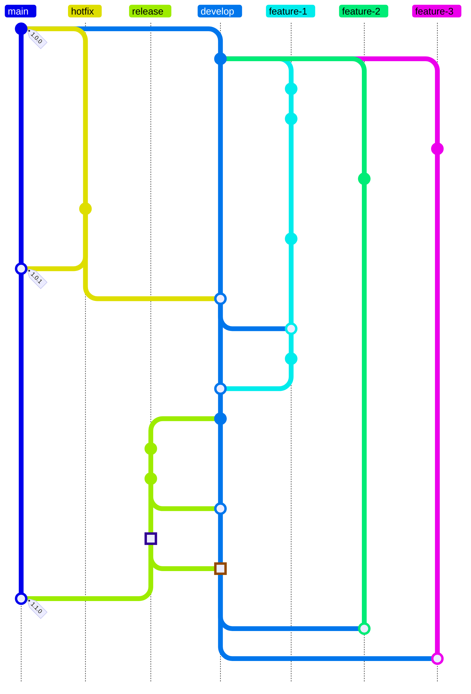
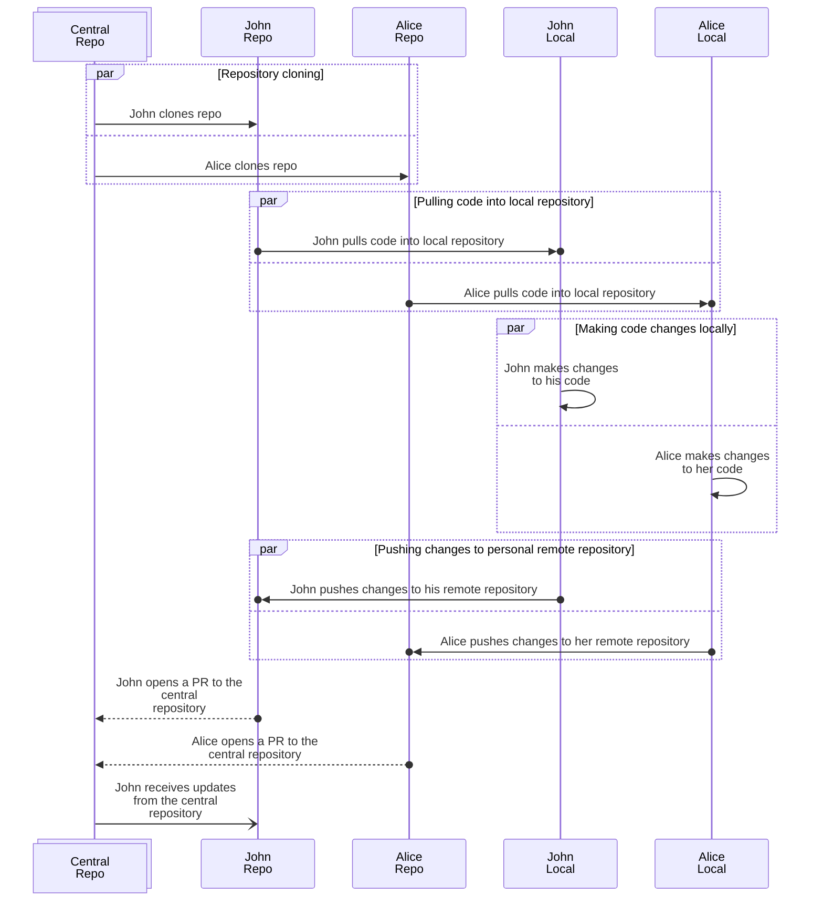
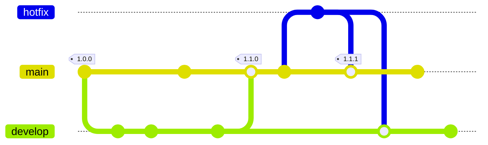
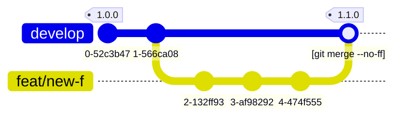
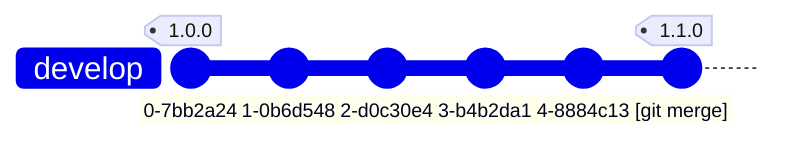
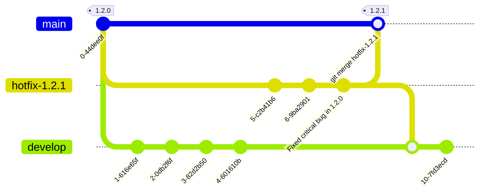

Git Flow is a popular branching model in Git that helps organize the development process and manage application versions. It was [proposed by Vincent Driessen in 2010](https://nvie.com/posts/a-successful-git-branching-model/) and has since become a standard for many development teams.

In short, Git Flow looks like this:



See the link to the diagram code in the Live Mermaid editor below.[^1]

[^1]: You can view the diagram code in the [Live Mermaid editor](https://mermaid.live/edit?gist=https://gist.github.com/Andygol/1bb88ecff3d4deb3c0df074624fa3c83#pako:eNqNVMtugzAQ_BVrzwTZkPDwsa3UVuoxp4qLAxtABYwc01eUfy-POA9EaA5IeGd2dvAY7yGWCQKHxWIRVbGstnnKo4qQNNfPStRZvyCkFkoUBRaPsixzveNkK4odDtguk19D_U1ssDhhvaTRIeuHo1TcU4kWKScRMJvaNIIB2ihRxRnJpN7m30SqBBUnzhWW4CcWsjbg8qiZYfwhG23gq0l50g0azdii0I3CBTNKq0nYMbA3CbsG9kc-TvKXTibex3z3Do4zwxm27g4RNsMpRV4NpRJViiaPi8SY2c3pjb9qmzcwUCdi-19__CkzZ-AqPIUFih2a6NxR-xG-M7gJX0b_f12if2rk5OX1-eWtfdb3a883jgM8dZkE2fmfu3W8poK5cVrnqJ0VsCBVeQJcqwYtaOlttV3CviNHoDMsMYLOWiLUR-fs0PbUonqXsjRtSjZpBry_XCxo6kRofMpFqsSZglUb6aNsKg3ccVmvAXwP38CZz-xgGVDmeizw2Yp5Fvy0LGr7wTL0qes7lNHAOVjw20-ldhB6nuOtQtcPqRO67PAHc7WsQQ)

## Decentralized development {#decentralization-of-development}

[Git](https://git-scm.com/docs/git) has long become the standard for version control systems. Created by Linus Torvalds in 2005, Git allows developers to manage code changes efficiently and collaborate on projects.

> Git was built to work on the Linux kernel, meaning that it was built to handle repositories with tens of millions of lines of code from the start. Speed and performance has always been a primary design goal of Git.
>
> <https://git-scm.com/about>

By nature, Git was designed as a decentralized version control system, meaning every developer has a full copy of the repository, including its history. This allows developers to work independently and exchange changes conveniently. Everything looks fine until the next question appears: how do you organize project work so that it is effective and understandable for everyone? How do you overcome the chaos that can arise with many branches and changes?

### Decentralized centralization {#decentralized-centralization}

So, many developers are working on a project, and each has their own copy of the repository. All these copies are equal. By convention or historical circumstances, one of these copies is recognized as the central code repository where changes from other developers eventually land. This central repository can be hosted on GitHub, GitLab, or your own server. Such a repository is treated as the source of truth. Project members can make changes in their local branches and then send them to the central repository via pull requests or merge requests. This approach preserves a centralized structure where all changes pass through the central repository while still giving each developer the freedom to work independently in their own local copy.



## Main branches {#main-branches}

In Git Flow, there are two main branches: `main` and `develop`. The HEAD of `main` contains the stable code version ready for release. It should always be in a working state and must not contain unfinished changes. The `develop` branch is used to integrate new features and changes. It may contain unfinished work but should remain stable and ready for testing. When the code in `develop` is ready for release, it is merged into `main`, and a new tag is created to mark the version.



## Supporting branches {#supporting-branches}

Along with the main branches, Git Flow defines several supporting branch types used for developing new features, fixing bugs, and preparing releases. These are `feature`, `release`, and `hotfix` branches. Each branch type has its own purpose and usage rules. Technically, these are just regular Git branches, but teams follow conventions about how they are used and merged.

### `feature` branches {#feature-branches}

`feature` branches are used for developing new features or implementing changes. They are created from `develop` and merged back into `develop` after the work is finished. Branches can have arbitrary names, but they usually start with `feature/*` or `feat/*`. Names like `main`, `develop`, `release-*`, or `hotfix-*` should not be used for feature branches, because these names are reserved for other branch types.

Sometimes `feature` branches are called topic branches (`topic`) and used for work that does not necessarily have to be included in the next release. These branches live as long as needed to complete the feature and are eventually merged into `develop` to include the feature in a future release. Or they may be discarded if experiments around the feature are unsuccessful.

Usually, `feature` branches live in developers' repositories rather than in the central repository, since they are temporary.

#### Creating a `feature` branch {#creating-feature-branch}

To work on a new feature, create a `feature` branch from `develop`:

```sh
git checkout -b feature/my-new-feature develop
# or
git switch -c feature/my-new-feature develop
```

#### Merging changes from `feature` to `develop` {#merging-feature-branch}

When feature work is complete, it is merged into `develop` so it can be included in the next release.[^2]

[^2]: Do not forget to update your `feature` branches with the latest changes from `develop` when needed to avoid merge conflicts. You can do this with `git merge develop` or `git rebase develop` from within your `feature` branch before merging into `develop`.

```sh
git checkout develop
# or
git switch develop

git merge --no-ff feature/my-new-feature

git branch -d feature/my-new-feature

git push origin develop
```

The `--no-ff` flag is used to preserve feature branch history in the `develop` branch history, even when the merge could be done with fast-forward. This makes it easier to track which changes belong to a specific feature and simplifies rollback if needed. Compare the two examples below.



_Merge with `git merge --no-ff`_



_Regular merge with `git merge`_

In the second case, since all changes from the `feature` branch can be fast-forwarded into `develop`, the `develop` history does not preserve information that these commits came from a separate feature branch. This can make change tracking and context harder to understand. Using `--no-ff` (the first case) creates a dedicated merge commit, preserving that context.

### `release` branch {#release-branch}

A `release` branch is used to prepare a new version for release. It is created from `develop` when the code is release-ready but still needs final adjustments, such as updating the version number, fixing small bugs, or adjusting the release date. Minor fixes are allowed. After release preparation is complete, the `release` branch is merged into both `main` and `develop`, and a new tag[^tag] is created to mark the version. After that, `develop` is ready to accept changes for the next release.

[^tag]: It is recommended to follow Semantic Versioning conventions for version numbers to ensure a clear and consistent versioning system for your project. See the [Semantic Versioning documentation](https://semver.org/).

The `release` branch is created from `develop` when the state of `develop` matches the intended release state. At this point, all features planned for that release should already be in `develop`. New features intended for later releases should only be merged into `develop` after the `release` branch is created, so they do not affect release stability.

#### Creating a `release` branch {#creating-release-branch}

`release` branches are created from `develop`. For example, suppose the current production version in `main` is `1.1.25` and you want to ship a release with significant changes. The state of `develop` matches what you want to release as `1.2.0`. You create a release branch from `develop` and name it `release-1.2.0`.

```sh
git checkout -b release-1.2.0 develop
# or
git switch -c release-1.2.0 develop
```

Then make the required release-preparation changes, such as updating the version number, fixing minor bugs, or adjusting the release date.

```sh
# Make release-preparation changes
git add .
git commit -m "Prepare release 1.2.0"
```

The `release` branch exists until release preparation is finished. During this time, minor fixes are allowed, but new feature work is not: new features should go into `develop` for future releases.

#### Completing the release process {#completing-release-process}

Once release preparation is complete, merge `release` into both `main` and `develop`, and create a new tag to mark the version. After that, `develop` is ready for next-release work.

Every commit to `main` is considered a new version release by definition. To mark the released version, create a tag[^tag] with the version number. This makes it easy to see which changes are included in each release and simplifies rollback to previous versions if necessary.

```sh
git checkout main
git merge --no-ff release-1.2.0
git tag -a 1.2.0 -m "Release version 1.2.0"
```

At this point, the new version has been released and marked with tag `1.2.0` for future reference.

> You can also use `-s` or `-u` to sign a tag with a GPG key if you want additional security and trust for your releases.

Changes made in `release` must also be merged back into `develop`.

```sh
git checkout develop
git merge --no-ff release-1.2.0
```

This may cause conflicts if `develop` changed after the `release` branch was created. In that case, resolve the conflicts.[^2]

After this step, the release cycle is complete. The `release` branch is no longer needed and can be deleted.

```sh
git branch -d release-1.2.0
```

### `hotfix` branches {#hotfix-branches}

`hotfix` branches are used for urgent fixes of critical bugs in stable code. They are created from `main` when a critical issue is found and needs immediate correction. After applying the fix, the `hotfix` branch is merged into both `main` and `develop`, and a new tag is created to mark the version. This lets you quickly fix production issues without disrupting feature development in `develop`.

`hotfix` branches use names like `hotfix-*`. They are created from the tag in `main` that marks the version where the bug was found. For example, if the bug is in version `1.2.0`, the hotfix branch is created from tag `1.2.0` and named `hotfix-1.2.1`. This allows the team to continue feature development in `develop` while the critical fix is handled in `hotfix`.



#### Creating a `hotfix` branch {#creating-hotfix-branch}

Create a `hotfix` branch from `main`. For example, if the current production version in `main` is `1.2.0` and you need to fix a critical bug in that version, create a hotfix branch from `main` called `hotfix-1.2.1`.

```sh
git checkout -b hotfix-1.2.1 main
# or
git switch -c hotfix-1.2.1 main
```

Do not forget to update the version in code to indicate the bug-fix release.

```sh
# Update version in code
git add .
git commit -m "Bump version to 1.2.1"
```

Then add the actual bug fix in a separate commit.

```sh
# Apply critical bug fix
git add .
git commit -m "Fix critical bug ..."
```

#### Completing the hotfix process {#completing-hotfix-process}

When the bug fix is complete, merge `hotfix` into both `main` and `develop`, and create a new tag to mark the version.

First, merge `hotfix` into `main` and create a tag for the new version.

```sh
git checkout main
git merge --no-ff hotfix-1.2.1
git tag -a 1.2.1 -m "Fix critical bug in version 1.2.0"
```

> You can also use `-s` or `-u` to sign a tag with a GPG key if you want additional security and trust for your releases.

Then merge `hotfix` into `develop` to include the bug fix in the next release.[^2]

```sh
git checkout develop
git merge --no-ff hotfix-1.2.1
```

However, **if you currently have a `release` branch, merge `hotfix` into `release` instead of `develop`**. After the release cycle is completed, `release` is merged into `develop`, so hotfix changes will still end up in `develop`.

Finally, after the hotfix process is complete, delete the `hotfix` branch.

```sh
git branch -d hotfix-1.2.1
```

## Summary {#conclusion}

So, the general Git Flow branch model shown at the beginning of this post is not rocket science. It is simply a set of conventions that helps organize development and version management. These conventions are not mandatory, but they can be very useful for maintaining order and efficiency. It is important to remember that Git Flow is only one of many possible branching models in Git. The right model depends on your project's specific needs and context.

### PS {#ps}

During project development, you can also follow **The Twelve-Factor Manifesto** recommendations for dependency management, configuration, and other engineering concerns to build a more efficient and scalable development and runtime process. You can read more in [the Twelve-Factor documentation](https://andygol.co.ua/12f-app/).
