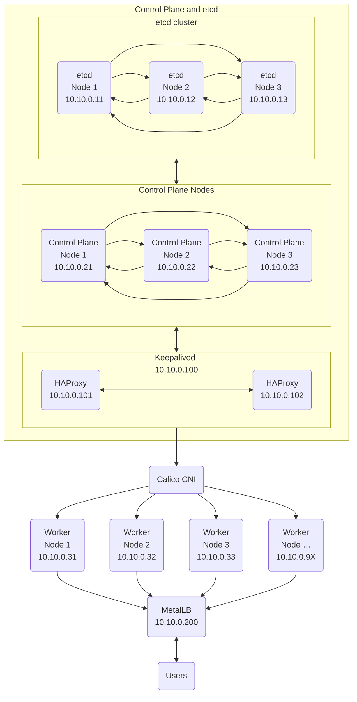

У цьому посібнику ми розглянемо кроки для розгортання високодоступного (High Availability, HA) Kubernetes кластера з зовнішньою топологією розміщення бази даних налаштувань etcd, на локальній машині під керуванням macOS. Ми використаємо Multipass для створення віртуальних машин, cloud-init для їх ініціалізації, kubeadm для ініціалізації кластера, HAProxy як load balancer для вузлів панелі управління, Calico як Container Network Interface ([CNI](https://www.cni.dev)) та [MetalLB для балансування трафіку до робочих вузлів](/uk/blog/2025/12/12/k8s-cluster-with-kubeadm/#step-7-install-metallb).

Цей посібник призначений як для самостійного вивчення, так і для виконання перших кроків розгортання кластера промислового рівня. Кожен крок пояснено детально, з описом компонентів та їх ролей.


## Архітектура кластера {#cluster-architecture}

Високодоступні кластери Kubernetes використовуються в промислових середовищах для забезпечення безперервної роботи застосунків. Резервування ключових компонентів кластера дозволяє уникнути простоїв у разі відмови окремих вузлів управління або etcd.



### Компоненти {#components}

Ми будемо розгортати кластер за допомогою kubeadm на віртуальних машинах Ubuntu, створених Multipass та ініціалізованих з використанням cloud-init.

- **Multipass** — це інструмент для швидкого створення віртуальних машин Ubuntu у хмарному стилі в операційних системах Linux, macOS та Windows. Він надає простий, але потужний інтерфейс командного рядка, який дозволяє швидко отримати доступ до Ubuntu або створити власну локальну мініхмару.

  Локальна розробка та тестування можуть бути складними, але [Multipass](https://multipass.run/) спрощує ці процеси, автоматизуючи процедуру розгортання та згортання інфраструктури. Multipass має бібліотеку готових образів, які можна використовувати для запуску спеціалізованих віртуальних машин або власних віртуальних машин, налаштованих за допомогою потужного інтерфейсу cloud-init.

  Розробники можуть використовувати Multipass для створення прототипів хмарних розгортань та створення нових, налаштованих середовищ розробки Linux на будь-якій машині. Multipass — це найшвидший спосіб для користувачів Mac і Windows отримати командний рядок Ubuntu у своїх системах. Ви також можете використовувати його як пісочницю, щоб випробувати нові речі, не порушуючи роботу хост-машини та не потребуючи подвійного завантаження.

- **Cloud-init** — це загальноприйнятий в галузі метод ініціалізації, присутній в багатьох дистрибутивах, для створення хмарних інстансів на різних платформах. Він підтримується всіма основними постачальниками публічних хмарних послуг, системами забезпечення приватної хмарної інфраструктури та інсталяціями на «голому залізі».

  Під час завантаження [cloud-init](https://cloud-init.io) визначає хмару, в якій працює, і відповідно ініціалізує систему. Хмарні інстанси під час першого завантаження автоматично забезпечуються мережею, сховищем, ключами SSH, пакунками та іншими вже налаштованими системними компонентами.

  Cloud-init забезпечує необхідний звʼязок між запуском хмарного екземпляра та підключенням до нього, щоб він працював як очікується.

  Для користувачів хмари cloud-init забезпечує управління конфігурацією хмарного екземпляра під час першого завантаження без необхідності встановлення потрібних компонентів вручну. Для постачальників хмарних послуг він забезпечує налаштування екземпляра, який можна інтегрувати з вашою хмарою.

  Якщо ви хочете дізнатися більше про те, що таке cloud-init, для чого він потрібен і як працює, прочитайте [детальний опис](https://cloudinit.readthedocs.io/en/latest/explanation/introduction.html#introduction) в його документації.

- **Kubeadm** — інструмент, створений для надання команд `kubeadm init` та `kubeadm join` як найкращих "швидких практичних способів" для створення кластерів Kubernetes.

  [Kubeadm](https://andygol-k8s.netlify.app/uk/docs/reference/setup-tools/kubeadm/) виконує необхідні дії для запуску мінімального життєздатного кластера. За своєю концепцією, він займається лише процесом розгортання кластера, створення екземплярів машин не є його функцією. Встановлення різноманітних додаткових компонентів, таких як Kubernetes Dashboard, засобів моніторингу та специфічних для хмарних середовищ надбудов, також не входить в перелік його завдань.

- **Etcd з топологією зовнішнього розміщення**. [Etcd](https://andygol-etcd.netlify.app/uk/) — це розподілене сховище ключів-значень із високою узгодженістю, яке забезпечує надійний спосіб зберігання даних, до яких потрібно отримати доступ розподіленій системі або кластеру машин. Воно коректно обробляє вибори лідерів під час мережевих розділень і може витримувати відмови машин, навіть вузлів-лідерів.

  Kubernetes використовує etcd для зберігання всієї своєї конфігурації та стану кластера. Це включає інформацію про вузли, поди, конфігурацію мережі, секрети та інші ресурси Kubernetes. Топологія високодоступного кластера Kubernetes передбачає два варіанти розміщення etcd: [топологія etcd зі спільним розміщенням](https://andygol-k8s.netlify.app/uk/docs/setup/production-environment/tools/kubeadm/ha-topology/#stacked-etcd-topology) (stacked) та [зовнішнього розміщення](https://andygol-k8s.netlify.app/uk/docs/setup/production-environment/tools/kubeadm/ha-topology/#external-etcd-topology) (external) учасників кластера etcd. У цьому посібнику ми розглянемо топологію зовнішнього розміщення etcd, де etcd розгортається окремо від вузлів управління Kubernetes. Це забезпечує кращу ізоляцію, масштабованість та гнучкість у керуванні кластером.

- **HAProxy**. Для розподілу трафіку до вузлів панелі управління будемо використовувати балансувальник навантаження [HAProxy](https://www.haproxy.org/). Це дозволить нам забезпечити високу доступність API сервера Kubernetes. Крім того, ми розгорнемо локальні екземпляри HAProxy на кожному вузлі панелі управління для доступу до вузлів кластера etcd.

- **Calico**. Оскільки **kubeadm** не створює мережу, в якій працюють поди, ми скористаємося [Calico](https://projectcalico.org/), популярним інструментом, що реалізує Container Network Interface (CNI) та забезпечує мережеві політики. Це уніфікована платформа для всіх потреб Kubernetes у сфері мережевих технологій, мережевої безпеки та спостережуваності, яка працює з будь-яким дистрибутивом Kubernetes. Calico спрощує забезпечення безпеки мережі за допомогою мережевих політик.

### Топологія кластера {#cluster-topology}



## Попередні вимоги {#prerequisites}

Для розгортання кластера нам знадобляться:

- Локальний компʼютер з встановленим **Multipass**. Для macOS його можна встановити за допомогою `brew install multipass`
- **kubectl** — Інструмент командного рядка Kubernetes, [kubectl](https://andygol-k8s.netlify.app/uk/docs/tasks/tools/#kubectl), дозволяє вам виконувати команди відносно кластерів Kubernetes. Ви можете використовувати kubectl для розгортання застосунків, огляду та управління ресурсами кластера, а також перегляду логів (`brew install kubectl`)
- Знання основ [Kubernetes](https://andygol-k8s.netlify.app/uk/docs/concepts/overview/) та [Linux](https://uk.wikipedia.org/wiki/Linux)
- **yq** ([версія від mikefarah](https://mikefarah.gitbook.io/yq)) — легкий і переносний процесор командного рядка для роботи з YAML, JSON, INI та XML.

## Налаштування SSH ключів {#ssh-key-setup}

Secure Shell, SSH (англ. Secure Shell — «безпечна оболонка») — мережевий протокол, що дозволяє проводити віддалене управління компʼютером. Він шифрує весь трафік, включаючи процес автентифікацій та передачу паролів та секретів. Для доступу до віртуальних машин потрібно налаштувати SSH ключі. Ми будемо використовувати ці ключі для підключення до всіх створених віртуальних машин та передачі між ними файлів.

### Генерування SSH ключа {#generating-an-ssh-key}

Щоб згенерувати пару ключів (публічний та приватний) виконайте наступну команду:

```bash
# Створіть нову пару SSH ключів (якщо у вас немає)
ssh-keygen -t rsa -b 4096 -C "k8s-cluster" -f ~/.ssh/k8s_cluster_key

# Перегляньте публічний ключ
cat ~/.ssh/k8s_cluster_key.pub
```

### Оновлення конфігурацій cloud-init {#updating-cloud-init-configuration}

Отриманий публічний ключ будемо використовувати у файлі `snipets/cloud-init-users.yaml` в секції `ssh-authorized-keys`:

```yaml
users:
  - name: k8sadmin
    ssh_authorized_keys:
      # Замініть на ваш справжній публічний ключ
      - ssh-rsa AAAAB3NzaC1yc2EAAAADAQABAAABAQC...
```

Також можна використовувати підставлення змінних під час виконання

```bash
$ multipass launch --cloud-init - <<EOF
users:
  - name: username
    sudo: ALL=(ALL) NOPASSWD:ALL
    ssh_authorized_keys:
      - $( cat ~/.ssh/id_rsa.pub )
EOF
```

### Доступ до віртуальних машин через SSH {#accessing-virtual-machines-via-ssh}

Після розгортання ми можемо отримати доступ до віртуальних машин за допомогою наступних команд:

```bash
multipass shell <імʼя-vm>
# або
ssh -i ~/.ssh/k8s_cluster_key k8sadmin@<ip-vm>
```

Multipass має вбудовану команду `shell`, яка дозволяє нам підключатися до будь-якої створеної віртуальної машини без необхідності додаткових налаштувань SSH. Однак, вона використовує стандартного користувача `ubuntu`. Якщо ви хочете підʼєднатися як користувач `k8sadmin`, якого ми створимо за допомогою cloud-init, використовуйте `ssh -i ~/.ssh/k8s_cluster_key k8sadmin@<ip-vm>`.

## Підготовка середовища {#environment-preparation}

Створіть теку для проєкту та створіть необхідні файли.

```bash
mkdir k8s-ha-cluster
cd k8s-ha-cluster
```

## Створення скриптів та конфігурацій {#creating-scripts-and-configurations}

### Параметри віртуальних машин {#virtual-machine-parameters}

Для розгортання віртуальних машин нам потрібні наступні параметри:

| Вузол | Кількість | `cpus` | `memory` | `disk` | `network` |
| :-- | :--: | :--: | :-- | :-- | :-- |
| etcd | 3+ або<br>(2n+1)<sup>[[1]][etcd-quorum]</sup> | 2 | 2G | 5G | name=en0,mode=manual |
| панель управління | 3 | 2 | 2.5G | 8G | name=en0,mode=manual |
| робочі вузли | 3+ | 2 | 2G | 10G | name=en0,mode=manual |
| HAProxy+Keepalived | 2 | 1 | 1G | 5G | name=en0,mode=manual |

[etcd-quorum]: https://andygol-etcd.netlify.app/uk/docs/v3.5/faq/#what-is-faulure-tolerance

### Cloud-init конфігурації {#cloud-init-configurations}

Ми будемо використовувати попередньо створені конфігурації віртуальних машин у форматі cloud-init для прискорення їх розгортання.

#### Створення користувача {#user-creation}

Створимо налаштування для користувача `k8sadmin` в `snipets/cloud-init-user.yaml`:

```yaml
# Створимо теку, якщо її ще немає
mkdir -p snipets

cat << EOF > snipets/cloud-init-user.yaml
# Налаштування користувача
users:
  - name: k8sadmin
    sudo: "ALL=(ALL) NOPASSWD:ALL"
    groups: sudo,users,containerd
    homedir: /home/k8sadmin
    shell: /bin/bash
    lock_passwd: false
    ssh_authorized_keys:
      # Ваш SSH key
      - $( cat ~/.ssh/k8s_cluster_key.pub )
EOF
```

Про конфігурацію користувача ми вже говорили в налаштуваннях SSH ключів. Про інші параметри цього розділу можна прочитати в розділі [Including users and groups](https://cloudinit.readthedocs.io/en/latest/reference/examples.html#including-users-and-groups) документації cloud-init.

#### Базова конфігурація для вузлів кластера {#base-configuration-for-cluster-nodes}

Базова конфігурація cloud-init для вузлів нашого кластера буде знаходитись в `snipets/cloud-init-base.yaml`:

```yaml
#cloud-config

# Додамо тут налаштування користувача з snipets/cloud-init-users.yaml

# Команди які виконується на ранній стадії boot для підготовки GPG ключа
bootcmd:
  - mkdir -p /etc/apt/keyrings
  - curl -fsSL https://pkgs.k8s.io/core:/stable:/v1.34/deb/Release.key | gpg --dearmor -o /etc/apt/keyrings/kubernetes-apt-keyring.gpg

# Конфігурація apt репозиторіїв
apt:
  sources:
    kubernetes.list:
      source: "deb [signed-by=/etc/apt/keyrings/kubernetes-apt-keyring.gpg] https://pkgs.k8s.io/core:/stable:/v1.34/deb/ /"

# Оновлення системи
package_update: true
package_upgrade: true
```

Для встановлення компонентів необхідних для роботи кластера нам потрібно [використовувати репозиторій проєкту Kubernetes](https://andygol-k8s.netlify.app/uk/docs/setup/production-environment/tools/kubeadm/install-kubeadm/#k8s-install-0). В [секції `bootcmd`](https://cloudinit.readthedocs.io/en/latest/reference/yaml_examples/boot_cmds.html#run-commands-in-early-boot), яка дуже схожа на `runcmd`, але команди з якої виконуються на самому початку процесу завантаження, ми отримуємо GPG ключ та зберігаємо його в `/etc/apt/keyrings`, а потім додаємо репозиторій Kubernetes до [списку джерел apt](https://cloudinit.readthedocs.io/en/latest/reference/examples.html#additional-apt-configuration-and-repositories) в секції `apt`. Рядки `package_update` та `package_upgrade` забезпечують отримання останніх оновлень системи під час завантаження, що є еквівалентом виконання команд `apt-get update` та `apt-get upgrade`.

У розділі `packages` ми вкажемо всі необхідні пакунки, які потрібно встановити на кожній віртуальній машині кластера.

```yaml
# Встановлення базових пакунків
packages:
  - apt-transport-https
  - ca-certificates
  - curl
  - gnupg
  - lsb-release
  - containerd
  - kubelet
  - kubeadm
  - kubectl # Окрім робочих вузлів
```

Окрім службових пакунків системи ми також [встановимо](https://cloudinit.readthedocs.io/en/latest/reference/examples.html#install-arbitrary-packages) `containerd`, `kubelet`, `kubeadm` та `kubectl`, які є основними компонентами для роботи Kubernetes кластера.

`containerd` — є рушієм виконання контейнерів, який використовується Kubernetes для запуску контейнеризованих застосунків. `kubelet` — це агент, який працює на кожному вузлі в кластері Kubernetes і відповідає за запуск контейнерів у подах. `kubeadm` — це інструмент для швидкого розгортання Kubernetes кластера, а `kubectl` — це інструмент командного рядка для взаємодії з кластером Kubernetes.

```yaml
# Налаштування користувача
users:
  - name: k8sadmin
    groups: sudo,users,containerd
```

Наш користувач є учасником групи `containerd`, яку будемо використовувати для доступу до сокета `/run/containerd/containerd.sock`, щоб уможливити використання `crictl` без потреби використання `sudo`.

Інструкція `write_files` в cloud-init дозволяє [створювати файли з вказаним вмістом](https://cloudinit.readthedocs.io/en/latest/reference/examples.html#writing-out-arbitrary-files) під час ініціалізації віртуальної машини. Скористаємось нею для створення файлів для налаштування модулів ядра для роботи Kubernetes, увімкнення IP форвардингу, створення налаштувань для `crictl` та скрипту яким ми будемо ініціалізувати та запускати `kubelet`. (Дивіться розділ `write_files` у файлі `cloud-init-base.yaml`)

Після того як ми створили всі необхідні файли за допомогою `write_files`, ми можемо [виконати вказані команди](https://cloudinit.readthedocs.io/en/latest/reference/examples.html#run-commands-on-first-boot) для налаштування системи в розділі `runcmd`. Тут ми можемо вказувати команди, які б ми мали виконати вручну після першого завантаження системи. У нашому випадку ми зафіксуємо версії `kubeadm`, `kubelet` та `kubectl`, вимкнемо swap, створимо файл налаштувань для `containerd` та запустимо його, а також активуємо та запустимо службу `kubelet`. (Дивіться розділ `runcmd` у файлі `cloud-init-base.yaml`)

Створіть два файли:

- <a id="cloud-init-config-yaml"></a>`snipets/cloud-init-config.yaml` — для встановлення статичної IP адреси нашим віртуальним машинам

  ```yaml
  cat << EOF > snipets/cloud-init-config.yaml
  #cloud-config
  timezone: Europe/Kyiv

  write_files:
    # Призначення статичної IP адреси
    # Варіант з alias для bridge101 для другого мережевого інтерфесу
    - path: /etc/netplan/60-static-ip.yaml
      # Явним чином вкажемо тип значення
      # permissions: !!str "0755" # https://github.com/canonical/multipass/issues/4176
      permissions: !!str '0600'
      content: |
        network:
          version: 2
          ethernets:
            enp0s2:
              # Тут вказється IP адреса конкретної віртуальної машини
              addresses:
                # - 10.10.0.24/24
              routes:
                - to: 10.10.0.0/24
                  scope: link
  runcmd:
    # Застосування налаштувань для використання статичної IP адреси
    - netplan apply

    # Вибір vim як стандартного редактора (опціонально)
    - update-alternatives --set editor /usr/bin/vim.basic
  EOF
  ```

  ☝️ Також тут вкажемо, що ми хочемо використовувати `vim` як наш стандартний редактор. Якщо ви надаєте перевагу `nano` закоментуйте чи приберіть рядок `- update-alternatives --set editor /usr/bin/vim.basic`

- та, файл `snipets/cloud-init-base.yaml` з базовими налаштуваннями для віртуальних машин кластера

  ```yaml
  cat << 'EOF' > snipets/cloud-init-base.yaml
  # Виконується на ранній стадії boot для підготовки GPG ключа
  bootcmd:
    - mkdir -p /etc/apt/keyrings
    - curl -fsSL https://pkgs.k8s.io/core:/stable:/v1.34/deb/Release.key | gpg --dearmor -o /etc/apt/keyrings/kubernetes-apt-keyring.gpg

  # Конфігурація apt репозиторіїв
  apt:
    sources:
      kubernetes.list:
        source: "deb [signed-by=/etc/apt/keyrings/kubernetes-apt-keyring.gpg] https://pkgs.k8s.io/core:/stable:/v1.34/deb/ /"

  # Оновлення системи
  package_update: true
  package_upgrade: true

  # Встановлення базових пакунків
  packages:
    - apt-transport-https
    - ca-certificates
    - curl
    - gnupg
    - lsb-release
    - containerd
    - kubelet
    - kubeadm
    - kubectl

  write_files:
    #  Налаштування модулів ядра для роботи Kubernetes
    - path: /etc/modules-load.d/k8s.conf
      # permissions: !!str '0644'
      content: |
        overlay
        br_netfilter

    # Увімкнення маршрутизації IPv4 пакетів
    # https://andygol-k8s.netlify.app/uk/docs/setup/production-environment/container-runtimes/#prerequisite-ipv4-forwarding-optional
    - path: /etc/sysctl.d/k8s.conf
      # permissions: !!str '0644'
      content: |
        net.bridge.bridge-nf-call-iptables  = 1
        net.bridge.bridge-nf-call-ip6tables = 1
        net.ipv4.ip_forward                 = 1

    # Додаємо конфіг для crictl
    # https://github.com/containerd/containerd/blob/main/docs/cri/crictl.md#install-crictl
    # https://github.com/kubernetes-sigs/cri-tools/blob/master/docs/crictl.md
    - path: /etc/crictl.yaml
      # permissions: !!str '0644'
      content: |
        runtime-endpoint: unix:///run/containerd/containerd.sock
        image-endpoint: unix:///run/containerd/containerd.sock
        timeout: 10
        debug: false

    # Встановлюємо групу для сокета containerd
    - path: /etc/systemd/system/containerd.service.d/override.conf
      content: |
        [Service]
        ExecStartPost=/bin/sh -c "chgrp containerd /run/containerd/containerd.sock && chmod 660 /run/containerd/containerd.sock"

    # Скрипт для запуску kubelet
    - path: /usr/local/bin/kubelet-start.sh
      permissions: !!str "0755"
      content: |
        #!/bin/bash

        echo "Запуск служби kubelet та очікування готовності (ліміт 300с)..."

        # Вмикаємо та запускаємо службу
        sudo systemctl enable --now kubelet

        WAIT_LIMIT=300       # Максимальний час очікування в секундах
        ELAPSED_TIME=0       # Скільки вже пройшло часу
        SLEEP_INTERVAL=1     # Початковий інтервал (1 секунда)

        while ! systemctl is-active --quiet kubelet; do
            if [ "$ELAPSED_TIME" -ge "$WAIT_LIMIT" ]; then
                echo "-------------------------------------------------------------" >&2
                echo "АВАРІЙНИЙ ВИХІД: kubelet не запустився за $WAIT_LIMIT секунд." >&2
                echo "Останні логи помилок:"                                         >&2
                journalctl -u kubelet -n 20 --no-pager                               >&2
                echo "-------------------------------------------------------------" >&2
                exit 1
            fi

            echo "Очікування kubelet... (минуло $ELAPSED_TIME/$WAIT_LIMIT сек,"
            echo "наступна спроба через ${SLEEP_INTERVAL}с)"

            sleep $SLEEP_INTERVAL

            # Оновлюємо лічильники
            ELAPSED_TIME=$((ELAPSED_TIME + SLEEP_INTERVAL))

            # Збільшуємо інтервал вдвічі для наступного разу (прогресія)
            # Але не робимо інтервал більшим за 20 секунд, щоб не "проспати" готовність
            SLEEP_INTERVAL=$((SLEEP_INTERVAL * 2))
            if [ "$SLEEP_INTERVAL" -gt 20 ]; then
                SLEEP_INTERVAL=20
            fi
        done

        echo "Kubelet успішно запущено за $ELAPSED_TIME секунд. Продовжуємо..."

  runcmd:
    # Фіксація версій пакунків Kubernetes
    - apt-mark hold kubelet kubeadm kubectl

    # Завантаження модулів ядра
    - modprobe overlay
    - modprobe br_netfilter

    # Застосування sysctl параметрів
    - sysctl --system

    # Налаштування containerd
    #
    # Налаштування драйвера cgroup systemd
    # https://andygol-k8s.netlify.app/uk/docs/setup/production-environment/container-runtimes/#containerd-systemd
    # https://github.com/containerd/containerd/blob/main/docs/cri/config.md#cgroup-drivercrictl pull
    #
    # Перевизначення образу пісочниці (pause)
    # https://andygol-k8s.netlify.app/uk/docs/setup/production-environment/container-runtimes/#override-pause-image-containerd

    - mkdir -p /etc/containerd
    - containerd config default | tee /etc/containerd/config.toml
    - sed -i 's|SystemdCgroup = false|SystemdCgroup = true|g; s|sandbox_image = "registry.k8s.io/pause.*"|sandbox_image = "registry.k8s.io/pause:3.10.1"|' /etc/containerd/config.toml
    - [ systemctl, daemon-reload ]
    - [ systemctl, restart, containerd ]
    - [ systemctl, enable, containerd ]

    # Вимкнення swap
    # https://andygol-k8s.netlify.app/uk/docs/concepts/cluster-administration/swap-memory-management/#swap-and-control-plane-nodes
    # https://andygol-k8s.netlify.app/uk/docs/setup/production-environment/tools/kubeadm/install-kubeadm/#swap-configuration
    - swapoff -a
    - sed -i '/ swap / s/^/#/' /etc/fstab

    # Увімкнення kubelet
    - /usr/local/bin/kubelet-start.sh
  EOF
  ```

  Права доступу до файлів, які створює cloud-init, стандартно є `0644`, якщо ви хочете вказати їх явно розкоментуйте відповідні рядки `# permissions: !!str '0644'`. Ми вказуємо тип даних явно (`!!str '0644'`) через проблему описану в тікеті [# 4176](https://github.com/canonical/multipass/issues/4176).

#### Конфігурація для etcd вузлів {#configuration-for-etcd-nodes}

Для вузлів etcd ми будемо використовувати базову конфігурацію з додатковими налаштуваннями, які специфічні для etcd. Створіть файл `snipets/cloud-init-etcd.yaml`:

```yaml
# Розширимо cloud-init-base.yaml наступними налаштуваннями

cat << EOF > snipets/cloud-init-etcd.yaml
write_files:
  # https://andygol-k8s.netlify.app/uk/docs/setup/production-environment/tools/kubeadm/setup-ha-etcd-with-kubeadm/#setup-up-the-cluster
  - path: /etc/systemd/system/kubelet.service.d/kubelet.conf
    content: |
      apiVersion: kubelet.config.k8s.io/v1beta1
      kind: KubeletConfiguration
      authentication:
        anonymous:
          enabled: false
        webhook:
          enabled: false
      authorization:
        mode: AlwaysAllow
      cgroupDriver: systemd
      address: 127.0.0.1
      containerRuntimeEndpoint: unix:///var/run/containerd/containerd.sock
      staticPodPath: /etc/kubernetes/manifests

  - path: /etc/systemd/system/kubelet.service.d/20-etcd-service-manager.conf
    content: |
      [Service]
      ExecStart=
      ExecStart=/usr/bin/kubelet --config=/etc/systemd/system/kubelet.service.d/kubelet.conf
      Restart=always
EOF
```

Будемо використовувати базові налаштування, які ми створили раніше та додамо специфічні для etcd налаштування у розділі `write_files`, де ми створюємо файл конфігурації для `kubelet`, який налаштовує його для роботи з etcd, як про це йдеться в розділі «[Налаштування високодоступного кластера etcd за допомогою kubeadm](https://andygol-k8s.netlify.app/uk/docs/setup/production-environment/tools/kubeadm/setup-ha-etcd-with-kubeadm/#setup-up-the-cluster)» документації Kubernetes.

#### Конфігурація вузла балансувальника HAProxy {#configuring-the-haproxy-balancer-node}

Для вузлів балансувальника навантаження трафіку панелі управління створимо файл `snipets/cloud-init-haproxy.yaml`, який встановлюватиме зі стандартного репозиторію пакунки `haproxy` та `keepalived` та додаватиме налаштування. Для створення віртуальної машини для HAProxy використаємо базові налаштування з `configs/cloud-init-user.yaml` та розширимо їх інструкціями `write_files:` для створення файлу налаштувань балансувальника — `/etc/haproxy/haproxy.cfg`, `/etc/keepalived/keepalived.conf`. (Див. розділ «[Налаштування балансувальника навантаження для вузлів панелі управління (HAProxy+Keepalived)](#налаштування-балансувальника-навантаження-для-вузлів-панелі-управління-haproxykeepalived)»)

### Вибір топології мережі {#choosing-a-network-topology}

Для цієї демонстрації оберемо компактну мережу. (10.10.0.0/24)

```none
10.10.0.0/24      - Головна підмережа (256 адрес)
├─ 10.10.0.1      - Gateway/Bridge (на хост-машині)
├─ 10.10.0.10-19  - etcd (3+ вузли)
├─ 10.10.0.20-29  - Control Plane (3+ masters)
├─ 10.10.0.30-50  - Workers (до 20 workers)
└─ 10.10.0.100    - HAProxy/Keepalived (два вузла 10.10.0.101/10.10.0.102)
```

Щоб задати статичні адреси віртуальним машинам Multipass скористаємось одним з варіантів про який йдеться в статті «[Додавання статичної IP адреси віртуальним машинам Multipass на macOS](/uk/blog/2025/12/26/static-ip-for-multipass-vm/#adding-static-ip-address-to-the-second-network-interface-of-the-virtual-machine)».

У файл cloud-init додамо відповідний розділ з налаштуванням статичної мережевої адреси на другому мережевому інтерфейсі (див. [`snipets/cloud-init-config.yaml`](#cloud-init-config-yaml)).

## Створення etcd кластера {#creating-an-etcd-cluster}

Почнемо зі створення кластера etcd, в якому наш високодоступний кластер Kubernetes буде зберігати налаштування та бажаний стан обʼєктів системи.

### Розгортання першого вузла кластера etcd {#deploying-the-first-node-of-the-etcd-cluster}

Розпочнімо розгортання нашого кластера зі створення першого вузла etcd.

```bash
export VM_IP="10.10.0.11/24"

multipass launch --name ext-etcd-1 \
  --cpus 2 --memory 2G --disk 5G \
  --network name=en0,mode=manual \
  --cloud-init <( yq eval-all '
      # Злиття всіх файлів в один обʼєкт
      . as $item ireduce ({}; . *+ $item) |

      # Вилучення kubectl зі списку пакунків
      del(.packages[] | select(. == "kubectl")) |

      # Оновлення конфігурації мережі
      with(.write_files[] | select(.path == "/etc/netplan/60-static-ip.yaml");
        .content |= (
          from_yaml |
          .network.ethernets.enp0s2.addresses += [strenv(VM_IP)] |
          to_yaml
        )
      ) ' \
      snipets/cloud-init-config.yaml \
      snipets/cloud-init-user.yaml \
      snipets/cloud-init-base.yaml \
      snipets/cloud-init-etcd.yaml )
```

Команда `multipass launch --name ext-etcd-1` почне розгортання віртуальної машини з назвою вказаною в параметрі `--name/-n`, в цьому випадку **ext-etcd-1**; параметри `--cpus 2 --memory 2G --disk 5G` відповідно визначають кількість ядер процесора, памʼяті та дискового простору; `--network name=en0,mode=manual` створить ще один мережевий інтерфейс віртуальної машини, IP адресу якому буде призначено через змінну `VM_IP`.

Оскільки etcd активно пише дані на диск, продуктивність роботи бази даних напряму залежить від продуктивності дискової підсистеми. Для промислового використання наполегливо рекомендуються системи зберігання з SSD. Мінімальний розмір дискового простору стандартно має бути не менше 2Гб, відповідно, для уникнення розміщення даних у свопі розмір оперативної памʼяті має покривати цю квоту. 8Гб є рекомендованим максимумом для звичайних розгортань. Вимоги для машин etcd для невеликих промислових кластерів: 2 vCPU, 8 Гб памʼяті та 50-80Гб SSD. (Див. <https://andygol-etcd.netlify.app/uk/docs/v3.5/op-guide/hardware/#small-cluster>, <https://andygol-etcd.netlify.app/uk/docs/v3.5/faq/#system-requirements>)

Ми зберемо параметри cloud-init на льоту обʼєднуючи наші файли заготовки `snipets/cloud-init-config.yaml`, `snipets/cloud-init-user.yaml`, `snipets/cloud-init-base.yaml`, `snipets/cloud-init-etcd.yaml` за допомогою **yq**.

Якщо ви не створювали тимчасову віртуальну машину для ініціалізації `bridge101` та не [додавали аліас для нього](/uk/blog/2025/12/26/static-ip-for-multipass-vm/#multipass-bridge-for-the-second-network-interface), після розгортання віртуальної машини саме час зробити наступне. Виконайте на вашому хості наступне:

```bash
# Визначте назву bridge. Скоріш за все назва буде bridge101.
ifconfig -v | grep -B 20 "member: vmenet" | grep "bridge" | awk -F: '{print $1}' | tail -n 1

# Додайте адресу
sudo ifconfig bridge101 10.10.0.1/24 alias

# Перевірте що додалось
ifconfig bridge101 | grep "inet "
```

Якщо ви це 👆 зробили після створення тимчасової віртуальної машини, можете її зараз вилучити

```bash
multipass delete <temp-vm> --purge
```

#### Налаштування першого вузла etcd {#configuring-the-first-etcd-node}

Увійдемо до нашого вузла за допомогою SSH.

```bash
ssh -i ~/.ssh/k8s_cluster_key k8sadmin@10.10.0.11
```

Оскільки у нас ще немає сертифікатів ЦС нам потрібно згенерувати їх.

```bash
sudo kubeadm init phase certs etcd-ca
```

Ми отримаємо два файли `ca.crt` та `ca.key` в теці `/etc/kubernetes/pki/etcd/`

<a id="etcd-kubeadmcfg-yaml"></a>Тепер створимо конфігураційний файл для kubeadm `kubeadmcfg.yaml` використавши відповідні значення в змінних `ETCD_HOST` (IP адреса віртуальної машини) та `ETCD_NAME` (її коротка назва). Зверніть увагу на значення змінної `ETCD_INITIAL_CLUSTER_STATE` яка вказує на те що ми створюємо новий кластер etcd. Надалі ми будемо приєднувати до нього інші вузли.

```bash
ETCD_HOST=$(hostname -I | awk '{print $2}')
ETCD_NAME=$(hostname -a)
ETCD_INITIAL_CLUSTER=${ETCD_INITIAL_CLUSTER:-"${ETCD_NAME}=https://${ETCD_HOST}:2380"}
ETCD_INITIAL_CLUSTER_STATE=${ETCD_INITIAL_CLUSTER_STATE:-"new"}
cat << EOF > $HOME/kubeadmcfg.yaml
---
apiVersion: "kubeadm.k8s.io/v1beta4"
kind: InitConfiguration
nodeRegistration:
    name: ${ETCD_NAME}
localAPIEndpoint:
    advertiseAddress: ${ETCD_HOST}
---
apiVersion: "kubeadm.k8s.io/v1beta4"
kind: ClusterConfiguration
etcd:
    local:
        serverCertSANs:
        - "${ETCD_HOST}"
        peerCertSANs:
        - "${ETCD_HOST}"
        extraArgs:
        - name: initial-cluster
          value: ${ETCD_INITIAL_CLUSTER}
        - name: initial-cluster-state
          value: ${ETCD_INITIAL_CLUSTER_STATE}
        - name: name
          value: ${ETCD_NAME}
        - name: listen-peer-urls
          value: https://${ETCD_HOST}:2380
        - name: listen-client-urls
          value: https://${ETCD_HOST}:2379,https://127.0.0.1:2379
        - name: advertise-client-urls
          value: https://${ETCD_HOST}:2379
        - name: initial-advertise-peer-urls
          value: https://${ETCD_HOST}:2380
EOF
```

Використовуючи створений файл `kubeadmcfg.yaml`, який ми помістили в домашню теку користувача `k8sadmin`, виконаємо генерацію сертифікатів etcd та створимо маніфест статичного поду для вузла кластера etcd.

```bash
# 1. Генерація сертифікатів
sudo kubeadm init phase certs etcd-server --config=$HOME/kubeadmcfg.yaml
sudo kubeadm init phase certs etcd-peer --config=$HOME/kubeadmcfg.yaml
sudo kubeadm init phase certs etcd-healthcheck-client --config=$HOME/kubeadmcfg.yaml
sudo kubeadm init phase certs apiserver-etcd-client --config=$HOME/kubeadmcfg.yaml
```

Тепер у нас мають бути в наявності наступні ключі та сертифікати

```none
/home/k8sadmin
└── kubeadmcfg.yaml
---
/etc/kubernetes/pki
├── apiserver-etcd-client.crt
├── apiserver-etcd-client.key
└── etcd
    ├── ca.crt
    ├── ca.key
    ├── healthcheck-client.crt
    ├── healthcheck-client.key
    ├── peer.crt
    ├── peer.key
    ├── server.crt
    └── server.key
```

Після створення відповідних сертифікатів настав час створити маніфест статичного пода. В результаті у нас маєте бути файл `/etc/kubernetes/manifests/etcd.yaml`.

```bash
# 2. Створення маніфесту статичного пода
sudo kubeadm init phase etcd local --config=$HOME/kubeadmcfg.yaml
```

Отримавши маніфест `/etc/kubernetes/manifests/etcd.yaml` `kubelet` вузла має підхопити його, викачати образ контейнера та запустити под з `etcd`, після чого перший вузол нашого кластера має відповідати на проби справності

```bash
crictl exec $(crictl ps --label io.kubernetes.container.name=etcd --quiet) etcdctl \
   --cert /etc/kubernetes/pki/etcd/peer.crt \
   --key /etc/kubernetes/pki/etcd/peer.key \
   --cacert /etc/kubernetes/pki/etcd/ca.crt \
   --endpoints https://10.10.0.11:2379 \
   endpoint health -w table
```

```console
+-------------------------+--------+------------+-------+
|        ENDPOINT         | HEALTH |    TOOK    | ERROR |
+-------------------------+--------+------------+-------+
| https://10.10.0.11:2379 |   true | 7.777048ms |       |
+-------------------------+--------+------------+-------+
```

### Розгортання наступних вузлів кластера etcd {#deploying-subsequent-etcd-cluster-nodes}

Для розгортання наступних вузлів кластера etcd: `ext-etcd-2`, `ext-etcd-3` й так далі (за потреби) змінимо значення `VM_IP` на `"10.10.0.12/24"` та імʼя віртуальної машини в параметрі `--name` на `ext-etcd-2` відповідно.

```bash
export VM_IP="10.10.0.12/24"

multipass launch --name ext-etcd-2 \
  --cpus 2 --memory 2G --disk 5G \
  --network name=en0,mode=manual \
  --cloud-init <( yq eval-all '
      # Злиття всіх файлів в один обʼєкт
      . as $item ireduce ({}; . *+ $item) |

      # Вилучення kubectl зі списку пакунків
      del(.packages[] | select(. == "kubectl")) |

      # Оновлення конфігурації мережі
      with(.write_files[] | select(.path == "/etc/netplan/60-static-ip.yaml");
        .content |= (
          from_yaml |
          .network.ethernets.enp0s2.addresses += [strenv(VM_IP)] |
          to_yaml
        )
      ) ' \
      snipets/cloud-init-config.yaml \
      snipets/cloud-init-user.yaml \
      snipets/cloud-init-base.yaml \
      snipets/cloud-init-etcd.yaml )
```

Після завершення розгортання вузла перевіримо чи є у нас SSH доступ до нього:

```bash
ssh -i ~/.ssh/k8s_cluster_key k8sadmin@10.10.0.12 -- ls -la
```

#### Налаштування вузлів etcd та їх приєднання до кластера {#configuring-etcd-nodes-and-joining-them-to-the-cluster}

На нашому вузлі etcd `ext-etcd-1`, який вже працює, виконаємо наступну команду для отримання інструкцій для приєднання вузла `ext-etcd-2` до кластера etcd. Після команди `member add` вкажемо назву вузла, який потрібно приєднати, а в параметрі `--peer-urls` шлях до нього

```bash
crictl exec $(crictl ps --label io.kubernetes.container.name=etcd --quiet) etcdctl \
   --cert /etc/kubernetes/pki/etcd/peer.crt \
   --key /etc/kubernetes/pki/etcd/peer.key \
   --cacert /etc/kubernetes/pki/etcd/ca.crt \
   --endpoints https://10.10.0.11:2379 \
   member add ext-etcd-2 --peer-urls=https://10.10.0.12:2380
```

`etcdctl` зареєструє нового учасника кластера etcd, а у відповідь ми отримаємо його ID та рядок `"ext-etcd-1=https://10.10.0.11:2380,ext-etcd-2=https://10.10.0.12:2380"` з повним переліком вузлів кластера (разом з новим членом)

```console
Member e3e9330902f761c3 added to cluster 3f0c3972eda275cb

ETCD_NAME="ext-etcd-2"
ETCD_INITIAL_CLUSTER="ext-etcd-1=https://10.10.0.11:2380,ext-etcd-2=https://10.10.0.12:2380"
ETCD_INITIAL_ADVERTISE_PEER_URLS="https://10.10.0.12:2380"
ETCD_INITIAL_CLUSTER_STATE="existing"
```

#### Створення kubeadmcfg.yaml {#creating-kubeadmcfgyaml}

[Створіть файл налаштувань `~/kubeadmcfg.yaml`](#etcd-kubeadmcfg-yaml) на вузлі `ext-etcd-2` замінивши значення змінних на ті що ви тільки що отримали після виконання команди `… member add …`.

Наступним обовʼязковим кроком є копіювання файлів ЦС з `ext-etcd-1` на `ext-etcd-2`. Для зручності кроки з перенесення файлів ЦС було обʼєднано в скрипт який потрібно створити на вашій хост машині.

```bash
cat << 'EOF' > copy-etcd-ca.sh
#!/bin/bash

# --- Стандартні налаштування (змініть під себе) ---
DEFAULT_KEY="~/.ssh/k8s_cluster_key"
DEFAULT_SRC="10.10.0.11"
DEFAULT_DEST="10.10.0.12"
USER="k8sadmin"
CERT_PATH="/etc/kubernetes/pki/etcd"

# --- Присвоєння аргументів ---
# $1 - перший аргумент (хост-джерело), $2 - другий (хост-призначення), $3 - третій (шлях до ключа)
SRC_HOST=${1:-$DEFAULT_SRC}
DEST_HOST=${2:-$DEFAULT_DEST}
KEY=${3:-$DEFAULT_KEY}

echo "Використовуються параметри:"
echo "  Джерело:     ${SRC_HOST}"
echo "  Призначення: ${DEST_HOST}"
echo "  SSH Ключ:    ${KEY}"
echo "---------------------------------------"

# 1. Підготовка файлів на джерелі
echo "[1/4] Підготовка файлів на ${SRC_HOST}..."
ssh -i "${KEY}" "${USER}@${SRC_HOST}" "sudo cp $CERT_PATH/ca.* /tmp/ && sudo chown ${USER}:${USER} /tmp/ca.*" || exit 1

# 2. Передача файлів між хостами
echo "[2/4] Копіювання з ${SRC_HOST} на $DEST_HOST..."
scp -i "${KEY}" "${USER}@${SRC_HOST}:/tmp/ca.*" "${USER}@$DEST_HOST:/tmp/" || exit 1

# 3. Розміщення файлів на цільовому хості
echo "[3/4] Розміщення файлів на $DEST_HOST..."
ssh -i "${KEY}" "${USER}@$DEST_HOST" "sudo mkdir -p $CERT_PATH && sudo mv /tmp/ca.* $CERT_PATH/ && sudo chown root:root $CERT_PATH/ca.* && sudo chmod 600 $CERT_PATH/ca.key" || exit 1

# 4. Очищення
echo "[4/4] Видалення тимчасових файлів..."
ssh -i "${KEY}" "${USER}@${SRC_HOST}" "rm /tmp/ca.*"

echo "Файли ca.crt та ca.key успішно перенесено з ${SRC_HOST} до $DEST_HOST"
EOF

chmod +x copy-etcd-ca.sh
```

Виконайте перенесення файлів ЦС з хосту `10.10.0.11` до `10.10.0.12` командою (вкажіть ваші параметри за потреби):

```bash
./сopy-etcd-ca.sh 10.10.0.11 10.10.0.12
```

Тепер згенеруємо файли ключів та сертифікатів використовуючи створений файл `kubeadmcfg.yaml` на вузлі `ext-etcd-2`.

```bash
# 1. Генерація сертифікатів
sudo kubeadm init phase certs etcd-server --config=$HOME/kubeadmcfg.yaml
sudo kubeadm init phase certs etcd-peer --config=$HOME/kubeadmcfg.yaml
sudo kubeadm init phase certs etcd-healthcheck-client --config=$HOME/kubeadmcfg.yaml
sudo kubeadm init phase certs apiserver-etcd-client --config=$HOME/kubeadmcfg.yaml
```

Після створення необхідних файлів ключів та сертифікатів для другого вузла etcd видалимо файл з приватним ключем ЦС `/etc/kubernetes/pki/etcd/ca.key`, він тут більше не потрібен.

```bash
# 2. Видаляємо /etc/kubernetes/pki/etcd/ca.key
sudo rm -f /etc/kubernetes/pki/etcd/ca.key
```

Тепер коли ми маємо потрібні сертифікати на своїх місцях створимо маніфест для розгортання статичного пода.

```bash
sudo kubeadm init phase etcd local --config=$HOME/kubeadmcfg.yaml
```

Через хвилину-дві переглянемо перелік вузлів нашого кластера etcd

```bash
crictl exec $(crictl ps --label io.kubernetes.container.name=etcd --quiet) etcdctl \
  --cert /etc/kubernetes/pki/etcd/peer.crt \
  --key /etc/kubernetes/pki/etcd/peer.key \
  --cacert /etc/kubernetes/pki/etcd/ca.crt \
  --endpoints https://10.10.0.11:2379  member list -w table
```

```console
+------------------+---------+------------+-------------------------+-------------------------+------------+
|        ID        | STATUS  |    NAME    |       PEER ADDRS        |      CLIENT ADDRS       | IS LEARNER |
+------------------+---------+------------+-------------------------+-------------------------+------------+
| 86041dd24c0806ff | started | ext-etcd-1 | https://10.10.0.11:2380 | https://10.10.0.11:2379 |      false |
| e3e9330902f761c3 | started | ext-etcd-2 | https://10.10.0.12:2380 | https://10.10.0.12:2379 |      false |
+------------------+---------+------------+-------------------------+-------------------------+------------+
```

Для додавання наступного вузла кластера повторіть ті ж самі кроки що й для `ext-etcd-2`. Звертайте увагу на те що змінна `ETCD_INITIAL_CLUSTER_STATE` повинна мати значення `"existing"`, а в змінній `ETCD_INITIAL_CLUSTER` для створення `~/kubeadmcfg.yaml` на вузлі `ext-etcd-3` потрібно буде зазначити всі вузли, які мають бути членами кластера. Для вузла `ext-etcd-3` з IP `10.10.0.13` ця змінна матиме наступний вигляд:

```bash
ETCD_INITIAL_CLUSTER="ext-etcd-1=https://10.10.0.11:2380,ext-etcd-2=https://10.10.0.12:2380,ext-etcd-3=https://10.10.0.13:2380"
ETCD_INITIAL_CLUSTER_STATE="existing"
```

#### Скасування приєднання вузла до кластера {#canceling-node-joining-to-the-cluster}

Якщо ви з будь-яких причин не хочете приєднувати вузол до кластера etcd, вам потрібно скасувати попередню команду приєднання. Для цього треба видалити цей вузол зі списку членів кластера за його **ID**. Навіть якщо вузол ще не запущений, він вже зареєстрований в кластері в стані `unstarted`.

Знайдіть ID потрібного вузла. Його можна знайти у першому рядку виводу команди приєднання, або ж через отримання списку всіх членів кластера:

```bash
crictl exec $(crictl ps --label io.kubernetes.container.name=etcd --quiet) etcdctl \
   --cert /etc/kubernetes/pki/etcd/peer.crt \
   --key /etc/kubernetes/pki/etcd/peer.key \
   --cacert /etc/kubernetes/pki/etcd/ca.crt \
   --endpoints https://10.10.0.11:2379 \
   member list
```

У виводі ви побачите рядок, який виглядає приблизно так: \
`62f5145363dbf1b5, unstarted, ext-etcd-2, https://10.10.0.12:2380, ...`

або в табличному вигляді

```console
+------------------+-----------+------------+-------------------------+-------------------------+------------+
|        ID        |  STATUS   |    NAME    |       PEER ADDRS        |      CLIENT ADDRS       | IS LEARNER |
+------------------+-----------+------------+-------------------------+-------------------------+------------+
| 167ef81a292916d4 |   started | ext-etcd-2 | https://10.10.0.12:2380 | https://10.10.0.12:2379 |      false |
| 62f5145363dbf1b5 | unstarted |            | https://10.10.0.14:2380 |                         |      false |
| 86041dd24c0806ff |   started | ext-etcd-1 | https://10.10.0.11:2380 | https://10.10.0.11:2379 |      false |
| ba9a6c0afb514fec |   started | ext-etcd-3 | https://10.10.0.13:2380 | https://10.10.0.13:2379 |      false |
+------------------+-----------+------------+-------------------------+-------------------------+------------+
```

Скопіюйте ID (тут, `62f5145363dbf1b5`) і виконайте команду видалення:

```bash
etcdctl \
   --cert /etc/kubernetes/pki/etcd/peer.crt \
   --key /etc/kubernetes/pki/etcd/peer.key \
   --cacert /etc/kubernetes/pki/etcd/ca.crt \
   --endpoints https://10.10.0.11:2379 \
   member remove <ID_ВУЗЛА>
```

💡 Так само відбувається видалення будь-якого вузла з переліку членів кластера. Якщо ви хочете замінити один вузол кластера іншим — спочатку видаліть "старий" вузол, після чого виконайте приєднання нового вузла.

**Чому це важливо?**

Якщо ви просто залишите вузол у статусі `unstarted`, etcd буде постійно намагатися з ним звʼязатися, що може призвести до збільшення затримок (latency) або проблем із досягненням кворуму в майбутньому.

**Порада**: Перед повторною спробою приєднання переконайтеся, що на новому вузлі (10.10.0.12) видалено стару теку даних etcd (data-dir), щоб він міг почати синхронізацію "з чистого аркуша" як новий член кластера.

#### Видалення data-dir {#removing-data-dir}

Шлях до теки даних (data-dir) залежить від того, як саме встановлено etcd (через kubeadm чи як окремий сервіс).

1. Якщо etcd працює як Static Pod (найчастіший випадок, kubeadm)

   Перегляньте маніфест пода на вузлі, де etcd вже працює:

   ```bash
   grep "data-dir" /etc/kubernetes/manifests/etcd.yaml
   ```

   Зазвичай стандартний шлях у такому разі: **`/var/lib/etcd`**

2. Якщо etcd працює як системний сервіс (Systemd)

   Якщо ви встановлювали etcd вручну або через бінарні файли, перевірте конфігурацію сервісу:

   ```bash
   systemctl cat etcd | grep data-dir
   ```

   Або подивіться у файлі конфігурації (якщо він є): `/etc/etcd/etcd.conf`.

3. Перевірка через інформацію про запущені процеси

   Ви можете побачити шлях безпосередньо в аргументах запущеного процесу:

   ```bash
   ps -ef | grep etcd | grep data-dir
   ```

Коли ви видалите помилковий запис про вузол (як описано вище) і захочете спробувати знову:

- Очистіть теку на вузлі перед його повторним запуском

  ```bash
  rm -rf /var/lib/etcd/*
  ```

  _Зауваження: Переконайтеся, що ви видаляєте дані саме на потрібному вузлі._

- **Перевірте права доступу**: Після очищення переконайтеся, що користувач, від якого працює etcd (зазвичай `etcd` або `root`), має права на запис у цю теку.

## Налаштування балансувальника навантаження для вузлів панелі управління (HAProxy+Keepalived) {#configuring-the-load-balancer-for-control-plane-nodes-haproxykeepalived}

У кластері Kubernetes з HA-архітектурою **балансувальник має бути піднятий ДО ініціалізації першого вузла панелі управління**.

Це "правило першої цеглини": ми не можемо побудувати стіну, якщо не визначили, де вона стоятиме. `controlPlaneEndpoint` — це точка входу, яка має бути доступною з першої секунди життя кластера.

Порядок дій, якому ми будемо слідувати:

1. **Розгорнемо HAProxy+Keepalived (10.10.0.100)**
   - Не обовʼязково треба мати "живі" бекенди (вузли панелі управління) у цей момент, але балансувальник має слухати порт 6443 і бути доступним в мережі.
2. **Додамо вузли панелі управління в конфіг HAProxy.**
   - Ми ще не запустили на першому вузлі `kubeadm init`, але додамо його та IP інших вузлів у бекенди HAProxy.
3. **Запустимо `kubeadm init` на першому вузлі панелі управління.**
   - Коли `kubeadm` спробує "постукати" на `10.10.0.100:6443`, балансувальник переспрямує цей запит на цей самий перший вузол (де API-сервер щойно піднявся), і операція ініціалізації завершиться успішно.
4. **Приєднаємо інші вузли Control Plane.**
   - Використаємо `kubeadm join ... --control-plane`.

### Тимчасовий "хак" (якщо не має можливості підняти HAProxy зараз) {#temporary-hack-if-you-cant-set-up-haproxy-right-now}

Якщо у вас не має можливості розгорнути окрему машину для балансувальника прямо зараз, ви можете застосувати "маневр з IP-адресою":

- **Тимчасово призначте IP 10.10.0.100 першому вузлу Control Plane** як додаткову (через alias).
- Виконайте `kubeadm init`. Система побачить "себе" за цією адресою і завершить налаштування.
- Пізніше, коли ви розгорнете справжній HAProxy, перенесіть цей IP туди.

### Створення налаштувань HAProxy+Keepalived {#configuring-haproxykeepalived}

Для того щоб зробити наш балансувальник дійсно відмовостійким (High Availability), необхідно налаштувати **Keepalived**. Він дозволить двом вузлам **HAProxy** спільно використовувати одну "перехідну" IP-адресу (Virtual IP — VIP).

#### Налаштування Netplan {#netplan-configuration}

Залишимо адресу `10.10.0.100` для Keepalived, а в розділі мережевих налаштувань віртуальної машини HAProxy (у нас їх буде дві) зробимо наступне:

```yaml
  - path: /etc/netplan/60-static-ip.yaml
    permissions: !!str '0600'
    content: |
      network:
        version: 2
        ethernets:
          enp0s2:
            addresses:
              - 10.10.0.101/24 # Реальна IP вузла LB1 (для другого буде .102)
            routes:
              - to: 10.10.0.0/24
                scope: link
```

вкажемо адресу `10.10.0.101` для основного балансувальника, а `10.10.0.102` — для резервного.

#### Конфігурація Keepalived {#keepalived-configuration}

Додамо наступний блок у `write_files`. Ця конфігурація змусить Keepalived стежити за станом HAProxy і передавати VIP іншому вузлу, якщо сервіс або машина впаде.

```yaml
write_files:
  - path: /etc/keepalived/keepalived.conf
    content: |
      vrrp_script check_haproxy {
          script "killall -0 haproxy" # Перевірка, чи живий процес
          interval 2
          weight 2
      }

      vrrp_instance VI_1 {
          state MASTER              # На другому вузлі вкажіть BACKUP
          interface enp0s2          # Назва вашого інтерфейсу
          virtual_router_id 51      # Має бути однаковим для обох LB
          priority 101              # На другому вузлі вкажіть 100
          advert_int 1

          authentication {
              auth_type PASS
              auth_pass k8s_secret  # Спільний пароль
          }

          virtual_ipaddress {
              10.10.0.100/24        # Ваша VIP адреса для Cluster Endpoint
          }

          track_script {
              check_haproxy
          }
      }
```

#### Налаштування ядра (Sysctl) {#kernel-configuration-sysctl}

Щоб HAProxy міг "сісти" на IP-адресу `10.10.0.100`, яка йому ще не належить (поки Keepalived не підняв її), потрібно дозволити `nonlocal_bind`.

Додамо це у `write_files`:

```yaml
write_files:
  - path: /etc/sysctl.d/99-kubernetes-lb.conf
    content: |
      net.ipv4.ip_nonlocal_bind = 1
```

І додамо команди в `runcmd` для застосування:

```yaml
runcmd:
  - sysctl --system
  - netplan apply
  - systemctl enable --now haproxy
  - systemctl enable --now keepalived
```

#### Як це працює разом {#how-it-works-together}

1. **HAProxy** слухає на порту 6443, але він "бачить" лише трафік, який приходить на VIP `10.10.0.100`.
2. **Keepalived** тримає адресу `10.10.0.100` на активному вузлі (MASTER).
3. Коли ми запускаємо `kubeadm init --control-plane-endpoint "10.10.0.100:6443"`, запит іде на VIP -> потрапляє в HAProxy -> перенаправляється на перший доступний вузол Control Plane.
4. Якщо перший балансувальник вимкнеться, другий (BACKUP) миттєво забере собі IP `10.10.0.100`, і наш кластер Kubernetes продовжить роботу без розриву зʼєднання.

Для розгортання відмовостійкого балансувальника нам потрібно скласти до купи налаштування з:

- `snipets/cloud-init-config.yaml` — налаштування часового поясу, та мережеві налаштування
- `snipets/cloud-init-user.yaml` – будемо використовувати користувача **k8sadmin**, у якого групу `containerd` замінимо на `haproxy`
- `snipets/cloud-init-lb.yaml` – налаштування специфічні для розгортання та запуску вузлів балансувальника

Створимо `snipets/cloud-init-lb.yaml`

```yaml
cat << 'EOF' > snipets/cloud-init-lb.yaml

package_update: true
package_upgrade: true

packages:
  - haproxy
  - keepalived

write_files:
  - path: /etc/sysctl.d/99-haproxy.conf
    content: |
      net.ipv4.ip_nonlocal_bind = 1

  - path: /etc/haproxy/haproxy.cfg
    content: |
      global
          log /dev/log local0
          user haproxy
          group haproxy
          daemon
          stats socket /run/haproxy/admin.sock mode 660 level admin

      defaults
          log     global
          mode    tcp
          option  tcplog
          timeout connect 5000
          timeout client  50000
          timeout server  50000

      frontend k8s-api
          bind *:6443
          default_backend k8s-api-backend

      backend k8s-api-backend
          balance roundrobin
          option tcp-check
          timeout server 2h
          timeout client 2h
          # Тут ми прописуємо відомі нам параметри вузлів панелі управління
          server cp-1 10.10.0.21:6443 check check-ssl verify none fall 3 rise 2
          server cp-2 10.10.0.22:6443 check check-ssl verify none fall 3 rise 2
          server cp-3 10.10.0.23:6443 check check-ssl verify none fall 3 rise 2

      listen stats
          bind *:8404
          mode http
          stats enable
          stats uri /stats

  - path: /etc/keepalived/keepalived.conf
    content: |
      vrrp_script check_haproxy {
          script "killall -0 haproxy"
          interval 2
          weight 2
      }
      vrrp_instance VI_1 {
          state ${LB_STATE} # для lb1 буде MASTER, для lb2 буде BACKUP
          interface enp0s2
          virtual_router_id 51
          priority ${LB_PRIORITY} # для lb1 буде 101, для lb2 буде 100
          advert_int 1
          authentication {
              auth_type PASS
              auth_pass k8s_pwd # значення k8s_pwd потрібно замінити на найдійніший пароль
          }
          virtual_ipaddress {
              ${LB_IP} # загальна адреса балансувальника 10.10.0.100/24
          }
          track_script {
              check_haproxy
          }
      }

runcmd:
  - sysctl --system
  - systemctl enable --now haproxy
  - systemctl enable --now keepalived
EOF
```

### Розгортання HAProxy+Keepalived {#deploying-haproxykeepalived}

Створимо віртуальні машини для HAProxy+Keepalived:

Для створення відмовостійкого балансувальника нам знадобиться дві майже ідентичних команди для запуску. Основна різниця між ними полягає в налаштуваннях Keepalived (`state` та `priority`) та індивідуальних IP-адресах вузлів.

Запустимо перший вузол балансувальника

```bash
# Реальна IP адреса для інтерфейсу (netplan)
export VM_IP="10.10.0.101/24"

# Параметри для keepalived.conf
export LB_IP="10.10.0.100/24"
export LB_STATE="MASTER"
export LB_PRIORITY="101"

multipass launch --name lb1 \
  --cpus 1 --memory 1G --disk 5G \
  --network name=en0,mode=manual \
  --cloud-init <(yq eval-all '
    # 1. Злиття всіх файлів в один обʼєкт
    . as $item ireduce ({}; . *+ $item) |

    # 2. Виконання netplan apply після sysctl
    .runcmd |= (
      filter(. != "netplan apply") |
      (to_entries | .[] | select(.value == "sysctl --system") | .key) as $idx |
      .[:$idx+1] + ["netplan apply"] + .[$idx+1:]
    ) |
    .runcmd[].headComment = "" |

    # 3. Заміна групи користувача
    with(.users[] | select(.name == "k8sadmin");
      .groups |= sub("containerd", "haproxy")
    ) |

    # 4. Налаштування IP для застосування через Netplan
    with(.write_files[] | select(.path == "/etc/netplan/60-static-ip.yaml");
      .content |= (from_yaml | .network.ethernets.enp0s2.addresses += [strenv(VM_IP)] | to_yaml)
    ) |

    # 5. Заміна змінних ${LB_...} у всіх файлах write_files
    with(.write_files[];
      .content |= sub("\${LB_STATE}", strenv(LB_STATE)) |
      .content |= sub("\${LB_PRIORITY}", strenv(LB_PRIORITY)) |
      .content |= sub("\${LB_IP}", strenv(LB_IP))
    )
  ' \
  snipets/cloud-init-config.yaml \
  snipets/cloud-init-user.yaml \
  snipets/cloud-init-lb.yaml)
```

І другий вузол балансувальника

```bash
# Реальна IP адреса для інтерфейсу (netplan)
export VM_IP="10.10.0.102/24"

# Параметри для keepalived.conf
export LB_IP="10.10.0.100/24"
export LB_STATE="BACKUP"
export LB_PRIORITY="100"

multipass launch --name lb2 \
  --cpus 1 --memory 1G --disk 5G \
  --network name=en0,mode=manual \
  --cloud-init <(yq eval-all '
    # 1. Злиття всіх файлів в один обʼєкт
    . as $item ireduce ({}; . *+ $item) |

    # 2. Виконання netplan apply після sysctl
    .runcmd |= (
      filter(. != "netplan apply") |
      (to_entries | .[] | select(.value == "sysctl --system") | .key) as $idx |
      .[:$idx+1] + ["netplan apply"] + .[$idx+1:]
    ) |
    .runcmd[].headComment = "" |

    # 3. Заміна групи користувача
    with(.users[] | select(.name == "k8sadmin");
      .groups |= sub("containerd", "haproxy")
    ) |

    # 4. Налаштування IP для застосування через Netplan
    with(.write_files[] | select(.path == "/etc/netplan/60-static-ip.yaml");
      .content |= (from_yaml | .network.ethernets.enp0s2.addresses += [strenv(VM_IP)] | to_yaml)
    ) |

    # 5. Заміна змінних ${LB_...} у всіх файлах write_files
    with(.write_files[];
      .content |= sub("\${LB_STATE}", strenv(LB_STATE)) |
      .content |= sub("\${LB_PRIORITY}", strenv(LB_PRIORITY)) |
      .content |= sub("\${LB_IP}", strenv(LB_IP))
    )
  ' \
  snipets/cloud-init-config.yaml \
  snipets/cloud-init-user.yaml \
  snipets/cloud-init-lb.yaml)
```

Після запуску перевіримо наявність IP `10.10.0.100`.

Зайдемо на будь-яку машину і перевіримо, чи зʼявилася адреса `10.10.0.100`:

```bash
multipass exec lb1 -- ip addr show enp0s2
```

#### Що робити після запуску? {#what-to-do-after-launch}

- **Перевірити статистику**: Відкриємо в оглядачі `http://10.10.0.100:8404/stats`. Ми побачимо, що бекенди (наші вузли панелі управління) позначені червоним (бо вони ще не ініціалізовані) — це нормально.

- **Запуск Kubernetes**: Тепер ми можемо запустити `kubeadm init` на першому вузлі Control Plane. Оскільки VIP `10.10.0.100` вже активний і HAProxy слухає порт `6443`, помилка тайм-ауту не виникне.

## Розгортання Control Plane {#deploying-the-control-plane}

Зберемо налаштування cloud-init для розгортання вузлів нашої панелі управління. Вони будуть схожі на той що ми використовували для створення вузлів etcd але з деякими відмінностями.

Відповідно до [рекомендацій](https://andygol-k8s.netlify.app/uk/docs/setup/production-environment/tools/kubeadm/install-kubeadm/#before-you-begin) виділимо вузлу панелі управління не менше ніж 2 ядра процесора та 2ГБ оперативної памʼяті. Для першого вузла панелі управління будемо використовувати IP адресу `10.10.0.21`. Також встановимо HAProxy як локальний балансувальник навантаження для доступу до вузлів etcd.

### Налаштування локального балансувальника навантаження для доступу до вузлів etcd {#configuring-a-local-load-balancer-for-access-to-etcd-nodes}

Для доступу до вузлів etcd розгорнемо локальний балансувальник навантаження. Кожен API-сервер буде звертатись до свого балансувальника навантаження (`127.0.0.1:2379`). Такий підхід називається **"Sidecar Load Balancing"** (або локальний проксі). Він забезпечує максимальну відмовостійкість: навіть якщо мережу між вузлами почне "штормити", кожен API-сервер матиме свій локальний шлях до etcd.

Оскільки ми робимо це для кластера Kubernetes, найкращий спосіб реалізувати це — використати [Static Pods](https://andygol-k8s.netlify.app/uk/docs/tasks/configure-pod-container/static-pod/). Керівник вузла (kubelet) сам запускатиме та підтримуватиме HAProxy.

#### Підготовка конфігурації HAProxy {#preparing-the-haproxy-configuration}

Для вузлів панелі управління створимо файл з налаштуваннями HAProxy `/etc/haproxy-lbaas/haproxy.cfg` для балансування трафіку до вузлів etcd

```yaml
cat << EOF > snipets/cloud-init-cp-haproxy.yaml
write_files:
  # Налаштування HAProxy для доступу до вузів etcd
  - path: /etc/haproxy-lbaas/haproxy.cfg
    content: |
      global
          log /dev/log local0
          user haproxy
          group haproxy

      defaults
          log global
          mode tcp
          option tcplog
          timeout connect 5000ms
          timeout client 50000ms
          timeout server 50000ms

      frontend etcd-local
          bind 127.0.0.1:2379
          description "Local proxy for etcd cluster"
          default_backend etcd-cluster

      backend etcd-cluster
          option tcp-check
          # Важливо: використовуємо roundrobin для розподілу навантаження
          balance roundrobin
          server etcd-1 10.10.0.11:2379 check inter 2000 rise 2 fall 3
          server etcd-2 10.10.0.12:2379 check inter 2000 rise 2 fall 3
          server etcd-3 10.10.0.13:2379 check inter 2000 rise 2 fall 3
EOF
```

#### Створення Static Pod для HAProxy {#creating-a-static-pod-for-haproxy}

Змусимо `kubelet` запустити HAProxy. Створімо маніфест у теці статичних подів (стандартно це `/etc/kubernetes/manifests/`).

Створимо файл `/etc/kubernetes/manifests/etcd-proxy.yaml` з маніфестом статичного пода HAProxy:

```yaml
cat << EOF > snipets/cloud-init-cp-haproxy-manifest.yaml
write_files:
  # Маніфест статичного пода HAProxy для балансування трафіку до вузлів etcd
  - path: /etc/kubernetes/manifests/etcd-haproxy.yaml
    content: |
      apiVersion: v1
      kind: Pod
      metadata:
        name: etcd-haproxy
        namespace: kube-system
        labels:
          component: etcd-haproxy
          tier: control-plane
      spec:
        containers:
        - name: etcd-haproxy
          image: haproxy:2.8-alpine # Використовуємо легкий образ
          resources:
            requests:
              cpu: 100m
              memory: 100Mi
          volumeMounts:
          - name: haproxy-config
            mountPath: /usr/local/etc/haproxy/haproxy.cfg
            readOnly: true
        hostNetwork: true # Важливо: под має бачити 127.0.0.1 хоста
        volumes:
        - name: haproxy-config
          hostPath:
            path: /etc/haproxy-lbaas/haproxy.cfg
            type: File
EOF
```

#### Створення першого вузла панелі управління {#deploying-the-first-control-panel-node}

Створимо перший вузол панелі управління `cp-1` з IP `10.10.0.21/24`

```bash
export VM_IP="10.10.0.21/24"

multipass launch --name cp-1 \
  --cpus 2 --memory 2.5G --disk 8G \
  --network name=en0,mode=manual \
  --cloud-init <( yq eval-all '
      # Злиття всіх файлів в один обʼєкт
      . as $item ireduce ({}; . *+ $item) |

      # Оновлення конфігурації мережі
      with(.write_files[] | select(.path == "/etc/netplan/60-static-ip.yaml");
        .content |= (
          from_yaml |
          .network.ethernets.enp0s2.addresses += [strenv(VM_IP)] |
          to_yaml
        )
      ) ' \
      snipets/cloud-init-config.yaml \
      snipets/cloud-init-user.yaml \
      snipets/cloud-init-base.yaml \
      snipets/cloud-init-cp-haproxy.yaml \
      snipets/cloud-init-cp-haproxy-manifest.yaml)
```

Після створення вузла панелі управління скопіюємо наступні файли з будь-якого вузла etcd на **перший вузол** панелі управління (цього не треба буде робити для інших вузлів панелі управління впродовж перших двох годин після ініціалізації допоки Секрет з ключами не буде вилучений системою).

```bash
# 1. Підготуємо файли на початковому вузлі (10.10.0.11):
# Копіюємо у тимчасову теку і змінюємо власника на поточного користувача, щоб scp міг їх прочитати
ssh -i ~/.ssh/k8s_cluster_key k8sadmin@10.10.0.11 " \
  mkdir -p /tmp/cert/ && \
  sudo cp /etc/kubernetes/pki/etcd/ca.crt /tmp/cert/ && \
  sudo cp /etc/kubernetes/pki/apiserver-etcd-client.* /tmp/cert/ && \
  sudo chown k8sadmin:k8sadmin /tmp/cert/* "

# 2. Перенесення файлів між вузлами через ваш локальний термінал:
# Використовуємо лапки для обробки wildcards (*) на віддаленому боці
scp -i ~/.ssh/k8s_cluster_key -r 'k8sadmin@10.10.0.11:/tmp/cert/' 'k8sadmin@10.10.0.21:/tmp'

# 3. Розміщення файлів на цільовому вузлі (10.10.0.21):
# Створюємо теку (якщо її немає), переміщуємо файли і повертаємо права root
ssh -i ~/.ssh/k8s_cluster_key k8sadmin@10.10.0.21 " \
  sudo mkdir -p /etc/kubernetes/pki/etcd/ && \
  sudo mv /tmp/cert/ca.crt /etc/kubernetes/pki/etcd/ && \
  sudo chown root:root /etc/kubernetes/pki/etcd/ca.crt && \
  sudo mv /tmp/cert/apiserver-etcd-client.* /etc/kubernetes/pki/ && \
  sudo chown root:root /etc/kubernetes/pki/apiserver-etcd-client.*"

# 4. Очищення тимчасових файлів:
ssh -i ~/.ssh/k8s_cluster_key k8sadmin@10.10.0.11 "rm -rf /tmp/cert"
ssh -i ~/.ssh/k8s_cluster_key k8sadmin@10.10.0.21 "rm -rf /tmp/cert"
```

#### Перевірка використання Static Pods HAProxy {#checking-the-use-of-static-pods-haproxy}

Ми поклали маніфест `etcd-proxy.yaml` у `/etc/kubernetes/manifests/`. Проте `kubelet` ігнорує цю теку, доки не отримає команду на запуск (це відбудеться після ініціалізації вузла панелі управління).

Крім того, на етапі `preflight` команда `kubeadm` намагається перевірити доступність etcd **до того**, як почне працювати будь-який компонент кластера. Оскільки наш HAProxy має працювати як Pod, він ще не запущений, порт `127.0.0.1:2379` закритий — і ми отримаємо `connection refused` під час спроби ініціалізації вузла панелі управління.

```log
[preflight] Running pre-flight checks
	[WARNING ExternalEtcdVersion]: Get "https://127.0.0.1:2379/version": dial tcp 127.0.0.1:2379: connect: connection refused
```

Після ініціалізації вузла панелі управління є кілька способів перевірити працездатність звʼязку з etcd через локальний HAProxy:

1. **Перевірка через cURL (найшвидший спосіб)**

   Оскільки ми використовуємо TLS, нам знадобляться сертифікати, які ми вже підготували для kubeadm. Спробуємо звернутися до etcd через локальний порт:

   ```bash
   sudo curl --cacert /etc/kubernetes/pki/etcd/ca.crt \
        --cert /etc/kubernetes/pki/apiserver-etcd-client.crt \
        --key /etc/kubernetes/pki/apiserver-etcd-client.key \
        https://127.0.0.1:2379/health
   ```

   **Очікуваний результат:** `{"health":"true"}`. Якщо у нас є ця відповідь, значить HAProxy успішно прокидає трафік до одного з вузлів нашого кластера etcd.

2. **Перевірка стану Static Pod**

   Перевіримо, чи взагалі запустився контейнер HAProxy. Оскільки `kubectl` може не працювати, якщо etcd недоступний, використовуйте інструмент середовища виконання контейнерів (в нашому випадку crictl):

   ```bash
   # Для containerd (стандарт для сучасних K8s)
   sudo crictl ps | grep etcd-haproxy

   # Перегляд логів проксі
   sudo crictl logs $(sudo crictl ps -q --name etcd-haproxy)
   ```

   У логах HAProxy ви мають бути записи про успішні перевірки справності (Health check passed) для бекенд-вузлів 10.10.0.11, .12, .13.

3. **Перевірка через системні сокети**

   Переконаймося, що HAProxy дійсно слухає порт 2379 на локальному інтерфейсі:

   ```bash
   sudo ss -tulpn | grep 2379
   ```

   Ми маємо побачити, що процес (haproxy) слухає `127.0.0.1:2379`.

### Налаштування kubeadm {#configuring-kubeadm}

Створимо на першому візлі в домашній теці користувача `k8sadmin` файл `kubeadm-config.yaml` для ініціалізації панелі управління

```bash
ssh -i ~/.ssh/k8s_cluster_key k8sadmin@10.10.0.21 "cat << 'EOF' > \$HOME/kubeadm-config.yaml
---
apiVersion: kubeadm.k8s.io/v1beta4
kind: ClusterConfiguration
kubernetesVersion: \"v1.34.3\"
controlPlaneEndpoint: \"10.10.0.100:6443\"
etcd:
  external:
    endpoints:
      - https://127.0.0.1:2379
    caFile: /etc/kubernetes/pki/etcd/ca.crt
    certFile: /etc/kubernetes/pki/apiserver-etcd-client.crt
    keyFile: /etc/kubernetes/pki/apiserver-etcd-client.key
networking:
  serviceSubnet: \"10.96.0.0/16\"
  podSubnet: \"10.244.0.0/16\"
  dnsDomain: \"cluster.local\"
EOF"
```

### Запуск ініціалізації та оминання перевірки ExternalEtcdVersion {#starting-initialization-and-bypassing-externaletcdversion-verification}

Коли `kubeadm init` починає роботу він намагається перевірити доступ до зовнішнього кластера etcd. Однак ми «завернули» доступ до кластера у локальний HAProxy, який `kubelet` запускає як статичний под. Однак на цей момент у нас ще не запущено `kube-apiserver` який візьме на себе керування `kubelet`, який своєю чергою запустить под з `haproxy`. Тому нам потрібно вимкнути "передполітні перевірки" для etcd (`--ignore-preflight-errors=ExternalEtcdVersion`). Для ініціалізації кластера на вузлі панелі управління виконайте наступну команду:

```bash
sudo kubeadm init \
  --config $HOME/kubeadm-config.yaml \
  --upload-certs \
  --ignore-preflight-errors=ExternalEtcdVersion
```

**На що звернути увагу під час ініціалізації:**

Після запуску команди стежте за етапом `[control-plane] Creating static pod manifest for "kube-apiserver"`. Якщо API-сервер успішно запуститься, це означатиме, що він зміг підключитися до `etcd` через ваш локальний проксі.

**Якщо команда знову зупиниться на помилці**, перевірте, чи не залишилося в системі процесів від попередніх спроб:

```bash
# Якщо потрібно повністю скинути стан перед новою спробою
sudo kubeadm reset -f
# Після reset треба буде знову перезапустити kubelet, щоб піднявся проксі
sudo systemctl restart kubelet
```

За нормальних обставин ви побачите наступний лог роботи `kubeadm init`

<details markdown="1">
<summary><strong>Подивитись лог</strong></summary>

```log
[init] Using Kubernetes version: v1.34.3
[preflight] Running pre-flight checks
	[WARNING ExternalEtcdVersion]: Get "https://127.0.0.1:2379/version": dial tcp 127.0.0.1:2379: connect: connection refused
[preflight] Pulling images required for setting up a Kubernetes cluster
[preflight] This might take a minute or two, depending on the speed of your internet connection
[preflight] You can also perform this action beforehand using 'kubeadm config images pull'
[certs] Using certificateDir folder "/etc/kubernetes/pki"
[certs] Generating "ca" certificate and key
[certs] Generating "apiserver" certificate and key
[certs] apiserver serving cert is signed for DNS names [cp-1 kubernetes kubernetes.default kubernetes.default.svc kubernetes.default.svc.cluster.local] and IPs [10.96.0.1 192.168.2.176 10.10.0.100]
[certs] Generating "apiserver-kubelet-client" certificate and key
[certs] Generating "front-proxy-ca" certificate and key
[certs] Generating "front-proxy-client" certificate and key
[certs] External etcd mode: Skipping etcd/ca certificate authority generation
[certs] External etcd mode: Skipping etcd/server certificate generation
[certs] External etcd mode: Skipping etcd/peer certificate generation
[certs] External etcd mode: Skipping etcd/healthcheck-client certificate generation
[certs] External etcd mode: Skipping apiserver-etcd-client certificate generation
[certs] Generating "sa" key and public key
[kubeconfig] Using kubeconfig folder "/etc/kubernetes"
[kubeconfig] Writing "admin.conf" kubeconfig file
[kubeconfig] Writing "super-admin.conf" kubeconfig file
[kubeconfig] Writing "kubelet.conf" kubeconfig file
[kubeconfig] Writing "controller-manager.conf" kubeconfig file
[kubeconfig] Writing "scheduler.conf" kubeconfig file
[control-plane] Using manifest folder "/etc/kubernetes/manifests"
[control-plane] Creating static Pod manifest for "kube-apiserver"
[control-plane] Creating static Pod manifest for "kube-controller-manager"
[control-plane] Creating static Pod manifest for "kube-scheduler"
[kubelet-start] Writing kubelet environment file with flags to file "/var/lib/kubelet/kubeadm-flags.env"
[kubelet-start] Writing kubelet configuration to file "/var/lib/kubelet/instance-config.yaml"
[patches] Applied patch of type "application/strategic-merge-patch+json" to target "kubeletconfiguration"
[kubelet-start] Writing kubelet configuration to file "/var/lib/kubelet/config.yaml"
[kubelet-start] Starting the kubelet
[wait-control-plane] Waiting for the kubelet to boot up the control plane as static Pods from directory "/etc/kubernetes/manifests"
[kubelet-check] Waiting for a healthy kubelet at http://127.0.0.1:10248/healthz. This can take up to 4m0s
[kubelet-check] The kubelet is healthy after 501.932756ms
[control-plane-check] Waiting for healthy control plane components. This can take up to 4m0s
[control-plane-check] Checking kube-apiserver at https://192.168.2.176:6443/livez
[control-plane-check] Checking kube-controller-manager at https://127.0.0.1:10257/healthz
[control-plane-check] Checking kube-scheduler at https://127.0.0.1:10259/livez
[control-plane-check] kube-controller-manager is healthy after 1.515332016s
[control-plane-check] kube-scheduler is healthy after 19.381430245s
[control-plane-check] kube-apiserver is healthy after 21.504025006s
[upload-config] Storing the configuration used in ConfigMap "kubeadm-config" in the "kube-system" Namespace
[kubelet] Creating a ConfigMap "kubelet-config" in namespace kube-system with the configuration for the kubelets in the cluster
[upload-certs] Storing the certificates in Secret "kubeadm-certs" in the "kube-system" Namespace
[upload-certs] Using certificate key:
7a088e936453ab3143f25cdb9827b8cac60888c75f91b9d6c2d08d23a32a2bc9
[mark-control-plane] Marking the node cp-1 as control-plane by adding the labels: [node-role.kubernetes.io/control-plane node.kubernetes.io/exclude-from-external-load-balancers]
[mark-control-plane] Marking the node cp-1 as control-plane by adding the taints [node-role.kubernetes.io/control-plane:NoSchedule]
[bootstrap-token] Using token: z28v5d.4vm6rzekoibear23
[bootstrap-token] Configuring bootstrap tokens, cluster-info ConfigMap, RBAC Roles
[bootstrap-token] Configured RBAC rules to allow Node Bootstrap tokens to get nodes
[bootstrap-token] Configured RBAC rules to allow Node Bootstrap tokens to post CSRs in order for nodes to get long term certificate credentials
[bootstrap-token] Configured RBAC rules to allow the csrapprover controller automatically approve CSRs from a Node Bootstrap Token
[bootstrap-token] Configured RBAC rules to allow certificate rotation for all node client certificates in the cluster
[bootstrap-token] Creating the "cluster-info" ConfigMap in the "kube-public" namespace
[kubelet-finalize] Updating "/etc/kubernetes/kubelet.conf" to point to a rotatable kubelet client certificate and key
[addons] Applied essential addon: CoreDNS
[addons] Applied essential addon: kube-proxy

Your Kubernetes control-plane has initialized successfully!

To start using your cluster, you need to run the following as a regular user:

  mkdir -p $HOME/.kube
  sudo cp -i /etc/kubernetes/admin.conf $HOME/.kube/config
  sudo chown $(id -u):$(id -g) $HOME/.kube/config

Alternatively, if you are the root user, you can run:

  export KUBECONFIG=/etc/kubernetes/admin.conf

You should now deploy a pod network to the cluster.
Run "kubectl apply -f [podnetwork].yaml" with one of the options listed at:
  https://kubernetes.io/docs/concepts/cluster-administration/addons/

You can now join any number of control-plane nodes running the following command on each as root:

  kubeadm join 10.10.0.100:6443 --token z28v5d.4vm6rzekoibear23 \
	--discovery-token-ca-cert-hash sha256:4c23033729b477d1fc30ae4b4041fe7dae70fa8defd5ecb57c571e969e00f8e0 \
	--control-plane --certificate-key 7a088e936453ab3143f25cdb9827b8cac60888c75f91b9d6c2d08d23a32a2bc9

Please note that the certificate-key gives access to cluster sensitive data, keep it secret!
As a safeguard, uploaded-certs will be deleted in two hours; If necessary, you can use
"kubeadm init phase upload-certs --upload-certs" to reload certs afterward.

Then you can join any number of worker nodes by running the following on each as root:

kubeadm join 10.10.0.100:6443 --token z28v5d.4vm6rzekoibear23 \
	--discovery-token-ca-cert-hash sha256:4c23033729b477d1fc30ae4b4041fe7dae70fa8defd5ecb57c571e969e00f8e0
```

</details><br>

Після запуску ініціалізації з ігноруванням помилок, нам важливо переконатися, що API-сервер дійсно зміг підключитися до бази даних, а не просто "висить" у стані очікування.

**Головна перевірка: Стан API-сервера**

Якщо `kubeadm init` пройшов далі етапу preflight, він спробує запустити `kube-apiserver`. Якщо API-сервер не може звʼязатися з etcd через наш проксі, він буде постійно перезавантажуватися.

Перевіримо логи API-сервера:

```bash
sudo tail -f /var/log/pods/kube-system_kube-apiserver-*/kube-apiserver/*.log
```

<details markdown="1">
<summary><strong>Подивитись лог API-сервера</strong></summary>

```bash
k8sadmin@cp-1:~$ sudo tail -f /var/log/pods/kube-system_kube-apiserver-cp-1_70e58895431aff7a0cb441009519f1c6/kube-apiserver/0.log
2026-01-07T11:10:20.602046303+02:00 stderr F W0107 09:10:20.601902       1 logging.go:55] [core] [Channel #359 SubChannel #360]grpc: addrConn.createTransport failed to connect to {Addr: "127.0.0.1:2379", ServerName: "127.0.0.1:2379", BalancerAttributes: {"<%!p(pickfirstleaf.managedByPickfirstKeyType={})>": "<%!p(bool=true)>" }}. Err: connection error: desc = "transport: authentication handshake failed: context canceled"
2026-01-07T11:10:20.617773217+02:00 stderr F W0107 09:10:20.617570       1 logging.go:55] [core] [Channel #363 SubChannel #364]grpc: addrConn.createTransport failed to connect to {Addr: "127.0.0.1:2379", ServerName: "127.0.0.1:2379", BalancerAttributes: {"<%!p(pickfirstleaf.managedByPickfirstKeyType={})>": "<%!p(bool=true)>" }}. Err: connection error: desc = "transport: Error while dialing: dial tcp 127.0.0.1:2379: operation was canceled"
2026-01-07T11:10:20.634721419+02:00 stderr F W0107 09:10:20.634607       1 logging.go:55] [core] [Channel #367 SubChannel #368]grpc: addrConn.createTransport failed to connect to {Addr: "127.0.0.1:2379", ServerName: "127.0.0.1:2379", BalancerAttributes: {"<%!p(pickfirstleaf.managedByPickfirstKeyType={})>": "<%!p(bool=true)>" }}. Err: connection error: desc = "transport: authentication handshake failed: context canceled"
2026-01-07T11:10:20.644114716+02:00 stderr F W0107 09:10:20.644002       1 logging.go:55] [core] [Channel #371 SubChannel #372]grpc: addrConn.createTransport failed to connect to {Addr: "127.0.0.1:2379", ServerName: "127.0.0.1:2379", BalancerAttributes: {"<%!p(pickfirstleaf.managedByPickfirstKeyType={})>": "<%!p(bool=true)>" }}. Err: connection error: desc = "transport: Error while dialing: dial tcp 127.0.0.1:2379: operation was canceled"
2026-01-07T11:10:20.662781139+02:00 stderr F W0107 09:10:20.662426       1 logging.go:55] [core] [Channel #375 SubChannel #376]grpc: addrConn.createTransport failed to connect to {Addr: "127.0.0.1:2379", ServerName: "127.0.0.1:2379", BalancerAttributes: {"<%!p(pickfirstleaf.managedByPickfirstKeyType={})>": "<%!p(bool=true)>" }}. Err: connection error: desc = "transport: Error while dialing: dial tcp 127.0.0.1:2379: operation was canceled"
2026-01-07T11:10:20.675026234+02:00 stderr F W0107 09:10:20.674872       1 logging.go:55] [core] [Channel #379 SubChannel #380]grpc: addrConn.createTransport failed to connect to {Addr: "127.0.0.1:2379", ServerName: "127.0.0.1:2379", BalancerAttributes: {"<%!p(pickfirstleaf.managedByPickfirstKeyType={})>": "<%!p(bool=true)>" }}. Err: connection error: desc = "transport: authentication handshake failed: context canceled"
2026-01-07T11:10:20.860920026+02:00 stderr F W0107 09:10:20.860664       1 logging.go:55] [core] [Channel #383 SubChannel #384]grpc: addrConn.createTransport failed to connect to {Addr: "127.0.0.1:2379", ServerName: "127.0.0.1:2379", BalancerAttributes: {"<%!p(pickfirstleaf.managedByPickfirstKeyType={})>": "<%!p(bool=true)>" }}. Err: connection error: desc = "transport: Error while dialing: dial tcp 127.0.0.1:2379: operation was canceled"
2026-01-07T11:11:10.4594371+02:00 stderr F I0107 09:11:10.459184       1 controller.go:667] quota admission added evaluator for: replicasets.apps
2026-01-07T11:19:59.613078541+02:00 stderr F I0107 09:19:59.612638       1 cidrallocator.go:277] updated ClusterIP allocator for Service CIDR 10.96.0.0/16
```

</details><br>

Цей лог свідчить про дуже важливий етап: наш `kube-apiserver` **успішно запустився**, але процес ініціалізації пройшов через "боротьбу" за звʼязок з etcd.

Ось що сталося:

1. **Етап помилок (Handshake failed)**

   Перші рядки логу показують помилки: `transport: authentication handshake failed: context canceled та dial tcp 127.0.0.1:2379: operation was canceled`.

   Це означає що:

   - API-сервер намагався підключитися до вашого HAProxy (`127.0.0.1:2379`).
   - Зʼєднання встановлювалося, але TLS-рукостискання (handshake) обривалося.

   **Причина**: Це відбувалося в той самий момент, коли `kubeadm` ще генерував або підкладав сертифікати, або коли HAProxy ще не встиг встановити стабільну сесію з бекенд-вузлами etcd. Це нормальна поведінка під час "холодного" старту панелі управління.

2. **Етап успіху (Стабілізація)**

   Зверніть увагу на останні рядки: `I0107 09:11:10.459184 ... quota admission added evaluator for: replicasets.apps`, `I0107 09:19:59.612638 ... updated ClusterIP allocator for Service CIDR 10.96.0.0/16`

   Це перемога:

   - **API-сервер живий**. Якби він не зміг підключитися до etcd, він би просто завершив роботу з помилкою (CrashLoopBackOff) і ви б не побачили логів про `cidrallocator`.

   Повідомлення про `ClusterIP allocator` означає, що API-сервер вже почав записувати дані в etcd і керувати ресурсами кластера.

   Інтервал між записами (10 хвилин) показує стабільну фонову роботу контролерів.

3. **Стан компонентів**

   Те, що ви бачите теки для `kube-controller-manager` та `kube-scheduler` у `/var/log/pods/`, підтверджує, що `kubeadm` успішно пройшов фазу створення маніфестів і всі три основні компоненти Control Plane запущені.

   ```bash
   k8sadmin@cp-1:~$ sudo ls -la /var/log/pods/
   total 28
   drwxr-x---  7 root root   4096 Jan  8 22:23 .
   drwxr-xr-x 11 root syslog 4096 Jan  8 22:23 ..
   drwxr-xr-x  3 root root   4096 Jan  8 22:23 kube-system_etcd-haproxy-cp-1_e2b3a81fe56706e845a17ba096c5dfad
   drwxr-xr-x  3 root root   4096 Jan  8 22:23 kube-system_kube-apiserver-cp-1_e74afa6943effdf6bbdcfc384bd87bb6
   drwxr-xr-x  3 root root   4096 Jan  8 22:23 kube-system_kube-controller-manager-cp-1_b635ba5e5439cc2c581bf61ca1e6fb9e
   drwxr-xr-x  3 root root   4096 Jan  8 22:23 kube-system_kube-proxy-9qh54_9e21026d-0d6e-4f8c-a071-842149ffd24e
   drwxr-xr-x  3 root root   4096 Jan  8 22:23 kube-system_kube-scheduler-cp-1_0cf013b3f4c49c84241ee3a56735a15d
   ```

**Що перевірити зараз?**

Оскільки API-сервер відповідає, виконайте наступні команди, щоб остаточно переконатися в справності першого вузла:

1. **Перевірка вузлів**: `kubectl get nodes` (_Ви маєте побачити cp-1 у статусі NotReady — це нормально, бо ми ще не встановили Calico_).

2. **Перевірка працездатності проксі (через HAProxy)**: `kubectl get --raw /healthz/etcd` (_Має повернути `ok`_).

3. **Перевірка точок доступу etcd**: `kubectl describe pod kube-apiserver-cp-1 -n kube-system | grep etcd` (**Переконайтеся, що там фігурує лише `https://127.0.0.1:2379`**).

4. **Перевірка HAProxy**: перейдіть за посиланням <http://10.10.0.100:8404/stats> в інфопанель балансувальника навантаження панелі управління (_В розділі k8s-api-backend статус першого вузла панелі управління має бути UP_)

Далі рекомендується розгорнути CNI-втулок для мережі подів.

## Встановлення Calico {#installing-calico}

Для створення мережі подів скористаємось Calico. Стаття «[Install Calico networking and network policy for on-premises deployments](https://docs.tigera.io/calico/latest/getting-started/kubernetes/self-managed-onprem/onpremises)» докладно описує процес встановлення Calico на власному обладнані.

Ми будемо використовувати Tigera Operator та визначення власних ресурсів (CRDs, custom resource definitions). Застосуємо  наступні два маніфести:

```bash
kubectl create -f https://raw.githubusercontent.com/projectcalico/calico/v3.31.3/manifests/operator-crds.yaml
kubectl create -f https://raw.githubusercontent.com/projectcalico/calico/v3.31.3/manifests/tigera-operator.yaml
```

Після чого завантажимо файл з власними ресурсами потрібними для налаштування Calico.

```bash
curl -O https://raw.githubusercontent.com/projectcalico/calico/v3.31.3/manifests/custom-resources-bpf.yaml
```

та вкажемо CIDR мережі подів таке саме, що ми його вказали під час ініціалізації першого вузла панелі управління — `10.244.0.0/16` (стандартне значення в Calico — `cidr: 192.168.0.0/16`).

Після внесення змін застосуємо маніфест для встановлення Calico

```bash
kubectl create -f custom-resources-bpf.yaml
```

Відстежуватимемо встановлення за допомогою команді `watch kubectl get tigerastatus`. Через кілька хвилин (6-7 хвилин) усі компоненти Calico будуть мати значення `True` у стовпці `AVAILABLE`.

```console
NAME                            AVAILABLE   PROGRESSING   DEGRADED   SINCE
apiserver                       True        False         False      4m9s
calico                          True        False         False      3m29s
goldmane                        True        False         False      3m39s
ippools                         True        False         False      6m4s
kubeproxy-monitor               True        False         False      6m15s
whisker                         True        False         False      3m19s
```

Як тільки компоненти Calico стануть доступними, вузол панелі управління перейде в стан `READY`.

### Що роботи спочатку: розгортати Calico чи виконувати kubeadm join? {#what-to-do-first-deploy-calico-or-run-kubeadm-join}

Технічно можна і так, і так, але варіант №1 (CNI перед Join) є кращою практикою.

#### Варіант 1: Спершу CNI, потім Join (Рекомендовано) {#option-1-cni-first-then-join-recommended}

Коли ви встановлюєте CNI одразу після ініціалізації першого вузла (`cp-1`), мережа кластера стає робочою негайно.

- **Статус Node**: Перший вузол швидко переходить у стан `Ready`.
- **CoreDNS**: Поди CoreDNS, які зазвичай висять у стані `Pending` без мережі, запускаються.
- **Приєднання нових вузлів**: Коли ви приєднуєте `cp-2` та `cp-3`, вони одразу отримують мережеві налаштування. Системні поди на нових вузлах зможуть швидше почати комунікацію між собою.
- **Зручність**: Ви бачите реальний стан справності кожного нового вузла одразу після його приєднання.

#### Варіант 2: Спершу Join, потім CNI {#option-2-join-first-then-cni}

Це теж робочий сценарій, але він виглядає більш "тривожно" під час процесу.

- **Статус Node**: Усі вузли (`cp-1`, `cp-2`, `cp-3`) будуть у стані `NotReady`.
- **CoreDNS**: Всі системні мережеві компоненти будуть чекати.
- **Приєднання**: `kubeadm join` пройде успішно, оскільки для самого процесу приєднання (TLS Bootstrap та копіювання конфігів) CNI не потрібен — тут використовується фізична мережа між вузлами.
- **Ризики**: Якщо під час приєднання виникне проблема з мережевою комунікацією самих подів (наприклад, health-checks системних компонентів), вам буде складніше зрозуміти — чи це проблема `join`, чи просто відсутність CNI.

Рекомендується дотримуватися наступного порядку:

1. `kubeadm init` на **cp-1**.
2. Потрібні налаштування `kubeconfig`.
3. **Встановлення CNI** (наприклад, Cilium, Calico або Flannel).
4. Перевірка `kubectl get nodes` (має бути `Ready`).
5. Перенесення сертифікатів на нові вузли (за потреби).
6. `kubeadm join` для **cp-2** та **cp-3**.

## Розгортання та приєднання наступних вузлів панелі управління {#deploying-and-joining-the-subsequent-control-panel-nodes}

Скористаймось вже готовою командою для першого вузла панелі управління. Замінимо IP адресу на відповідну для кожного вузла:

- **cp-2.yaml** — `10.10.0.22`
- **cp-3.yaml** — `10.10.0.23`

Створимо віртуальні машини:

```bash
export VM_IP="10.10.0.22/24"

multipass launch --name cp-2 \
  --cpus 2 --memory 2.5G --disk 8G \
  --network name=en0,mode=manual \
  --cloud-init <( yq eval-all '
      # Злиття всіх файлів в один обʼєкт
      . as $item ireduce ({}; . *+ $item) |

      # Оновлення конфігурації мережі
      with(.write_files[] | select(.path == "/etc/netplan/60-static-ip.yaml");
        .content |= (
          from_yaml |
          .network.ethernets.enp0s2.addresses += [strenv(VM_IP)] |
          to_yaml
        )
      ) ' \
      snipets/cloud-init-config.yaml \
      snipets/cloud-init-user.yaml \
      snipets/cloud-init-base.yaml \
      snipets/cloud-init-cp-haproxy.yaml \
      snipets/cloud-init-cp-haproxy-manifest.yaml)
```

Дочекаємось готовності вузла та приєднаємо його як ще один вузол панелі управління. Скористаймось виводом отриманим під час ініціалізації першого вузла панелі управління та додамо до нього параметр `--ignore-preflight-errors=ExternalEtcdVersion`, так само як ми це робили під час ініціалізації першого вузла панелі управління:

```bash
sudo kubeadm join 10.10.0.100:6443 --token z28v5d.4vm6rzekoibear23 \
        --discovery-token-ca-cert-hash sha256:4c23033729b477d1fc30ae4b4041fe7dae70fa8defd5ecb57c571e969e00f8e0 \
        --control-plane --certificate-key 7a088e936453ab3143f25cdb9827b8cac60888c75f91b9d6c2d08d23a32a2bc9 \
        --ignore-preflight-errors=ExternalEtcdVersion
```

Лог виконання приєднання другого вузла панелі управління виглядатиме наступним чином

<details markdown="1">
<summary><strong>Подивитись лог приєднання другого вузла</strong></summary>

```log
k8sadmin@cp-2:~$ sudo kubeadm join 10.10.0.100:6443 --token z28v5d.4vm6rzekoibear23 \
        --discovery-token-ca-cert-hash sha256:4c23033729b477d1fc30ae4b4041fe7dae70fa8defd5ecb57c571e969e00f8e0 \
        --control-plane --certificate-key 7a088e936453ab3143f25cdb9827b8cac60888c75f91b9d6c2d08d23a32a2bc9 \
        --ignore-preflight-errors=ExternalEtcdVersion
[preflight] Running pre-flight checks
[preflight] Reading configuration from the "kubeadm-config" ConfigMap in namespace "kube-system"...
[preflight] Use 'kubeadm init phase upload-config kubeadm --config your-config-file' to re-upload it.
[preflight] Running pre-flight checks before initializing the new control plane instance
[preflight] Pulling images required for setting up a Kubernetes cluster
[preflight] This might take a minute or two, depending on the speed of your internet connection
[preflight] You can also perform this action beforehand using 'kubeadm config images pull'
[download-certs] Downloading the certificates in Secret "kubeadm-certs" in the "kube-system" Namespace
[download-certs] Saving the certificates to the folder: "/etc/kubernetes/pki"
[certs] Using certificateDir folder "/etc/kubernetes/pki"
[certs] Generating "apiserver" certificate and key
[certs] apiserver serving cert is signed for DNS names [cp-2 kubernetes kubernetes.default kubernetes.default.svc kubernetes.default.svc.cluster.local] and IPs [10.96.0.1 192.168.2.177 10.10.0.100]
[certs] Generating "apiserver-kubelet-client" certificate and key
[certs] Generating "front-proxy-client" certificate and key
[certs] Valid certificates and keys now exist in "/etc/kubernetes/pki"
[certs] Using the existing "sa" key
[kubeconfig] Generating kubeconfig files
[kubeconfig] Using kubeconfig folder "/etc/kubernetes"
[kubeconfig] Writing "admin.conf" kubeconfig file
[kubeconfig] Writing "controller-manager.conf" kubeconfig file
[kubeconfig] Writing "scheduler.conf" kubeconfig file
[control-plane] Using manifest folder "/etc/kubernetes/manifests"
[control-plane] Creating static Pod manifest for "kube-apiserver"
[control-plane] Creating static Pod manifest for "kube-controller-manager"
[control-plane] Creating static Pod manifest for "kube-scheduler"
[check-etcd] Skipping etcd check in external mode
[kubelet-start] Writing kubelet configuration to file "/var/lib/kubelet/instance-config.yaml"
[patches] Applied patch of type "application/strategic-merge-patch+json" to target "kubeletconfiguration"
[kubelet-start] Writing kubelet configuration to file "/var/lib/kubelet/config.yaml"
[kubelet-start] Writing kubelet environment file with flags to file "/var/lib/kubelet/kubeadm-flags.env"
[kubelet-start] Starting the kubelet
[control-plane-join] Using external etcd - no local stacked instance added
[kubelet-check] Waiting for a healthy kubelet at http://127.0.0.1:10248/healthz. This can take up to 4m0s
[kubelet-check] The kubelet is healthy after 1.005951104s
[kubelet-start] Waiting for the kubelet to perform the TLS Bootstrap
[mark-control-plane] Marking the node cp-2 as control-plane by adding the labels: [node-role.kubernetes.io/control-plane node.kubernetes.io/exclude-from-external-load-balancers]
[mark-control-plane] Marking the node cp-2 as control-plane by adding the taints [node-role.kubernetes.io/control-plane:NoSchedule]
[control-plane-check] Waiting for healthy control plane components. This can take up to 4m0s
[control-plane-check] Checking kube-apiserver at https://192.168.2.177:6443/livez
[control-plane-check] Checking kube-controller-manager at https://127.0.0.1:10257/healthz
[control-plane-check] Checking kube-scheduler at https://127.0.0.1:10259/livez
[control-plane-check] kube-controller-manager is healthy after 2.950097ms
[control-plane-check] kube-scheduler is healthy after 6.396945ms
[control-plane-check] kube-apiserver is healthy after 501.413278ms

This node has joined the cluster and a new control plane instance was created:

* Certificate signing request was sent to apiserver and approval was received.
* The Kubelet was informed of the new secure connection details.
* Control plane label and taint were applied to the new node.
* The Kubernetes control plane instances scaled up.


To start administering your cluster from this node, you need to run the following as a regular user:

	mkdir -p $HOME/.kube
	sudo cp -i /etc/kubernetes/admin.conf $HOME/.kube/config
	sudo chown $(id -u):$(id -g) $HOME/.kube/config

Run 'kubectl get nodes' to see this node join the cluster.
```

</details><br>

Якщо між створенням першого вузла панелі управління та додаванням наступних вузлів пройшло багато часу ви можете зіткнутись з такою помилкою.

```log
[preflight] You can also perform this action beforehand using 'kubeadm config images pull'
[download-certs] Downloading the certificates in Secret "kubeadm-certs" in the "kube-system" Namespace
error: error execution phase control-plane-prepare/download-certs: error downloading certs: error downloading the secret: Secret "kubeadm-certs" was not found in the "kube-system" Namespace. This Secret might have expired. Please, run `kubeadm init phase upload-certs --upload-certs` on a control plane to generate a new one
```

Оскільки ми використовуємо **зовнішній etcd (External Etcd)**, стандартна процедура `upload-certs` не працює так, як описано в більшості інструкцій, тому що Kubernetes з міркувань безпеки не зберігає ключі до зовнішньої бази даних у своїх секретах.

Якщо нам треба буде додати наступний вузол або відновити поточний потрібно виконати кілька додаткових кроків.

Цей метод використовується, коли автоматичне завантаження ключів (`--certificate-key`) неможливе або термін зберігання секрету з ключами сплив.

1. **Підготовка файлової системи на новому вузлі**

   На новому вузлі (наприклад, `cp-4`) створіть необхідні теки для сертифікатів та маніфестів.

   ```bash
   # На новому вузлі
   sudo mkdir -p /etc/kubernetes/pki/etcd
   sudo mkdir -p /etc/kubernetes/manifests
   ```

2. **Ручне перенесення сертифікатів**

   Нам потрібно скопіювати **9 файлів** з будь-якого працюючого вузла панелі управління (наприклад з `cp-1`) на новий вузол. Шляхи мають повністю збігатись.

   Файл на джерелі (cp-1)|Куди класти на новому (cp-4)|Опис
   --|--|--
   `/etc/kubernetes/pki/ca.crt`|`/etc/kubernetes/pki/ca.crt`|CA кластера
   `/etc/kubernetes/pki/ca.key`|`/etc/kubernetes/pki/ca.key`|Ключ CA
   `/etc/kubernetes/pki/sa.pub`|`/etc/kubernetes/pki/sa.pub`|Ключ ServiceAccount (публічний)
   `/etc/kubernetes/pki/sa.key`|`/etc/kubernetes/pki/sa.key`|Ключ ServiceAccount (приватний)
   `/etc/kubernetes/pki/front-proxy-ca.crt`|`/etc/kubernetes/pki/front-proxy-ca.crt`|CA для агрегації API
   `/etc/kubernetes/pki/front-proxy-ca.key`|`/etc/kubernetes/pki/front-proxy-ca.key`|Ключ Front Proxy
   `/etc/kubernetes/pki/apiserver-etcd-client.crt`|`/etc/kubernetes/pki/apiserver-etcd-client.crt`|Клієнтський серт. для etcd
   `/etc/kubernetes/pki/apiserver-etcd-client.key`|`/etc/kubernetes/pki/apiserver-etcd-client.key`|Клієнтський ключ для etcd
   `/etc/kubernetes/pki/etcd/ca.crt`|`/etc/kubernetes/pki/etcd/ca.crt`|CA самого etcd

   **Важливо**: Після копіювання встановіть правильні права на файли ключів (.key), інакше kubeadm може сваритися на безпеку:

   ```bash
   sudo chmod 600 \
     /etc/kubernetes/pki/apiserver-etcd-client.key \
     /etc/kubernetes/pki/ca.key \
     /etc/kubernetes/pki/front-proxy-ca.key  \
     /etc/kubernetes/pki/sa.key
   ```

   **Примітка**: Якщо ви не бажаєте вручну копіювати всі 9 файлів ключів та сертифікатів, а обмежитись лише копіюванням файлів `/etc/kubernetes/pki/etcd/ca.crt`, `/etc/kubernetes/pki/apiserver-etcd-client.key` та `/etc/kubernetes/pki/apiserver-etcd-client.crt` на цільову машину, ви можете спочатку запустити команду приєднання з параметром `--certificate-key` (як у випадку Stacked Etcd), що допоможе скопіювати більшість потрібних фалів тих якими опікується apiserver. Після цього скопіюйте вручну три файли для etcd та запустіть команду приєднання без параметра `--certificate-key`.

   Для прискорення процесу копіювання можна скористатись наступним скриптом

   ```bash
   cat << 'EOF' > k8s-transit.sh
   #!/bin/bash

   # Як використовувати
   #  "Використання: $0 <SRC_IP> <DST_IP> <USER> [SSH_KEY_PATH]"
   #  "Приклад: k8s-transit.sh 10.10.0.21 10.10.0.178 k8sadmin ~/.ssh/id_rsa"

   # --- СТАНДАРТНІ ЗНАЧЕННЯ ---
   DEFAULT_SRC="10.10.0.21"
   DEFAULT_DST="10.10.0.178"
   DEFAULT_USR="k8sadmin"
   DEFAULT_KEY="~/.ssh/k8s_cluster_key"
   # ---------------------------

   SRC=${1:-$DEFAULT_SRC}
   DST=${2:-$DEFAULT_DST}
   USR=${3:-$DEFAULT_USR}
   KEY_PATH=${4:-$DEFAULT_KEY}

   # Формуємо опцію для SSH-ключа
   SSH_OPTS=""
   if [ -f "$(eval echo $KEY_PATH)" ]; then
       SSH_OPTS="-i $KEY_PATH"
   fi

   echo "🚀 Використовуємо конфігурацію:"
   echo "   Джерело (SRC): $SRC"
   echo "   Ціль (DST):    $DST"
   echo "   Користувач:    $USR"
   echo "   Ключ SSH:      ${KEY_PATH:-'стандартно'}"
   echo "----------------------------------------------------"

   # Список файлів
   FILES=(
       "/etc/kubernetes/pki/ca.crt"
       "/etc/kubernetes/pki/ca.key"
       "/etc/kubernetes/pki/sa.pub"
       "/etc/kubernetes/pki/sa.key"
       "/etc/kubernetes/pki/front-proxy-ca.crt"
       "/etc/kubernetes/pki/front-proxy-ca.key"
       "/etc/kubernetes/pki/apiserver-etcd-client.crt"
       "/etc/kubernetes/pki/apiserver-etcd-client.key"
       "/etc/kubernetes/pki/etcd/ca.crt"
   )

   # 1. Підготовка тек
   ssh $SSH_OPTS -t $USR@$DST "sudo mkdir -p /etc/kubernetes/pki/etcd"

   # 2. Транзит файлів
   for FILE in "${FILES[@]}"; do
       echo "Передаю: $FILE"
       ssh $SSH_OPTS $USR@$SRC "sudo cat $FILE" | ssh $SSH_OPTS $USR@$DST "sudo tee $FILE > /dev/null"
   done

   # 3. Налаштування власника та прав доступу
   echo "🔒 Зміна власника на root та налаштування прав на $DST..."
   ssh $SSH_OPTS -t $USR@$DST " \
       sudo chown -R root:root /etc/kubernetes/pki && \
       sudo chmod 644 /etc/kubernetes/pki/*.crt /etc/kubernetes/pki/sa.pub && \
       sudo chmod 600 /etc/kubernetes/pki/*.key /etc/kubernetes/pki/sa.key"

   echo "✅ Успішно завершено!"
   EOF

   chmod +x k8s-transit.sh
   ```

3. **Налаштування доступу до etcd (Local Proxy)**

   Оскільки ми використовуємо архітектуру, де кожен вузол спілкується з etcd через локальний проксі (HAProxy), переконаймося, що маніфест проксі вже лежить на новому вузлі.

   Якщо ні — скопіюймо файл `etcd-haproxy.yaml` з `cp-1` в теку `/etc/kubernetes/manifests/` на новому вузлі. _Це гарантує, що як тільки запуститься kubelet, він підніме зв'язок з базою даних._

4. **Генерація команди Join (на працюючому вузлі)**

   На працюючому вузлі (`cp-1`) згенеруємо токен і хеш. Нам не потрібен ключ сертифіката, бо ми вже перенесли файли вручну.

   ```bash
   # На cp-1
   kubeadm token create --print-join-command
   ```

   _В результаті ми отримаємо команду вигляду:_ `kubeadm join 10.10.0.100:6443 --token <token> --discovery-token-ca-cert-hash <hash>`

5. **Запуск приєднання (на новому вузлі)**

   Запустімо отриману команду на новому вузлі, додавши прапорець `--control-plane`. **⚠️ Не додавайте** `--certificate-key`.

   ```bash
   # На новому вузлі
   sudo kubeadm join 10.10.0.100:6443 \
       --token <ваш_токен> \
       --discovery-token-ca-cert-hash sha256:<ваш_хеш> \
       --control-plane \
       --ignore-preflight-errors=ExternalEtcdVersion
   ```

   <details markdown="1">
   <summary><strong>Подивитись лог приєднання вузла</strong></summary>

   ```log
   k8sadmin@cp-4:~$ sudo kubeadm join 10.10.0.100:6443 --token efwfq8.puh8nqqk3a3dqqdx --discovery-token-ca-cert-hash sha256:4c23033729b477d1fc30ae4b4041fe7dae70fa8defd5ecb57c571e969e00f8e0 --control-plane --ignore-preflight-errors=ExternalEtcdVersion
   [preflight] Running pre-flight checks
   [preflight] Reading configuration from the "kubeadm-config" ConfigMap in namespace "kube-system"...
   [preflight] Use 'kubeadm init phase upload-config kubeadm --config your-config-file' to re-upload it.
   [preflight] Running pre-flight checks before initializing the new control plane instance
   [preflight] Pulling images required for setting up a Kubernetes cluster
   [preflight] This might take a minute or two, depending on the speed of your internet connection
   [preflight] You can also perform this action beforehand using 'kubeadm config images pull'
   [certs] Using certificateDir folder "/etc/kubernetes/pki"
   [certs] Generating "front-proxy-client" certificate and key
   [certs] Generating "apiserver" certificate and key
   [certs] apiserver serving cert is signed for DNS names [cp-4 kubernetes kubernetes.default kubernetes.default.svc kubernetes.default.svc.cluster.local] and IPs [10.96.0.1 192.168.2.179 10.10.0.100]
   [certs] Generating "apiserver-kubelet-client" certificate and key
   [certs] Valid certificates and keys now exist in "/etc/kubernetes/pki"
   [certs] Using the existing "sa" key
   [kubeconfig] Generating kubeconfig files
   [kubeconfig] Using kubeconfig folder "/etc/kubernetes"
   [kubeconfig] Writing "admin.conf" kubeconfig file
   [kubeconfig] Writing "controller-manager.conf" kubeconfig file
   [kubeconfig] Writing "scheduler.conf" kubeconfig file
   [control-plane] Using manifest folder "/etc/kubernetes/manifests"
   [control-plane] Creating static Pod manifest for "kube-apiserver"
   [control-plane] Creating static Pod manifest for "kube-controller-manager"
   [control-plane] Creating static Pod manifest for "kube-scheduler"
   [check-etcd] Skipping etcd check in external mode
   [kubelet-start] Writing kubelet configuration to file "/var/lib/kubelet/instance-config.yaml"
   [patches] Applied patch of type "application/strategic-merge-patch+json" to target "kubeletconfiguration"
   [kubelet-start] Writing kubelet configuration to file "/var/lib/kubelet/config.yaml"
   [kubelet-start] Writing kubelet environment file with flags to file "/var/lib/kubelet/kubeadm-flags.env"
   [kubelet-start] Starting the kubelet
   [control-plane-join] Using external etcd - no local stacked instance added
   [kubelet-check] Waiting for a healthy kubelet at http://127.0.0.1:10248/healthz. This can take up to 4m0s
   [kubelet-check] The kubelet is healthy after 503.676345ms
   [kubelet-start] Waiting for the kubelet to perform the TLS Bootstrap
   [mark-control-plane] Marking the node cp-4 as control-plane by adding the labels: [node-role.kubernetes.io/control-plane node.kubernetes.io/exclude-from-external-load-balancers]
   [mark-control-plane] Marking the node cp-4 as control-plane by adding the taints [node-role.kubernetes.io/control-plane:NoSchedule]
   [control-plane-check] Waiting for healthy control plane components. This can take up to 4m0s
   [control-plane-check] Checking kube-apiserver at https://192.168.2.179:6443/livez
   [control-plane-check] Checking kube-controller-manager at https://127.0.0.1:10257/healthz
   [control-plane-check] Checking kube-scheduler at https://127.0.0.1:10259/livez
   [control-plane-check] kube-scheduler is healthy after 9.840373ms
   [control-plane-check] kube-controller-manager is healthy after 11.326085ms
   [control-plane-check] kube-apiserver is healthy after 21.681901ms

   This node has joined the cluster and a new control plane instance was created:

   * Certificate signing request was sent to apiserver and approval was received.
   * The Kubelet was informed of the new secure connection details.
   * Control plane label and taint were applied to the new node.
   * The Kubernetes control plane instances scaled up.


   To start administering your cluster from this node, you need to run the following as a regular user:

   	mkdir -p $HOME/.kube
   	sudo cp -i /etc/kubernetes/admin.conf $HOME/.kube/config
   	sudo chown $(id -u):$(id -g) $HOME/.kube/config

   Run 'kubectl get nodes' to see this node join the cluster.
   ```

   </details><br>

Якщо у вас **Stacked Etcd** наступної команди для отримання нових інструкцій для приєднання вузлів до кластера буде цілком достатньо. В такій архітектурі `kubeadm` повністю автоматизує процес: він завантажує всі необхідні сертифікати (включаючи ті, що потрібні для створення нового вузла члена etcd) у секрет `kubeadm-certs`.

```bash
# На вузлі cp-1
ssh -i ~/.ssh/k8s_cluster_key k8sadmin@10.10.0.21
sudo -sE
$(kubeadm token create --print-join-command) --control-plane --certificate-key $(kubeadm init phase upload-certs --upload-certs | tail -1)
```

Це працює для Stacked Etcd:

- `upload-certs`: На відміну від External Etcd, у Stacked-режимі `kubeadm` знає про всі локальні сертифікати etcd і упаковує їх у пакунок.

- `--certificate-key`: Ви отримуєте ключ розшифрування, який дозволяє новому вузлу автоматично завантажити цей пакунок у свою теку `/etc/kubernetes/pki/`.

- **Автоматизація**: Новому вузлу не потрібно нічого копіювати вручну — він сам створить і сертифікати Kubernetes, і локальну копію etcd, приєднавши її до наявних учасників.

Ця команда чудово працює, однак: `kubeadm init phase upload-certs --upload-certs` завантажує сертифікати в секрет лише на **2 години**.

Якщо ви плануєте додавати вузли пізніше, вам доведеться запускати цю команду знову. Якщо ж ви робите це "тут і зараз" — це ідеальний і найшвидший спосіб.

**Порада**: Якщо на новому вузлі вже були невдалі спроби приєднання, перед запуском нової команди обовʼязково зробіть `sudo kubeadm reset -f`.

### Відʼєднання та заміна вузла панелі управління {#disconnecting-and-replacing-a-control-panel-node}

Виведення вузла панелі управління, якщо він вийшов з ладу, або для його заміни, в архітектурі з **External Etcd** має суттєву перевагу: оскільки база даних знаходиться поза межами вузлів Kubernetes, ви ризикуєте лише доступністю API, а не цілісністю даних.

Для видалення вузла панелі управління (наприклад, `cp-2`) з кластера виконайте наступні кроки.

1. **Підготовка кластера**

   Виконуйте ці дії на іншому справному вузлі (наприклад, `cp-1`) або спілкуйтесь з панеллю управління через адресу балансувальника HAProxy.

   - **Видаліть навантаження з вузла**: Дозвольте завершити поточні завдання та забороніть призначення нових подів

     ```bash
     kubectl cordon cp-2
     kubectl drain cp-2 --ignore-daemonsets --delete-emptydir-data
     ```

   - **Видаліть вузол з реєстру Kubernetes**: Це видалить обʼєкт Node та відповідні сертифікати (якщо використовується авторотація).

     ```bash
     kubectl delete node cp-2
     ```

2. **Очищення самого вузла (на cp-2)**

   Тепер перейдіть на вузол, який потрібно відʼєднати.

   - **Скидання налаштувань kubeadm**: Це видалить маніфести статичних подів (`kube-apiserver`, `controller-manager` тощо) та файли конфігурації в `/etc/kubernetes`.

     ```bash
     sudo kubeadm reset -f
     ```

   - **Очищення IPVS/Iptables:**

     ```bash
     sudo iptables -F && sudo iptables -t nat -F && sudo iptables -t mangle -F && sudo iptables -X

     # Якщо використовували IPVS:
     sudo ipvsadm --clear
     ```

   - **Видалення залишкових файлів**: Бажано видалити теку з сертифікатами, щоб при повторному приєднанні не виникло конфліктів.

     ```bash
     sudo rm -rf /etc/kubernetes/pki
     ```

3. **Очищення Etcd**

   Ось тут з'являється головна відмінність між архітектурами.

   **Для External Etcd**:

   Оскільки etcd працює окремо, **нічого робити не потрібно**. Зовнішній кластер etcd навіть не знає, що API-сервер на `cp-2` перестав працювати. Ви просто видалили одного з клієнтів бази даних.

   **Для Stacked Etcd:**

   Це найважливіший крок. Оскільки etcd працював локально на `cp-2`, він був частиною кворуму. Якщо ви просто вимкнете вузол, etcd-кластер вважатиме його "впавшим" і чекатиме на повернення, що може негативно вплинути на кворум.

   1. Потрібно зайти на інший майстер-вузол.
   2. Знайти ID члена etcd для cp-2:

      ```bash
      kubectl exec -n kube-system etcd-cp-1 -- etcdctl \
        --endpoints=https://127.0.0.1:2379 \
        --cacert=/etc/kubernetes/pki/etcd/ca.crt \
        --cert=/etc/kubernetes/pki/etcd/server.crt \
        --key=/etc/kubernetes/pki/etcd/server.key \
        member list
      ```

   3. Видалити цей ID:

      ```bash
      kubectl exec -n kube-system etcd-cp-1 -- etcdctl \
        --endpoints=https://127.0.0.1:2379 \
        --cacert=/etc/kubernetes/pki/etcd/ca.crt \
        --cert=/etc/kubernetes/pki/etcd/server.crt \
        --key=/etc/kubernetes/pki/etcd/server.key \
        member remove <MEMBER_ID>
      ```

4. **Оновлення Load Balancer**

   Якщо у вас перед панеллю управління стоїть зовнішній балансувальник (наприклад, HAProxy або хмарний LB), обовʼязково **видаліть IP-адресу `cp-2` з конфігурації backend**.

   Якщо ви використовуєте локальний HAProxy на кожному вузлі (як ми налаштовували раніше), то інші вузли просто перестануть звертатися до `cp-2`, але конфігурацію на робочих вузлах (workers) варто оновити, щоб вони не витрачали час на спроби зʼєднатися з відсутнім вузлом панелі управління.

5. **Заміна вузла (якщо потрібно)**

   Якщо ви хочете замінити `cp-2` новим вузлом з такою ж назвою:

   - Підготуйте нову ОС.
   - Виконайте кроки з попередньої інструкції (копіювання 9 файлів сертифікатів + маніфест проксі).
   - Запустіть `kubeadm join`.

## Розгортання Worker Nodes {#deploying-worker-nodes}

Для розгортання робочих вузлів будемо використовувати налаштування з `snipets/cloud-init-config.yaml`, `snipets/cloud-init-user.yaml` та `snipets/cloud-init-base.yaml`. Під час процесу обʼєднання файлів приберемо `kubectl` з переліку пакунків для встановлення. Для робочих вузлів використовуватимемо IP адреси з діапазону 10.10.0.30 — 10.10.0.99.

```bash
export VM_IP="10.10.0.31/24"

multipass launch --name wn-1 \
  --cpus 2 --memory 2G --disk 10G \
  --network name=en0,mode=manual \
  --cloud-init <( yq eval-all '
      # Злиття всіх файлів в один обʼєкт
      . as $item ireduce ({}; . *+ $item) |

      # Вилучення kubectl зі списку пакунків
      del(.packages[] | select(. == "kubectl")) |

      # Оновлення конфігурації мережі
      with(.write_files[] | select(.path == "/etc/netplan/60-static-ip.yaml");
        .content |= (
          from_yaml |
          .network.ethernets.enp0s2.addresses += [strenv(VM_IP)] |
          to_yaml
        )
      ) ' \
      snipets/cloud-init-config.yaml \
      snipets/cloud-init-user.yaml \
      snipets/cloud-init-base.yaml )
```

По завершенні створення віртуальної машини увійдемо до неї через ssh

```bash
ssh -i ~/.ssh/k8s_cluster_key k8sadmin@10.10.0.31
```

Та виконаємо її приєднання до кластера командою, яку ми отримали під час ініціалізації панелі управління:

```bash
sudo kubeadm join 10.10.0.100:6443 --token jfugsz.51c9pp44fwifcu94 \
  --discovery-token-ca-cert-hash sha256:736ca5cf47fca3f4c1fd9c414f6ba70e4fefdb2f52deec5e2526f5ebccf838d6
```

Оператор Calico (tigera-operator) виконає реєстрацію вузла в мережі подів і через хвилину-дві статус робочого вузла зміниться на READY. Вузол готовий для отримання робочого навантаження.

## Встановлення MetalLB {#installing-metallb}

Щодо встановлення MetalLB для балансування доступу до робочих вузлів скористайтесь інструкцією зі статті «[Розгортання Kubernetes-кластера на локальному компʼютері: Повне покрокове керівництво](/uk/blog/2025/12/12/k8s-cluster-with-kubeadm/#step-7-install-metallb)».

Тепер ваш кластер готовий прийняти робоче навантаження.

## Тестування кластера {#testing-the-cluster}

```bash
multipass exec cp1 -- kubectl get nodes
multipass exec cp1 -- kubectl get pods -A
```

## Підсумки {#summary}

Цей посібник демонструє повне розгортання HA Kubernetes кластера з топологією external etcd. Кластер готовий до використання та може бути легко масштабований. Всі кроки дотримуються принципу DRY та можуть бути адаптовані для різних середовищ.

---

## Додатки {#appendices}

### Мережева архітектура для HA Kubernetes з external etcd {#network-architecture-for-ha-kubernetes-with-external-etcd}

<details markdown="1">
<summary><strong>Подивитись…</strong></summary>

#### Рекомендована топологія мережі — Підмережа: 10.10.0.0/22 (1024 адреси) {#recommended-network-topology-subnet-10100022-1024-addresses}

Ця підмережа достатньо велика для розширення та логічно поділена на блоки:

```text
┌─────────────────────────────────────────────────────────┐
│ 10.10.0.0/22      - Головна підмережа Kubernetes        │
├─────────────────────────────────────────────────────────┤
│ 10.10.0.0/26      - Інфраструктура (64 адреси)          │
│   10.10.0.1       - Gateway (macOS host)                │
│   10.10.0.2       - DNS (опціонально)                   │
│   10.10.0.10      - HAProxy/Load Balancer               │
│   10.10.0.11-20   - Резерв для інфраструктури           │
├─────────────────────────────────────────────────────────┤
│ 10.10.0.64/26     - etcd кластер (64 адреси)            │
│   10.10.0.65      - etcd-1                              │
│   10.10.0.66      - etcd-2                              │
│   10.10.0.67      - etcd-3                              │
│   10.10.0.68-70   - Резерв для додаткових etcd          │
├─────────────────────────────────────────────────────────┤
│ 10.10.0.128/25    - Control Plane (128 адрес)           │
│   10.10.0.129     - k8s-master-1                        │
│   10.10.0.130     - k8s-master-2                        │
│   10.10.0.131     - k8s-master-3                        │
│   10.10.0.132-140 - Резерв для додаткових masters       │
├─────────────────────────────────────────────────────────┤
│ 10.10.1.0/24      - Worker Nodes (256 адрес)            │
│   10.10.1.10      - k8s-worker-1                        │
│   10.10.1.11      - k8s-worker-2                        │
│   10.10.1.12      - k8s-worker-3                        │
│   10.10.1.13      - k8s-worker-4                        │
│   10.10.1.14      - k8s-worker-5                        │
│   10.10.1.15-100  - Резерв для додаткових workers       │
├─────────────────────────────────────────────────────────┤
│ 10.10.2.0/24   - Pod Network (256 адрес) - опціонально  │
│   Використовується для тестування                       │
├─────────────────────────────────────────────────────────┤
│ 10.10.3.0/24   - Service Network - опціонально          │
│   Використовується для тестування                       │
└─────────────────────────────────────────────────────────┘
```

**Детальний план IP адрес**

#### 1. Інфраструктура (10.10.0.0/26) {#1-infrastructure-10100026}

| IP адреса    | Hostname        | Роль                        |
|--------------|-----------------|-----------------------------|
| 10.10.0.1    | macOS-host      | Gateway/Bridge              |
| 10.10.0.10   | haproxy-lb      | Load Balancer (опціонально) |

#### 2. etcd Кластер (10.10.0.64/26) {#2-etcd-cluster-101006426}

| IP адреса    | Hostname   | Роль        | vCPU | RAM  | Disk |
|--------------|------------|-------------|------|------|------|
| 10.10.0.65   | etcd-1     | etcd member | 2    | 2GB  | 20GB |
| 10.10.0.66   | etcd-2     | etcd member | 2    | 2GB  | 20GB |
| 10.10.0.67   | etcd-3     | etcd member | 2    | 2GB  | 20GB |

**Мінімальна конфігурація etcd:** 3 вузли для кворуму

#### 3. Control Plane (10.10.0.128/25) {#3-control-plane-1010012825}

| IP адреса    | Hostname      | Роль                    | vCPU | RAM  | Disk |
|--------------|---------------|-------------------------|------|------|------|
| 10.10.0.129  | k8s-master-1  | Control Plane (Primary) | 2    | 4GB  | 40GB |
| 10.10.0.130  | k8s-master-2  | Control Plane           | 2    | 4GB  | 40GB |
| 10.10.0.131  | k8s-master-3  | Control Plane           | 2    | 4GB  | 40GB |

**Мінімальна конфігурація HA:** 3 master вузли

#### 4. Worker Nodes (10.10.1.0/24) {#4-worker-nodes-10101024}

| IP адреса    | Hostname       | Роль          | vCPU | RAM  | Disk |
|--------------|----------------|---------------|------|------|------|
| 10.10.1.10   | k8s-worker-1   | Worker Node   | 2    | 4GB  | 50GB |
| 10.10.1.11   | k8s-worker-2   | Worker Node   | 2    | 4GB  | 50GB |
| 10.10.1.12   | k8s-worker-3   | Worker Node   | 2    | 4GB  | 50GB |

**Рекомендація:** Мінімум 2-3 workers для тестування, можна масштабувати до 100+

#### Внутрішні мережі Kubernetes (не конфліктують з VM) {#kubernetes-internal-networks-do-not-conflict-with-vms}

```yaml
# Pod Network (CNI - Calico/Flannel/Weave)
--pod-network-cidr=192.168.0.0/16

# Service Network
--service-cidr=172.16.0.0/16

# Cluster DNS
--cluster-dns=172.16.0.10
```

Ці мережі **віртуальні** і не конфліктують з VM адресами 10.10.x.x

### Альтернативні варіанти підмереж {#alternative-subnet-options}

#### Варіант 1: Компактна топологія (10.10.10.0/24) {#option-1-compact-topology-101010024}

Для невеликого кластеру (до 10 вузлів):

```text
10.10.10.0/24 - Головна підмережа (256 адрес)
├─ 10.10.10.1      - Gateway
├─ 10.10.10.10-12  - etcd (3 вузли)
├─ 10.10.10.20-22  - Control Plane (3 masters)
└─ 10.10.10.30-50  - Workers (до 20 workers)
```

#### Варіант 2: Розширена топологія (10.10.0.0/16) {#option-2-extended-topology-10100016}

Для великого production кластеру:

```text
10.10.0.0/16 - Вся мережа (65536 адрес)
├─ 10.10.1.0/24   - Інфраструктура
├─ 10.10.10.0/24  - etcd кластер
├─ 10.10.20.0/24  - Control Plane
├─ 10.10.30.0/22  - Workers (1024 адреси)
└─ 10.10.40.0/22  - Резерв для розширення
```

#### Варіант 3: Класична приватна мережа (172.16.0.0/16) {#option-3-classic-private-network-172160016}

Альтернатива якщо 10.10.x.x зайнято:

```text
172.16.0.0/16
├─ 172.16.1.0/24   - Інфраструктура + etcd
├─ 172.16.2.0/24   - Control Plane
└─ 172.16.10.0/23  - Workers (512 адрес)
```

### DNS записи (рекомендовано) {#dns-records-recommended}

Додайте в `/etc/hosts` на macOS:

```bash
# Kubernetes HA Cluster
10.10.0.1       gateway.k8s.local
10.10.0.10      lb.k8s.local haproxy.k8s.local

# etcd cluster
10.10.0.65      etcd-1.k8s.local
10.10.0.66      etcd-2.k8s.local
10.10.0.67      etcd-3.k8s.local

# Control Plane
10.10.0.129     master-1.k8s.local k8s-master-1
10.10.0.130     master-2.k8s.local k8s-master-2
10.10.0.131     master-3.k8s.local k8s-master-3

# Workers
10.10.1.10      worker-1.k8s.local k8s-worker-1
10.10.1.11      worker-2.k8s.local k8s-worker-2
10.10.1.12      worker-3.k8s.local k8s-worker-3

# API endpoint (вказує на LB або будь-який master)
10.10.0.10      api.k8s.local kubernetes.k8s.local
```

</details><br>

---

## Виправлення проблем {#troubleshooting}

<details markdown="1">
<summary><strong>Переглянути</strong></summary>

### Виправлення `--pod-network-cidr` {#fix-pod-network-cidr}

Q: після встановлення CNI-втулка (Flannel) я помітив що забув використати `--pod-network-cidr=10.244.0.0/16` під час ініціалізації HA кластера з трьома control planes. Як це виправити без видалення кластера?

<details markdown="1">
<summary><strong>Відповідь</strong></summary>

Щоб виправити CIDR мережі Pod-ів у діючому HA-кластері (3 control planes) без його повного перевстановлення, вам потрібно оновити конфігурацію `kube-apiserver`, налаштування `kubeadm` в `ClusterConfiguration`, параметри `kube-proxy` та конфігурацію самого Flannel.

#### 1. Оновлення конфігурації ClusterConfiguration {#1-update-the-clusterconfiguration}

Kubernetes зберігає налаштування ініціалізації у ConfigMap. Їх потрібно змінити, щоб майбутні операції (наприклад, приєднання нових вузлів) використовували правильний CIDR.

1. Відредагуйте ConfigMap:

   ```bash
   kubectl edit configmap kubeadm-config -n kube-system
   ```

2. Знайдіть розділ `networking` і змініть або додайте параметр `podSubnet`:

   ```yaml
   networking:
     podSubnet: 10.244.0.0/16
   ```

#### 2. Оновлення маніфестів Control Plane (на всіх 3-х вузлах) {#2-update-control-plane-manifests-on-all-3-nodes}

На кожному з трьох control plane вузлів потрібно оновити статичний маніфест `kube-controller-manager`, щоб він правильно розподіляв IP-адреси для вузлів.

1. Відкрийте файл: `sudo vim /etc/kubernetes/manifests/kube-controller-manager.yaml`
2. Знайдіть прапорець `--cluster-cidr` і встановіть його:

    ```yaml
    - --cluster-cidr=10.244.0.0/16
    - --allocate-node-cidrs=true
    ```

3. Після збереження файлу Kubelet автоматично перезапустить компонент. Повторіть це на **всіх трьох** master-вузлах.

#### 3. Оновлення налаштувань kube-proxy {#3-update-kube-proxy-settings}

`kube-proxy` використовує CIDR для налаштування правил IPTables/IPVS.

1. Відредагуйте ConfigMap для kube-proxy:

   ```bash
   kubectl edit configmap kube-proxy -n kube-system
   ```

2. Знайдіть параметр `clusterCIDR` і змініть його:

   ```yaml
   clusterCIDR: "10.244.0.0/16"
   ```

3. Перезапустіть всі Pod-и kube-proxy для застосування змін:

   ```bash
   kubectl rollout restart daemonset kube-proxy -n kube-system
   ```

   Далі має все запрацювати. Якщо цього не сталося, перейдіть до наступних кроків.

#### 4. Перевстановлення Flannel з правильним CIDR {#4-reinstall-flannel-with-the-correct-cidr}

Оскільки Flannel вже встановлено з неправильними параметрами (або без них), його потрібно переналаштувати.

1. Завантажте актуальний маніфест Flannel з офіційного репозиторію:

    ```bash
    curl -sLO https://github.com/flannel-io/flannel/releases/latest/download/kube-flannel.yml
    ```

2. Перевірте у завантаженому файлі секцію net-conf.json. Вона повинна містити:

   ```json
   "Network": "10.244.0.0/16"
   ```

3. Видаліть старий Flannel та встановіть оновлений:

   ```bash
   kubectl delete -f kube-flannel.yml # якщо у вас є старий файл
   kubectl apply -f kube-flannel.yml
   ```

#### 5. Оновлення Spec вузлів (PodCIDR) {#5-update-node-specs-podcidr}

Це найкритичніший крок. Кожен вузол у кластері вже має призначений старий (або порожній) `podCIDR` у своїх властивостях. Їх потрібно оновити вручну.

Для кожного вузла (master та worker) виконайте:

```bash
kubectl patch node <node-name> -p '{"spec":{"podCIDR":"10.244.X.0/24", "podCIDRs":["10.244.X.0/24"]}}'
```

_Де X — унікальне число для кожного вузла (наприклад, 0, 1, 2)._

#### 6. Фінальне перезавантаження {#6-final-reboot}

Щоб зміни вступили в силу і Pod-и отримали адреси з нового діапазону:

1. **Перезавантажте вузли** по черзі або видаліть всі існуючі Pod-и в усіх namespace, щоб вони перестворилися з новими IP.
2. Перевірте статус мережі:

   ```bash
   kubectl get nodes -o jsonpath='{.items[*].spec.podCIDR}'
   ```

**Важливо**: Якщо у вас вже були запущені робочі навантаження (workloads), їхні IP-адреси не зміняться автоматично до моменту перестворення Pod-ів. На HA-кластері цей процес можна робити по черзі для кожного вузла (cordon -> drain -> reboot -> uncordon), щоб уникнути простою.

</details>

---

### Скидання etcd до первісного стану {#resetting-etcd-to-its-original-state}

Q: Як очистити дані в кластері? Скинути його в первісний стан?

<details markdown="1">
<summary><strong>Відповідь</strong></summary>

Щоб скинути etcd до «первісного» (порожнього) стану, необхідно повністю видалити його дані на кожному вузлі. Оскільки etcd є критичним компонентом Kubernetes, цей процес фактично знищить усю конфігурацію вашого кластера (Deployment, Services, Secrets тощо).

Покрокова інструкція для кластера, розгорнутого через kubeadm:

#### 1. Зупиніть сервіси, що залежать від etcd {#1-stop-services-that-depend-on-etcd}

На кожній майстер-ноді (control-plane) необхідно тимчасово прибрати маніфести статичних подів, щоб Kubernetes припинив спроби перезапустити etcd та API-сервер:

```bash
sudo mv /etc/kubernetes/manifests/*.yaml /tmp/
```

Зачекайте кілька секунд, поки контейнери зупиняться. Перевірити можна через `crictl ps` або `docker ps`.

#### 2. Очистіть дані на всіх вузлах {#2-clear-data-on-all-nodes}

Видаліть вміст теки даних etcd (зазвичай це `/var/lib/etcd`). Це потрібно зробити на всіх вузлах, де працював etcd:

```bash
sudo rm -rf /var/lib/etcd/*
```

#### 3. Ініціалізація нового "порожнього" кластера {#3-initialize-a-new-empty-cluster}

Тепер вам потрібно змусити etcd запуститися як новий кластер.

- **Варіант А (Повне скидання кластера через kubeadm):**

  Якщо ви хочете почати все з нуля (включаючи сертифікати та конфігурацію K8s), виконайте на кожному вузлі:

  ```bash
  sudo kubeadm reset -f
  sudo rm -rf /etc/cni/net.d
  # Після цього знову запустіть 'kubeadm init' на першій ноді
  ```

- **Варіант Б (Тільки очищення даних etcd без перевстановлення K8s):**

  Якщо сертифікати в `/etc/kubernetes/pki/etcd/` ще валідні, ви можете спробувати перестворити лише базу. Поверніть маніфести назад:

  ```bash
  sudo mv /tmp/etcd.yaml /etc/kubernetes/manifests/
  ```

  _Важливо_: Якщо в `etcd.yaml` вказані параметри `--initial-cluster-state=existing`, вам може знадобитися вручну змінити їх на `new` або скористатися командою `kubeadm init phase etcd local`, щоб згенерувати коректний маніфест для нової ініціалізації.

#### 4. Очищення через etcdctl (якщо кластер працює) {#4-cleanup-via-etcdctl-if-cluster-is-running}

Якщо кластер «живий», але ви просто хочете видалити всі дані (ключі), не зупиняючи сервіси:

```bash
etcdctl \
  --endpoints https://127.0.0.1:2379 \
  --cacert /etc/kubernetes/pki/etcd/ca.crt \
  --cert /etc/kubernetes/pki/etcd/peer.crt \
  --key /etc/kubernetes/pki/etcd/peer.key \
  del "" --prefix
```

Це видалить усі обʼєкти Kubernetes, але збереже саму структуру кластера etcd.

**Попередження**: Після повного очищення даних `/var/lib/etcd` API-сервер не зможе запуститися, поки ви не виконаєте повторну ініціалізацію через `kubeadm init`.

</details>

---

### Kubeconfig {#kubeconfig}

Q: Як правильно перенести kubeconfig на локальний хост та додати кластер до переліку інших кластерів?

<details markdown="1">
<summary><strong>Відповідь</strong></summary>

Щоб правильно перенести kubeconfig та об'єднати його з вашими існуючими кластерами, найкраще уникати ручного редагування основного файлу конфігурації, оскільки це часто призводить до помилок у відступах YAML.

#### 1. Завантаження файлу на локальний хост {#1-upload-the-file-to-localhost}

Використовуйте ssh для читання файлу безпосередньо в новий локальний файл. Замініть 10.10.0.21 на IP вашого cp-1.

```bash
# На вашій локальній машині
ssh -i ~/.ssh/k8s_cluster_key k8sadmin@10.10.0.21 "sudo cat /etc/kubernetes/admin.conf" > kubeconfig-new.yaml
```

#### 2. Очищення конфігурації (Важливо) {#2-clean-up-the-configuration-important}

Файл `admin.conf`, згенерований `kubeadm`, зазвичай має стандартні назви (`kubernetes-admin`, `kubernetes`). Якщо у вас кілька кластерів, ці назви будуть конфліктувати.

Відкрийте `kubeconfig-new.yaml` у редакторі та перейменуйте ключові поля. Наприклад, якщо ваш кластер називається **prod-cluster**:

1. `clusters.name`: `kubernetes` ➡️ `prod-cluster`

2. `contexts.name`: `kubernetes-admin@kubernetes` ➡️ `admin@prod-cluster`

3. `contexts.context.cluster`: `kubernetes` ➡️ `prod-cluster`

4. `contexts.context.user`: `kubernetes-admin` ➡️ `admin-prod`

5. `users.name`: `kubernetes-admin` ➡️ `admin-prod`

**Порада**: Якщо ви використовуєте Load Balancer (10.10.0.100), переконайтеся, що в полі `server` вказана саме ця IP-адреса, а не внутрішній IP `cp-1`.

#### 3. Обʼєднання з основним kubeconfig {#3-merge-with-the-main-kubeconfig}

Замість того, щоб копіювати текст, скористайтеся можливістю `kubectl` обʼєднувати декілька файлів через змінну оточення.

1. Тимчасово об'єднайте файли в пам'яті:

   ```bash
   export KUBECONFIG=~/.kube/config:./kubeconfig-new.yaml
   ```

2. Запишіть результат у новий файл (змерджений):

   ```bash
   kubectl config view --flatten > ~/.kube/config_new
   ```

3. Замініть старий конфіг новим:

   ```bash
   mv ~/.kube/config_new ~/.kube/config
   chmod 600 ~/.kube/config
   ```

#### 4. Перевірка та перемикання {#4-check-and-switch}

Тепер ви можете побачити всі свої кластери:

```bash
# Список контекстів
kubectl config get-contexts

# Перемикання на новий кластер
kubectl config use-context admin@prod-cluster

# Перевірка зв'язку
kubectl get nodes
```

**Альтернатива (якщо ви використовуєте кілька файлів)**

Якщо ви не хочете змішувати все в один файл `~/.kube/config`, ви можете просто тримати їх окремо в папці `~/.kube/configs/` і додавати шлях до них у ваш `.bashrc` або `.zshrc`:

```bash
export KUBECONFIG=$HOME/.kube/config:$HOME/.kube/configs/prod-cluster.yaml
```

Або інший варіант.

Набір команд `kubectl config` дозволяє маніпулювати конфігурацією набагато чистіше. Оскільки `kubeadm` завжди створює стандартні імена (`kubernetes`, `kubernetes-admin`), найкраща стратегія — це **iмпортувати файл з новою назвою context**, а `kubectl` автоматично підтягне повʼязані з ним кластер та користувача.

**Скрипт для імпорту та перейменування**

Цей підхід не редагує `temp-k8s.yaml`, а відразу вливає його в основний конфіг з новими іменами.

```bash
# 1. Завантажуємо файл
ssh k8sadmin@10.10.0.21 "sudo cat /etc/kubernetes/admin.conf" > temp-k8s.yaml

# 2. Визначаємо назву нового кластера
NEW_NAME="k8s-cluster-prod"

# 3. Додаємо кластер, користувача та контекст у ваш основний ~/.kube/config
# Ми витягуємо дані з тимчасового файлу за допомогою 'view'

# Додаємо кластер
kubectl config set-cluster "$NEW_NAME" \
  --server=$(kubectl config view --kubeconfig=temp-k8s.yaml -o jsonpath='{.clusters[0].cluster.server}') \
  --certificate-authority-data=$(kubectl config view --kubeconfig=temp-k8s.yaml --raw -o jsonpath='{.clusters[0].cluster.certificate-authority-data}')

# Додаємо користувача
kubectl config set-credentials "admin-$NEW_NAME" \
  --client-certificate-data=$(kubectl config view --kubeconfig=temp-k8s.yaml --raw -o jsonpath='{.users[0].user.client-certificate-data}') \
  --client-key-data=$(kubectl config view --kubeconfig=temp-k8s.yaml --raw -o jsonpath='{.users[0].user.client-key-data}')

# Створюємо контекст
kubectl config set-context "$NEW_NAME" \
  --cluster="$NEW_NAME" \
  --user="admin-$NEW_NAME"

# 4. Видаляємо тимчасовий файл
rm temp-k8s.yaml
```

</details>

</details>
