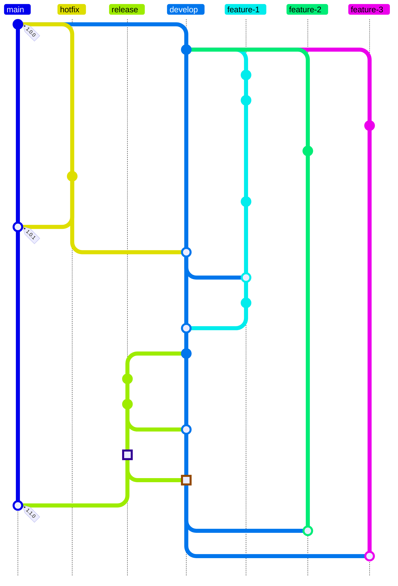
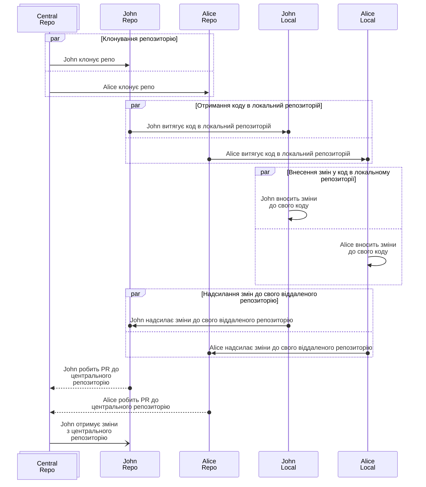
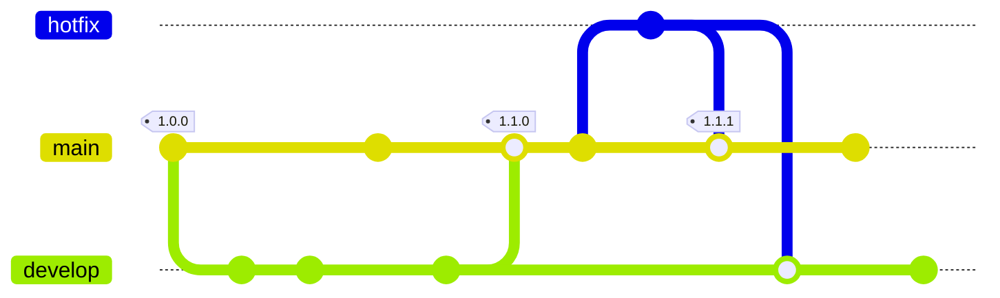
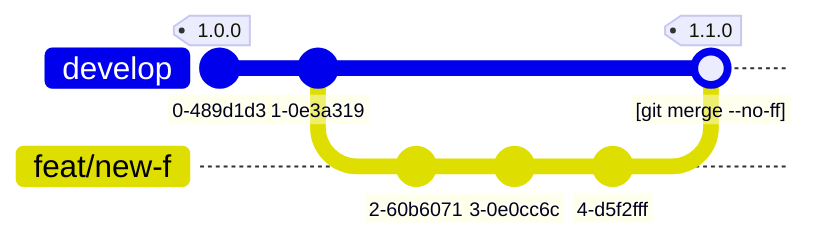
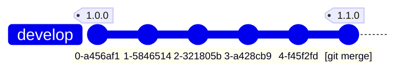
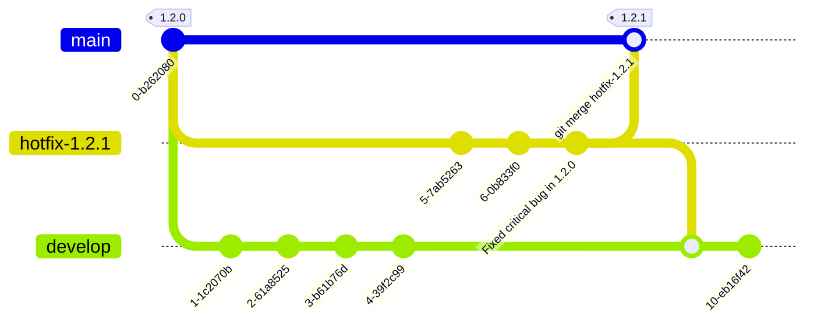

Git Flow — це популярна модель створення гілок у Git, яка допомагає організувати процес розробки та управління версіями застосунку. Вона була [запропонована Вінсентом Дріессеном у 2010 році](https://nvie.com/posts/a-successful-git-branching-model/) і відтоді стала стандартом для багатьох команд розробників.

У стислому вигляді Git Flow виглядає так:



Дивіться посилання на код діаграми у редакторі Live Mermaid нижче.[^1]

[^1]: Ви можете ознайомитись з кодом діаграми у [редакторі Live Mermaid](https://mermaid.live/edit?gist=https://gist.github.com/Andygol/1bb88ecff3d4deb3c0df074624fa3c83#pako:eNqNVMtugzAQ_BVrzwTZkPDwsa3UVuoxp4qLAxtABYwc01eUfy-POA9EaA5IeGd2dvAY7yGWCQKHxWIRVbGstnnKo4qQNNfPStRZvyCkFkoUBRaPsixzveNkK4odDtguk19D_U1ssDhhvaTRIeuHo1TcU4kWKScRMJvaNIIB2ihRxRnJpN7m30SqBBUnzhWW4CcWsjbg8qiZYfwhG23gq0l50g0azdii0I3CBTNKq0nYMbA3CbsG9kc-TvKXTibex3z3Do4zwxm27g4RNsMpRV4NpRJViiaPi8SY2c3pjb9qmzcwUCdi-19__CkzZ-AqPIUFih2a6NxR-xG-M7gJX0b_f12if2rk5OX1-eWtfdb3a883jgM8dZkE2fmfu3W8poK5cVrnqJ0VsCBVeQJcqwYtaOlttV3CviNHoDMsMYLOWiLUR-fs0PbUonqXsjRtSjZpBry_XCxo6kRofMpFqsSZglUb6aNsKg3ccVmvAXwP38CZz-xgGVDmeizw2Yp5Fvy0LGr7wTL0qes7lNHAOVjw20-ldhB6nuOtQtcPqRO67PAHc7WsQQ)

## Децентралізація розробки {#decentralization-of-development}

[Git](https://git-scm.com/docs/git/uk) давно став стандартом для систем контролю версій. Створений Лінусом Торвальдсом у 2005 році, Git дозволяє розробникам ефективно керувати змінами в коді та разом працювати над проєктами.

> Git було створено для роботи над ядром Linux, що означає, що він був розроблений для обробки репозиторіїв з десятками мільйонів рядків коду з самого початку. Швидкість та продуктивність завжди були основними цілями дизайну Git.
>
> <https://git-scm.com/about>

За своєю природою Git було створено як децентралізовану систему контролю версій, що означає, що кожен розробник має копію репозиторію, включаючи історію змін. Це дозволяє розробникам працювати автономно та зручно обмінюватися змінами. Все це виглядає гарно допоки не виникає питання: як організувати роботу над проєктом, щоб вона була ефективною та зрозумілою для всіх учасників? Як подолати той хаос, який може виникнути при великій кількості гілок та змін?

### Децентралізована централізація {#decentralized-centralization}

Отже, над проєктом працює багато розробників, у кожного є своя копія репозиторію. Усі ці копії є рівноправними. За домовленістю або за історичних обставин одна з цих копій визнається центральним сховищем коду, до якого потрапляють зміни від інших розробників. Це центральне сховище може бути розміщене на GitHub, GitLab або на вашому власному сервері. Такий репозиторій визнається довіреним джерелом істини. Учасники проєкту можуть вносити зміни у свої локальні гілки, а потім надсилати їх до центрального репозиторію через pull request або merge request. Цей підхід дозволяє зберігати централізовану структуру, де всі зміни проходять через центральне сховище, але при цьому кожен розробник має свободу працювати автономно та вносити зміни у своїй локальній копії.



## Основні гілки {#main-branches}

В Git Flow виділяються дві основні гілки: `main` та `develop`. HEAD гілки `main` містить стабільну версію коду, яка готова до випуску. Вона завжди повинна бути в робочому стані та не містити незавершених змін. Гілка `develop` використовується для інтеграції нових функцій та змін. Вона може містити незавершені зміни, але повинна бути стабільною та готовою до тестування. Коли код у гілці `develop` готовий до випуску, він зливається з гілкою `main`, а також створюється новий теґ для позначення версії.



## Допоміжні гілки {#supporting-branches}

Разом з основними гілками Git Flow визначає кілька типів допоміжних гілок, які використовуються для розробки нових функцій, виправлення помилок та підготовки релізів. Це гілки `feature`, `release` та `hotfix`. Кожна з цих гілок має своє призначення та правила використання. Ці гілки не є якимись особливими з технічної точки зору: це такі самі звичайні гілки в Git, хоча й мають певні домовленості щодо їх використання та злиття.

### Гілки `feature` {#feature-branches}

Гілки `feature` використовуються для розробки нових функцій або внесення змін. Вони створюються від гілки `develop` і після завершення роботи над функцією зливаються назад до `develop`. Гілки можуть мати довільні назви, але зазвичай вони починаються з `feature/*` чи `feat/*`. Назви `main`, `develop`, `release-*` або `hotfix-*` не можна використовувати для гілок `feature`, оскільки ці назви зарезервовані для інших типів гілок.

Іноді гілки `feature` називають тематичними гілками (`topic`) і їх використовують для розробки функцій, які не обовʼязково повинні бути включені в наступний реліз. Ці гілки існують стільки часу, скільки потрібно для розробки функції, і врешті-решт зливаються з гілкою `develop`, щоб остаточно додати функцію в майбутній випуск. Або ж вони можуть бути відкинуті, якщо експерименти з функцією не увінчалися успіхом.

Зазвичай гілки `feature` існують в репозиторіях розробників, а не в центральному репозиторії, оскільки вони є тимчасовими.

#### Створення гілки `feature` {#creating-feature-branch}

Для роботи над новою функцією створіть гілку `feature` від гілки `develop`:

```sh
git checkout -b feature/my-new-feature develop
# або
git switch -c feature/my-new-feature develop
```

#### Перенесення змін з гілки `feature` до `develop` {#merging-feature-branch}

Функція, робота над якою завершена, переноситься до гілки `develop`, щоб бути включеною в наступний реліз. [^2]

[^2]: Не забувайте за потреби оновлювати ваші власні гілки `feature` останніми змінами з гілки `develop`, щоб уникнути конфліктів при злитті. Ви можете зробити це за допомогою команди `git merge develop` або `git rebase develop` в гілці `feature` перед тим, як зливати її з `develop`.

```sh
git checkout develop
# або
git switch develop

git merge --no-ff feature/my-new-feature

git branch -d feature/my-new-feature

git push origin develop
```

Прапорець `--no-ff` використовується для збереження історії гілки `feature` в історії гілки `develop`, навіть якщо злиття може бути виконано за допомогою fast-forward. Це дозволяє легко відстежувати, які зміни були внесені в рамках конкретної функції, а також полегшує відкат змін, якщо це необхідно. Порівняйте ці два приклади нижче 👇.



_Злиття `git merge --no-ff`_



_Звичайне злиття `git merge`_

В останньому випадку, оскільки всі зміни з гілки `feature` можуть бути застосовані до гілки `develop`, історія гілки `develop` не містить інформації про те, що ці зміни були частиною окремої гілки `feature`. Це може ускладнити відстеження змін та розуміння контексту, в якому вони були внесені. Використання `--no-ff` (в першому випадку) створює окремий коміт злиття, який зберігає інформацію про те, що ці зміни були частиною гілки `feature`. Це полегшує відстеження змін та розуміння контексту, в якому вони були внесені.

### Гілка `release` {#release-branch}

Гілка `release` використовується для підготовки випуску нової версії. Вона створюється від гілки `develop`, коли код готовий до випуску, але потребує деяких фінальних налаштувань, таких як оновлення номера версії, виправлення дрібних помилок або уточнення дати випуску. Також дозволяються незначні виправлення. Після завершення підготовки релізу гілка `release` зливається з гілкою `main` та `develop`, а також створюється новий теґ[^tag] для позначення версії. Після цього гілка `develop` готова отримувати зміни для наступного випуску.

[^tag]: Рекомендується дотримуватись домовленостей Semantic Versioning для нумерації версій, щоб забезпечити зрозумілу та послідовну систему нумерації версій для вашого проєкту. Докладніше про це можна прочитати в [документації Semantic Versioning](https://semver.org/lang/uk/).

Гілка `release` створюється від гілки `develop`, коли стан коду в `develop` відповідає бажаному для випуску стану. На цей момент у гілку `develop` мають бути включені всі функції, які призначені для запланованого випуску. Включення нових функцій до гілки `develop` для наступних випусків виконується тільки після створення гілки `release`, щоб не порушити стабільність коду, який готується до випуску.

#### Створення гілки `release` {#creating-release-branch}

Гілки `release` створюються від гілки `develop`. Наприклад, версія поточного робочого коду в `main` є `1.1.25` і ми хочемо зробити випуск зі значними змінами. Стан гілки `develop` відповідає тому, що ми хочемо випустити як версію `1.2.0`. Ми створюємо гілку `release` з гілки `develop` і називаємо її `release-1.2.0`.

```sh
git checkout -b release-1.2.0 develop
# або
git switch -c release-1.2.0 develop
```

Далі вносимо необхідні зміни для підготовки релізу, такі як оновлення номеру версії, виправлення дрібних помилок або уточнення дати випуску.

```sh
# Вносимо зміни для підготовки релізу
git add .
git commit -m "Підготовка релізу 1.2.0"
```

Гілка `release` існує доти, доки не буде завершена підготовка релізу. У цей час допускаються незначні виправлення, але не допускається додавання нових функцій: їх додають до гілки `develop` для майбутніх випусків.

#### Завершення процесу випуску {#completing-release-process}

Як тільки підготовка релізу завершена, гілка `release` зливається з гілкою `main` та `develop`, а також створюється новий теґ для позначення версії. Після чого гілка `develop` готова отримувати зміни для наступного випуску.

Кожен коміт до гілки `main` вважається випуском нової версії (за визначенням). Тому для позначення випуску нової версії ми створюємо теґ[^tag] з номером версії. Це дозволяє легко відстежувати, які зміни були включені в кожну версію, та полегшує відкат до попередньої версії, якщо це необхідно.

```sh
git checkout main
git merge --no-ff release-1.2.0
git tag -a 1.2.0 -m "Випуск версії 1.2.0"
```

Отже, випуск нової версії відбувся, і її було позначено теґом `1.2.0` для подальшого використання.

> Ви можете також використовувати прапорці `-s` або `-u` для підпису теґу за допомогою GPG ключа, якщо ви хочете забезпечити додаткову безпеку та довіру до ваших випусків.

Зміни, які відбулися в гілці `release`, також потрібно злити з гілкою `develop`.

```sh
git checkout develop
git merge --no-ff release-1.2.0
```

Це може викликати певні конфлікти, якщо в гілці `develop` були внесені зміни після створення гілки `release`. У такому випадку вам потрібно буде вирішити ці конфлікти.[^2]

Після цього кроку ми остаточно завершили цикл випуску нової версії. Гілка `release` більше не потрібна, тому її можна видалити.

```sh
git branch -d release-1.2.0
```

### Гілки `hotfix` {#hotfix-branches}

Гілки `hotfix` використовуються для швидкого виправлення критичних помилок в стабільній версії коду. Вони створюються від гілки `main`, коли виявляється критична помилка, яка потребує негайного виправлення. Після внесення необхідних змін, гілка `hotfix` зливається з гілкою `main` та `develop`, а також створюється новий теґ для позначення версії. Це дозволяє швидко виправити помилки в стабільній версії коду, не порушуючи процес розробки нових функцій в гілці `develop`.

Гілки `hotfix` отримують назву `hotfix-*`. Вони створюються від відповідного теґу в гілці `main`, який позначає версію, в якій була виявлена помилка. Наприклад, якщо виявлена помилка в версії `1.2.0`, то гілка `hotfix` буде створена від теґу `1.2.0` і називатиметься `hotfix-1.2.1`. Це дозволяє команді продовжувати розробку нових функцій в гілці `develop`, в той час як критична помилка буде виправлена в гілці `hotfix`.



#### Створення гілки `hotfix` {#creating-hotfix-branch}

Гілка `hotfix` створюється від гілки `main`. Наприклад, версія поточного робочого коду в `main` є `1.2.0` і ми хочемо виправити критичну помилку в цій версії. Ми створюємо гілку `hotfix` з гілки `main` і називаємо її `hotfix-1.2.1`.

```sh
git checkout -b hotfix-1.2.1 main
# або
git switch -c hotfix-1.2.1 main
```

Не забуваємо змінити версію в коді, щоб позначити виправлення помилки.

```sh
# Зміна версії в коді
git add .
git commit -m "Зміна версії на 1.2.1"
```

Вносимо виправлення для усунення критичної помилки ще одним комітом.

```sh
# Вносимо виправлення для усунення критичної помилки
git add .
git commit -m "Виправлення критичної помилки …"
```

#### Завершення процесу виправлення помилки {#completing-hotfix-process}

Як тільки виправлення помилки завершено, гілка `hotfix` зливається з гілкою `main` та `develop`, а також створюється новий теґ для позначення версії.

Спочатку зливаємо гілку `hotfix` з гілкою `main` та створюємо теґ для позначення нової версії.

```sh
git checkout main
git merge --no-ff hotfix-1.2.1
git tag -a 1.2.1 -m "Виправлення критичної помилки в версії 1.2.0"
```

> Ви можете також використовувати прапорці `-s` або `-u` для підпису теґу за допомогою GPG ключа, якщо ви хочете забезпечити додаткову безпеку та довіру до ваших випусків.

Далі зливаємо гілку `hotfix` з гілкою `develop`, щоб включити виправлення помилки в наступний випуск.[^2]

```sh
git checkout develop
git merge --no-ff hotfix-1.2.1
```

Однак, **якщо у вас є гілка `release`, зміни з гілки `hotfix` потрібно злити в гілку `release`**, а не в `develop`. Після завершення циклу випуску нової версії, гілка `release` зливається з гілкою `develop`, тому зміни з гілки `hotfix` також потраплять в `develop`.

І останній крок, після завершення процесу виправлення помилки, це видалення гілки `hotfix`.

```sh
git branch -d hotfix-1.2.1
```

## Підсумок {#conclusion}

Отже, загальна схема роботи з гілками в Git Flow, яка знаходиться на початку цього допису, не є чимось із розряду неосяжного. Це просто набір домовленостей, які допомагають організувати процес розробки та управління версіями застосунку. Вони не є обовʼязковими, але можуть бути дуже корисними для підтримки порядку та ефективності в роботі. Важливо памʼятати, що Git Flow — це лише одна з багатьох можливих моделей створення гілок у Git. Вибір моделі залежить від конкретних потреб та обставин вашого проєкту.

### PS {#ps}

Під час розробки вашого проєкту ви також можете використовувати рекомендації з **The Twelve-Factor Manifesto** для управління залежностями, конфігурацією та іншими аспектами розробки, щоб забезпечити більш ефективний та масштабований процес розробки та використання застосунку. Докладніше про це можна прочитати в [документації Маніфесту дванадцяти факторів](https://andygol.co.ua/12f-app/).
